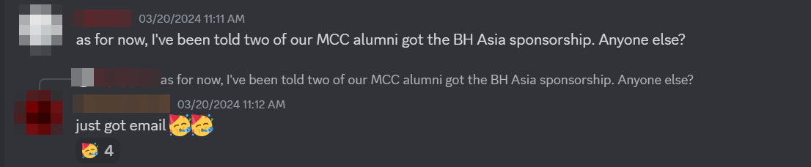

So, Black Hat Asia 2024! A huge conference packed with cybersecurity booths and fascinating talks. I should mention, though, that the ticket price was… well, let’s just say it wasn’t cheap. Luckily, Black Hat offers sponsorships for students! And so, with my assignments piling up and my final year project nowhere near done, I irresponsibly decided to sign up for it anyway!

And guess what? I **got it**!

## One Sponsorship Is Luck, Two Is Manifest Destiny

How did I find out I was sponsored? Well, **Mr [Ahmad Ashraff](https://www.linkedin.com/in/yappare/)** or **Mr Yapp** from Malaysia Cybersecurity Camp (MCC) casually asked the group about who gotten the sponsorship. That’s when it hit me. I hadn’t even checked my email. As someone who NEVER checks their emails, I thought, “I should probably start doing that more often.”

> *Remember MCC2023? No? READ MY BLOG ABOUT MY EXPERIENCE THERE!!*

You won’t believe it, but Mr. Yapp kindly sponsored transportation and accommodation for me and 4 other MCC Alumni to attend **Black Hat 2024**! I can’t even describe how grateful I am. Getting a sponsorship for **Black Hat Asia** was already a dream come true, but knowing that **transportation** and **accommodation** were both taken care of? That just blew my mind. Thank you so, so much to **Mr. Yapp** and **RE:HACK** for this incredible opportunity!

## Day 1: No Booth Was Safe

You won’t believe this funny moment from two weeks before the conference! I was giggling at a joke I had in mind for my Instagram about Black Hat. It felt too good not to share! Here it is!

###  MCC Takes Over Black Hat Asia

Anyway, on the first day, the first thought that popped into my mind was **SWAGS, SWAGS, SWAGS!!!** Let’s be real, with **Black Hat Asia** being such a huge event, it meant one thing, **a ton of popular companies** giving out their swags. But, **hold on**, before I dive into that, I met up with the MCC gang!

From the left:

1. [Teng](https://www.linkedin.com/in/wang-teng-zheng-1b176a1a6/)
2. [Naqib](https://www.linkedin.com/in/naqib-fitri/)
3. [Sarah](https://www.linkedin.com/in/sarahmjufri/)
4. [Amin](https://www.linkedin.com/in/amin-safri-a4a934221/)
5. [Invisible Amir](https://www.linkedin.com/in/ymiir/) 

> *Amir was also sponsored by Black Hat but he covered his own transportation & accommodation*

After a successful swag hunt, I was thrilled to meet **[Prashanth Krishnappa](https://www.linkedin.com/in/cy102/)** from **[Cyber Cohesion](https://www.linkedin.com/company/cyber-cohesion-theunitedfront/)**! This encounter was a highlight for sure. Prashanth recognised me because of Cyber Cohesion’s recent partnership with my university’s cybersecurity club, **FSEC-SS** (shoutout to **[Roheen](https://www.linkedin.com/in/roheender-sahota/)** for facilitating that!). He even mentioned he had seen my work, particularly my segment at **SherpaSec** on **Velociraptor**. It was great to finally meet him, and our conversation about cybersecurity was truly enjoyable!

### Bricking Bad

Lego comes from the Danish term meaning “play well,” and let me tell you, we did just that! At Black Hat, there’s a dedicated area where everyone pitches in to build a Lego art piece together.

We were provided with a paper showcasing a grid filled with colour IDs and a black Lego piece. Our objective was to fill in the Lego piece using individual pixels that matched the art piece.

Each segment constructed by participants is counted as an entry to win one of these awesome Lego sets!

In short, we didn’t win the lucky draw. But just before the excitement kicked in, I asked **[Dave Schefcik](https://www.linkedin.com/in/daveschefcik/)**, the station manager, about his artwork. He told me it could be worth about $45,000 USD, if not more! Once it’s finished, it will be showcased in a Black Hat office, either in the USA or Singapore. Here’s how I reacted when I heard that:

>**Me:** Hopefully it won't break during shipping
>
>**Dave:** Oh it will... It will...

Also, he’s going to be creating the same art piece at **Black Hat USA**, which will be four times bigger! The exciting part? He shared what his real job is, and I was left thinking, **“YOU HAVE EVERYBODY’S DREAM JOB!”** He works for a custom Lego building company named Brick Nerd as his side gig, his main job title is director at a cybersecurity company!

So, I had a chance to ask him about the custom **Black Hat** Lego set because, let’s be real, I needed to know if I could get one. He explained how much work went into it, beyond just the custom stickers and packaging. The goal was to design a set that looked like something Lego themselves would’ve produced, and pulling that off required an almost terrifying level of precision. This wasn’t just some random pile of bricks, it had custom everything, from the box to the details on individual pieces. Between that level of craftsmanship and the labour involved in getting it just right, it’s no surprise the cost is way up there.

The part that blew me away about the custom Lego set? **The black hat**. One single piece in the set that happens to be the most expensive thing. Not because it’s linked to the conference, but because Lego only made that specific piece one time. To get enough of them, he had to hunt them down in the **Lego black market** (yes, that’s real). They cost **$5** each when he found them, and now they’ve gone up to **$7**. For a piece of plastic smaller than a coin. Respect to the hat for its status, but wow, that’s a grudge-worthy price hike.

The most mind-blowing part came after we wrapped up the art piece. Dave started casually pointing out misplaced Lego pieces, leaving Teng curious about how he could spot them. Me? I was slightly drunk and feeling brave (thanks to one beer and two different wines), so I just flat-out asked him. Turns out, Dave had spent an insane amount of time staring at the image. Apparently, he was the one who designed it, imported it into Photoshop, and matched each Lego piece to the exact colours in the design pixel by pixel.

Absolutely wild. The whole process of building it was a blast, and if **Black Hat** gets the chance to bring this back, they have to. It made the conference so much more entertaining and interactive.

### Good Samaritan

"Good Samaritan" might not be the best description, but we (the MCC gang) met a really kind guy from Zimbabwe named [Blessing](https://www.linkedin.com/in/blessing-mufaro-kashava/). He gave us his take on the cybersecurity environment in Zimbabwe, and we had an engaging discussion about culture, cybersecurity, and university life. At the end, he mentioned he’s an ambassador for GitHub and Microsoft, and then he excitedly pulled out a bag filled with GitHub and Microsoft swag. Here’s how the exchange went:

> **Blessing:** Oh take it, i have a whole box full of it!
> 
> **Me:** Can i give you my address, so you can ship it to me? 🤣🤣

Regardless, he was such a genuinely kind person, and and the MCC team is in full agreement: **WE HAVE TO PROTECT HIM AT ALL COSTS!**

Here's today's bounty! By the end of the first day, I was genuinely excited and didn't want to leave. It was such a contrast to the conferences we had back in Malaysia! I’ll keep the details to myself, but let’s just say I learned a lot from the **Black Hat** community.

### Alcohol: The Ultimate Social Engineering Tool

For those who know me well, I’m not an extrovert; I’m just a bit confident and can be quite loud. But as you may have seen in the Lego section, alcohol tends to draw out my extroverted tendencies. After the conference, **[Belinda](https://www.linkedin.com/in/belinda-choong-0a1762b/)** invited us MCC folks to a bar for drinks and socialising!

Before diving into the fun, I should mention that the bar was quite hidden. Teng and I felt like drug addicts searching for drugs trying to find it. But we eventually succeeded! So, what did we discuss once we were there? After five beers, here’s what I remember.

I had the opportunity to meet an Industrial Control Systems (ICS) hacker from France, **[Faiz](https://www.linkedin.com/in/faiz-djellouli-015a2782/)**, who runs a company specialising in ICS security! He shared an incredible image of a simulation demonstrating the Stuxnet attack on a real Siemens Programmable Logic Controller (PLC) and displayed a picture of them executing a hack on a boat. Additionally, he provided fantastic advice on where to begin learning ICS hacking via blogs, YouTube, books, and even constructing a miniature ICS setup. This closely aligns with how I approach learning!

I also met **[Sn0rkY](https://www.linkedin.com/in/joffreyczarny/)**, who is also from France! He's a red team leader who has accumulated over 20 years of cybersecurity experience. It was captivating to discuss how things have evolved, especially before the existence of CTFs. Back then, they had to build and buy their own labs. Nowadays, the younger generation simply spins up AWS instances. Intrigued, I asked him about Command and Control (C2) servers and what types they utilise.

His insights were quite revealing. He explained that they often start with popular C2 tools such as Cobalt Strike, Havoc, and Sliver. If these tools are flagged, they switch profiles, if that doesn’t work, they proceed to develop custom C2 servers. Ultimately, they tailor their approach to meet the client’s needs, as there’s no sense in creating a custom C2 that will be detected. They begin with widely-used tools and escalate their tactics as necessary.

## Day 2: Return of the Merch Goblin

### The Great Yo-Yo Heist of 2024

The highlight for Day 2 at Black Hat Asia was undoubtedly the rare yoyos! These exclusive items, made by **[Snyk](https://www.linkedin.com/company/snyk/)** and **[Bugcrowd](https://www.linkedin.com/company/bugcrowd/)**, were scarce. I was lucky enough to get two of each and shared one of each with Roheen and Teng.

### “Man in the Middle,” But Make It Lego

Remember the Lego lucky draw? Well, there’s an exciting contest now for 5 more limited edition **Black Hat** Lego sets! The challenge is to create something imaginative with Lego around a specific theme. Entries are judged on their appearance, creativity, and storyline. I managed to win in the second round! My theme was **“Man in the Middle”** and I built a bridge with a figure walking in the middle of it.

Ah yes, set your eyes on the majestic Lego set! 

### Gotta Network Them All

Besides the custom Lego set, there was a swag restock! As usual, I picked up a ton to share with my friends. The buzz around the swag added to the excitement. I enjoyed chats with quite a few people, including **[Moataz Salah](https://www.linkedin.com/in/moataz-salah-aa861510/)**, the CEO of **[CyberTalents](https://www.linkedin.com/company/cybertalent/)**, a CTF platform. He was enthusiastic about his platform and wanted feedback, which I found encouraging. I’m looking forward to diving deeper into what CyberTalents offers. They also organised a CTF for Black Hat, and the challenges were fairly impressive. I’d love to join again if I can.

Thanks to Belinda, who I’m really thankful for, we were introduced to three more people at the conference! One of them was **[Louis](https://www.linkedin.com/in/louis-hur-87313019/)**, an ICS hacker from South Korea! Another introduction was to **[Ashley](https://www.linkedin.com/in/ashley-shen/)**, who works at Cisco. I didn’t get a chance to connect with them, but I hope to chat about their research and work in the future. The last person we met was **[Laurie](https://www.linkedin.com/in/lauriemercer/)** from HackerOne. I always thought HackerOne was just a bug bounty site, but I learned they also have a CTF platform! The neat thing is that this platform helps users learn about bug bounty hunting through challenges, and every completed challenge enhances a hacker’s reputation on HackerOne, potentially leading to private programs.

## Closing Thoughts: The Swags

When the conference ended, I was filled with happiness and excitement. Was it mainly because of the swags? Well, that was nice, but the real highlight was the incredible people I met and reconnected with. I felt a true sense of belonging to a **REAL** community that encourages knowledge sharing and learning.

I learned a great deal from my peers and also from booth representatives who were excited to share their insights with us, even knowing we were just students. Their passion was uplifting. To me, that’s what defines a cybersecurity community: sharing knowledge, learning from others, and maybe the swags too! 🤣🤣