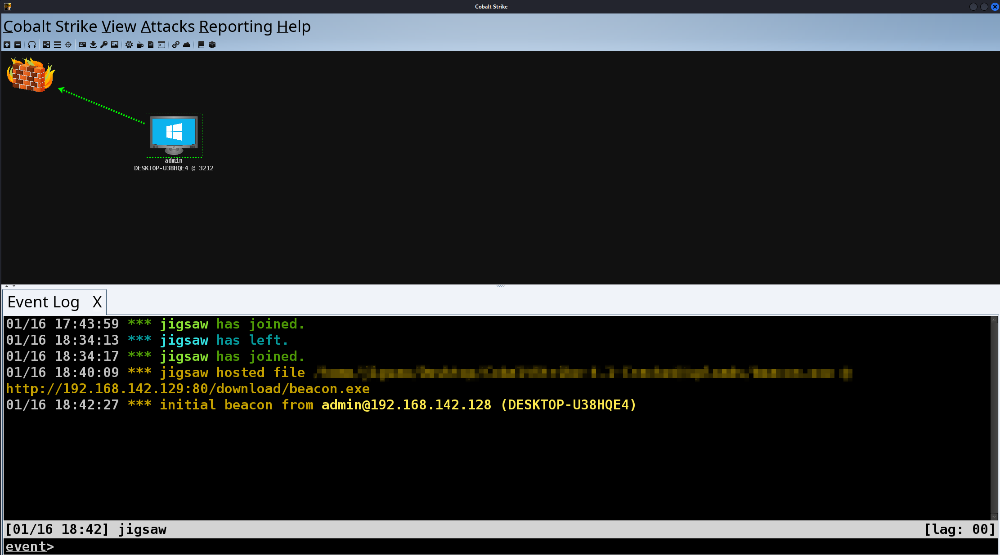

## Introduction

On the 11th of May 2024, Asia Pacific University's Forensic & Cybersecurity Research Centre Student Section hosted an internal CTF! As a contingency, in case I get busy with assignments and my final year project, I prepared my challenges in advance. However, being my final year in university, my friends encouraged me to participate in hopes of getting 1st place as I have never gotten a champion title in a CTF. The most I have ever gotten was 2nd place. Anyway, how was the CTF you maybe asking? Well, our team NT won first place! Thanks to the RE King [Danisy Eisyraf](https://www.linkedin.com/in/danisyeisyraf/) and Queen of OSINT [Chang Shiau Huei](https://www.linkedin.com/in/chang-shiau-huei/)!

However, as I wasn't involved in organising the CTF, I won't be talking about about it. Instead, I'm here to tell you about the Hard challenge which I have prepared in advance for this CTF called SCP 4.0 (yes, it was inspired by the SCP Foundation). Looking back at the challenge, it may have been too difficult for the participants  given that the CTF lasted only a few hours. This challenge was inspired by a previous HacktheBox Forensics challenge, and I was able to recreate it!

## Preparing the Environment


The environment is simple, we just need a Windows 10 virtual machine and a Kali Linux virtual machine. The applications we need will be:
- Cobalt Strike 4.X (Installed on the Kali Linux VM)
- Wireshark (Installed on the Windows 10 VM)
- ProcDump (Installed on the Windows 10 VM)

BUT WAIT!! Zach, Cobalt Strike is a paid product! How am I going to obtain it? Well, sad to say that your practical journey has to end here. However, you can see how the challenge was made and how it was solved from here.

```
┌──(jigsaw㉿jigsaw)-[~/Desktop/CobaltStrike]
└─$ sudo ./teamserver 192.168.142.129 jigsaw
```

When you are ready, start up Cobalt Strike as shown above. Execute the binary with `sudo` followed by your C2 server's IP address and the password of the user who is going to access the Cobalt Strike server. When the server has started, join the server with the client binary.


Once the client's GUI has loaded, login with the credentials you have set. After logging in, the main interface will be shown as demonstrated above. As John Hammond from Jurassic Park would say, "Welcome to Cobalt Strike!".

## Generating a Beacon


As of right now, the attacker's environment is completed.  The only remaining task is to generate a payload to run on the victim’s machine. For simplicity sake and because my knowledge on Cobalt Strike is as little my knowledge on vulnerability research, it will be the default Cobalt Strike beacon executable.


As we are using Wireshark to capture network traffic, the communication between the beacon and the C2 server must not be encrypted on the network level. For this reason, the listener will be configured with the `windows/beacon_http/reverse_http` listener which is listening on port 80. After this step, save the executable somewhere.


Now, Cobalt Strike has a feature to host the executable as a drive by download. As I'm too lazy to open up a Python server on the terminal, we'll just use that feature as it is already baked into Cobalt Strike by default.


Once the executable is hosted on the C2 server, all we need to do is to copy the URL shown and paste it onto our victim machine’s browser and away we go! However, it should be done without me saying, make sure that Microsoft Defender has been disabled on the Windows 10 VM beforehand.


## Exploiting the Victim Machine


Now that the payload has been downloaded onto the Windows 10 VM, it would make sense that we should launch the executable right away right? RIGHT??? Yea...no, Wireshark needs to be launched first to capture the network traffic between the Cobalt Strike server and the beacon. 



Once Wireshark is launched and begins capturing network packets, the beacon can now be launched resulting in a callback to the Cobalt Strike server as shown above.


Now as this is a CTF challenge, let's start creating some fluff to confuse the participants and obviously a flag.


## Forensics Acquisition


Once some fluff is created, we can stop Wireshark from capturing packets, followed by dumping the process of the beacon as it will become part of the challenge. This can be done by first looking at the Task Manager, and finding the Pid of the beacon.


The process can be dumped using ProcDump by executing ProcDump followed by the Pid of the beacon using the `-mp` switch.


## Forensics Analysis

Here's where the real challenge starts. A network capture file and a process dump. The reason why this challenge is ranked as Hard is because the communication between the Cobalt Strike server and the beacon does not send and receive data in plain text in Cobalt Strike version 4.X. Eventhough we configured a HTTP listener, it still encrypts the data before sending and when receiving them. The encryption method is specifically AES-256 in CBC mode with HMAC-SHA-256.

Luckily for us, there is a solution thanks to Didier Stevens’ [blog](https://blog.nviso.eu/2021/10/21/cobalt-strike-using-known-private-keys-to-decrypt-traffic-part-1/) which is divided in 7 parts. For a detailed explanation, you can refer to his blog on NVISO Labs.

```
┌──(jigsaw㉿jigsaw)-[~/Desktop/scp-4.0]
└─$ python3 cs-parse-http-traffic.py -k unknown capture.pcapng
```

First, [cs-parse-http-traffic.py](https://github.com/DidierStevens/Beta/blob/master/cs-parse-http-traffic.py) is used extract the encrypted data from the network capture file.


```plaintext {"Let's take this piece of data":26-27}
Packet number: 40
HTTP response (for request 36 GET)
Length raw data: 64
6141f2872594360aa3411b33c61582e3920f41bf72af502863e32a978cb1b3f82f3979aae93569d0c06784672b6e73b90fffbcbe4be2fc62a00a8d0cea4fb299

Packet number: 47
HTTP request POST
http://192.168.142.129/submit.php?id=1850308416
Length raw data: 68
000000407468637f4035f8e23e604e58262415b22150becd1158da6748936cff0b67e7dfe9910af33bab1c118045bd0f418c51caaeb58d30acd639acb17f6b9769e215a3

Packet number: 94
HTTP response (for request 91 GET)
Length raw data: 80
85c3951d0e9f00be1aef2d4b4b02f54de8245162c4bc967ef23691d1de1d21ee1ec2c1d766f66d20e9d44e996d5620977af1d17dfa5046ad0b9ee1fd83a2291a47de1accfbc9f570b5064b516eb782ea

Packet number: 102
HTTP request POST
http://192.168.142.129/submit.php?id=1850308416
Length raw data: 2996
00000bb0c362ecfc8b96d5db19572500 <-- SNIP -->

Packet number: 123
HTTP response (for request 119 GET)
Length raw data: 64
// ...
f711c8fcc407cafd6894c33bd11e17f3167372f8340bde9b69637efe75b6d091ce20d10f95ed12bbe10e2087731095cf9d66610b7026ad87e62cc0ca7f84c486

Packet number: 130
HTTP request POST
http://192.168.142.129/submit.php?id=1850308416
Length raw data: 548
00000220c67b3cd12150d2ad219d5dd2 <-- SNIP -->

Packet number: 145
HTTP response (for request 141 GET)
Length raw data: 80
004299ba5d6ed29d5a4bb7330eb0fe55 <-- SNIP -->

Packet number: 153
HTTP request POST
http://192.168.142.129/submit.php?id=1850308416
Length raw data: 1796
0000070062c3b66a95cd260960e9804b <-- SNIP -->

Packet number: 240
HTTP response (for request 207 GET)
Length raw data: 43616
8c7e997a281c47d14d15846ee48ab597 <-- SNIP -->
```


From here, we just need on of the raw data which is sent by the server to the beacon. The raw data contains tasks to be executed by the beacon. Let's take the data highlighted above.


```
┌──(jigsaw㉿jigsaw)-[~/Desktop/scp-4.0]
└─$ python3 cs-extract-key.py -t f711c8fcc407cafd6894c33bd11e17f3167372f8340bde9b69637efe75b6d091ce20d10f95ed12bbe10e2087731095cf9d66610b7026ad87e62cc0ca7f84c486 beacon.exe_240116_202412.dmp
```

[cs-extract-key.py](https://github.com/DidierStevens/Beta/blob/master/cs-extract-key.py) is usually used to find and decode the metadata of the beacon from the process dump. This metadata is basically metadata of the beacon whenever it calls back to the Cobalt Strike server. The metadata contains information such as these.


However, that method is only applicable for Cobalt Strike 3.X beacons as the metadata is distinguishable from other data from the process dump as the metadata will start with the sequence of bytes `00 00 BE EF`. For Cobalt Strike 4.X beacons, the data is encrypted so a dictionary attack will be used by taking a sequence of 16 bytes from the process dump and attempts to decrypt the data given to it. The string that `cs-extract-key.py` is specifically searching for in the context of Cobalt Strike 4.X beacons is `sha256\x00`. To do that, the raw data selected will be used to perform a dictionary attack specified with the `-t` switch and then followed by the process dump file. 


```plaintext {"We need this:":5-6} {"And this:":8-9}
File: beacon.exe_240116_202412.dmp
Searching for AES and HMAC keys
Searching after sha256\x00 string (0x3cd720)
AES key position: 0x003d3c58
// ...
AES Key:  730e4040888c9ccb40882e33789a5cd6
HMAC key position: 0x003d6f78
// ...
HMAC Key: 5a5a7717389bf665aac5ec021f0b56e6
SHA256 raw key: 5a5a7717389bf665aac5ec021f0b56e6:730e4040888c9ccb40882e33789a5cd6
Searching for raw key
```

As you can see, the results of using `cs-extract-key.py` give us the AES key and HMAC keys.


```
┌──(jigsaw㉿jigsaw)-[~/Desktop/scp-4.0]
└─$ python3 cs-parse-http-traffic.py -k 5a5a7717389bf665aac5ec021f0b56e6:730e4040888c9ccb40882e33789a5cd6 capture.pcapng
```

With the AES key and HMAC keys, we can then use `cs-parse-http-traffic.py` again but now with the AES and HMAC keys specified to retrieve the decrypted data.


Parsing the network capture file reveals the commands sent to the beacon from the Cobalt Strike server.


Looking through the data, there seems to be a PDF file present within the data. This is indicated by the file name at the beginning, `important document.pdf`.


```
┌──(jigsaw㉿jigsaw)-[~/Desktop/scp-4.0]
└─$ python3 cs-parse-http-traffic.py -k 5a5a7717389bf665aac5ec021f0b56e6:730e4040888c9ccb40882e33789a5cd6 -e capture.pcapng
```

Using `cs-parse-http-traffic.py` again with the `-e` switch, helps us extract aforementioned file, giving us the PDF file.


Opening up the PDF file give us the flag. 

```
ICTF{sTrIK!NG_8AcK_w!TH_cOb4L7_stRIke}
```


## Conclusion


In conclusion, was it a fun challenge to make? Yes. Was it too hard to be solved within a few hours? It depends, as it requires some research and understanding of how Cobalt Strike beacons work. It may cause the participants to suffer, but it is important to know that you should have fun during a CTF and try to learn from it.
