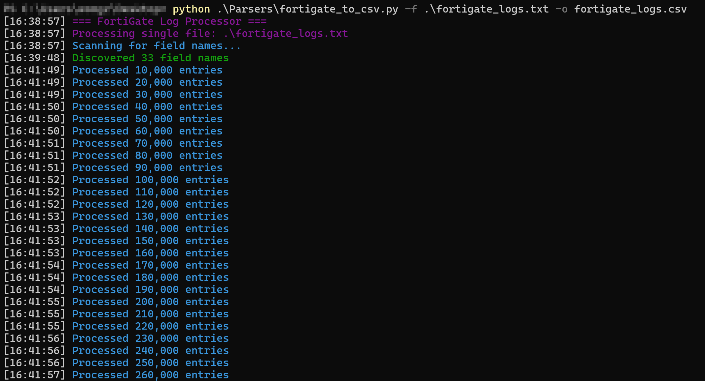
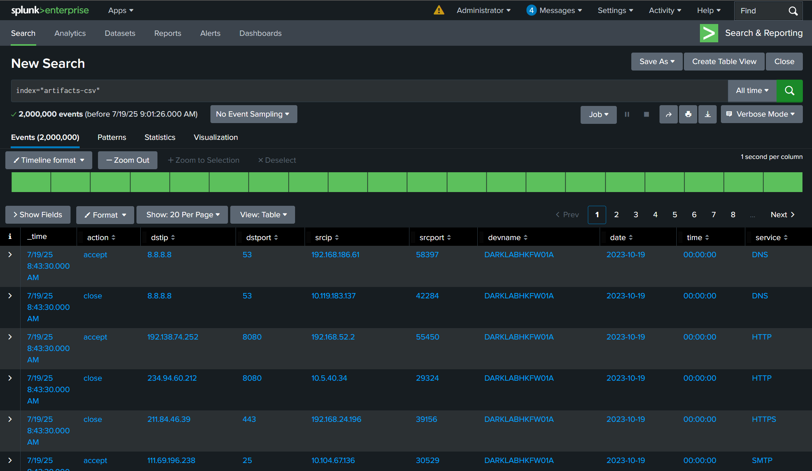

# Introduction
---
Before I dive into this blog, let me give you some quick context. At work, I handle compromise assessments. This involves collecting a triage of the client's machines. In my experience, that can mean anywhere from 2 machines to 400 machines. Every now and then, we receive firewall logs, especially from FortiGate.

My first brush with FortiGate logs happened during the PWC Hack A Day CTF in 2023. To be honest, I skipped analysing them. Why? Well, I was feeling a bit lazy (you will see this theme pop up again soon), and I was all in on the Active Directory challenges instead.

Anyway, while digging into these investigations, my senior colleague recommended using a CSV viewer to go through the logs one by one. But hey, with handy tools like `Hayabusa` for breaking down Windows Event Logs using Sigma rules, and others like `goaccess` or `MasterParser` for Linux logs, I figured there had to be a smarter path forward. Sadly, from what I have seen in compromise assessments, no solid parser exists that handles FortiGate logs all that well. The big issue? Those exported FortiGate logs come out looking like a total disaster.

```
field_1="value_1" field_2="value_2" field_3="value_3" field_4="value_4"
```

Picture the example above, but now multiply it by millions. FortiGate gives users the freedom to export various logs in different formats with different fields, which means the same fields won't always match up consistently. To put this in perspective, the PWC Hack A Day CTF challenge provided us with a 1 GB file of FortiGate logs. Meanwhile, my current assessment at the time of writing this involves working with approximately 75 GB worth of logs in the form of text files.

Then out of nowhere, a genius solution came to mind! Splunk! There's got to be some way to get FortiGate logs into Splunk right? RIGHT? Unfortunately, during my research journey, I discovered only a plugin designed for Splunk to consume FortiGate logs. This essentially means Splunk is designed to work with live streaming logs, and you can find tons of guides explaining how to feed real time FortiGate logs into Splunk. However, none on how to investigate exported FortiGate logs with Splunk.

With that being said, I thought IT IS WHAT IT IS...

# Late Night Ideas
---

I would say I receive FortiGate logs in 2 out of 10 compromise assessment cases. However, during my latest assessment at the time of writing, I received a 75 GB worth of FortiGate logs. Looking at the logs, I don't know how many "IT IS WHAT IT IS" I got left in me.


So, I turned to a professional hoping for some advice which let us to a conversation at 2am. What he advised me on is to use a custom parser which I have tried but again, exported FortiGate logs have different fields in different formats. Then, he said as a last resort he would use `grep`, which I agree with. However, my compromise assessments involve clients who don't know whether they are compromise or not. So, without context I do not know what to `grep`.

His last advice was to convert the logs to CSV format which might make the data readable, which I have received during one of my assessments. It did not look better than the text files, but this last advice just got me thinking though. 

# How CTF Experience Can Help You at Work
---
During my free time, I would speed run HackTheBox Sherlocks for fun. Occasionally, there will be CloudTrail logs involved. CloudTrail logs are basically exported into multiple gzipped json files. Without a tool, analysing these json files which are stored in different encapsulating folders are troublesome. That's when I found out about [Splunk4DFIR](https://github.com/mf1d3l/Splunk4DFIR).  This project basically allows an investigator to quickly spin up a Splunk instance and ingest exported logs into Splunk to query.

I have been using Splunk4DFIR for a long time, but only for CloudTrail logs. When I received my latest compromise assessment case, I was actually speed running a Sherlocks challenge which involved CloudTrail. That's when I got the idea maybe I can feed the logs into Splunk through this project. However, these are the artefacts that the project accepts:
```
├── cloudtrail
├── csv
├── elastic_agent
├── evtx
├── gcp
├── json
├── memprocfs
├── pcap
├── supertimelines
├── suricata
├── syslog
├── timelines
└── zeek
```

So, I resulted to analysing the logs manually that day. Until I had that 2am discussion. Since Splunk4DFIR accepts CSV files and json files, the idea of converting the log files into CSV files makes sense! 

The same night at 3 am, I whipped out ChatGPT and generated this Python script to either accept FortiGate log files with the `-f` switch for a single log file or a directory of log files with the `-d` switch to convert the FortiGate logs into a single CSV file. I also generated code to filter out unique source and destination IP Addresses and URL endpoints.

```python
import csv
import re
import os
import sys
import traceback
import argparse
from pathlib import Path
from datetime import datetime
from colorama import Fore, Style, init

# Initialize colorama
init(autoreset=True)

def print_debug(message, level="info", detail=None):
    """Enhanced debug printer with error details"""
    colors = {
        "debug": Fore.BLUE,
        "info": Fore.CYAN,
        "success": Fore.GREEN,
        "warning": Fore.YELLOW,
        "error": Fore.RED,
        "critical": Fore.RED + Style.BRIGHT,
        "header": Fore.MAGENTA
    }
    timestamp = datetime.now().strftime("%H:%M:%S")
    log_msg = f"[{timestamp}] {colors.get(level, Fore.WHITE)}{message}{Style.RESET_ALL}"
    
    if detail:
        log_msg += f"\n  ↳ DETAIL: {str(detail)[:200]}"
    if level in ("error", "critical"):
        log_msg += f"\n  ↳ STACK: {traceback.format_exc()[-300:]}"  # Truncated traceback
    
    print(log_msg)

def parse_log_entry(entry):
    """Robust parsing with detailed error reporting"""
    try:
        pattern = r'(\w+)="(.*?)"|(\w+)=([^"\s]+)(?:\s|$)'
        result = {}
        for match in re.findall(pattern, entry):
            key = match[0] or match[2]
            value = match[1] or match[3]
            if key in result:
                print_debug(f"Duplicate key detected: {key}", "warning", 
                           f"Existing: {result[key]}, New: {value}")
            result[key] = value
        return result
    except Exception as e:
        print_debug("Failed to parse log entry", "error", 
                   f"Entry: {entry[:100]}... | Error: {e}")
        return None

def extract_security_data(csv_path):
    """Extract URLs and IPs from consolidated CSV"""
    print_debug(f"Extracting security data from: {csv_path}", "header")
    
    urls = set()
    src_ips = set()
    dst_ips = set()
    suspicious = []
    
    try:
        with open(csv_path, 'r', encoding='utf-8') as f:
            reader = csv.DictReader(f)
            for i, row in enumerate(reader):
                # Extract URLs (from multiple possible fields)
                url_fields = ['url', 'host', 'referer', 'domain']
                for field in url_fields:
                    if field in row and row[field]:
                        urls.add(row[field])
                
                # Extract IPs (check multiple possible fields)
                ip_fields = {
                    'srcip': ['srcip', 'source_ip', 'sip', 'sender'],
                    'dstip': ['dstip', 'dest_ip', 'dip', 'destination']
                }
                
                for ip_type, fields in ip_fields.items():
                    for field in fields:
                        if field in row and row[field]:
                            if ip_type == 'srcip':
                                src_ips.add(row[field])
                            else:
                                dst_ips.add(row[field])
                
                # Detect suspicious patterns
                if 'action' in row and row['action'].lower() == 'blocked':
                    suspicious.append({
                        'timestamp': row.get('time', ''),
                        'source_ip': next((row[field] for field in ip_fields['srcip'] if field in row), ''),
                        'destination_ip': next((row[field] for field in ip_fields['dstip'] if field in row), ''),
                        'action': row['action'],
                        'reason': row.get('reason', ''),
                        'url': next((row[field] for field in url_fields if field in row), '')
                    })
                
                if i % 100000 == 0:
                    print_debug(
                        f"Processed {i:,} rows | Unique counts: "
                        f"URLs: {len(urls):,} | "
                        f"Source IPs: {len(src_ips):,} | "
                        f"Dest IPs: {len(dst_ips):,} | "
                        f"Suspicious: {len(suspicious):,}",
                        "info"
                    )
                    
        # Ensure output directory exists
        output_dir = os.path.dirname(csv_path)
        output_base = os.path.splitext(csv_path)[0]
        
        # Write extracted data files
        with open(f"{output_base}_urls.txt", 'w', encoding='utf-8') as f:
            f.write('\n'.join(sorted(urls)))
        
        with open(f"{output_base}_srcip.txt", 'w', encoding='utf-8') as f:
            f.write('\n'.join(sorted(src_ips)))
            
        with open(f"{output_base}_dstip.txt", 'w', encoding='utf-8') as f:
            f.write('\n'.join(sorted(dst_ips)))
            
        if suspicious:
            with open(f"{output_base}_suspicious.csv", 'w', encoding='utf-8', newline='') as f:
                writer = csv.DictWriter(f, fieldnames=[
                    'timestamp', 'source_ip', 'destination_ip', 
                    'action', 'reason', 'url'
                ])
                writer.writeheader()
                writer.writerows(suspicious)
        
        print_debug(
            f"Security extraction complete\n"
            f"  URLs found: {len(urls):,}\n"
            f"  Source IPs: {len(src_ips):,}\n"
            f"  Destination IPs: {len(dst_ips):,}\n"
            f"  Suspicious events: {len(suspicious):,}",
            "success"
        )
        return True
        
    except Exception as e:
        print_debug("Failed during security data extraction", "critical", e)
        return False

def process_file(input_file, output_csv):
    """Process a single log file"""
    print_debug(f"Processing single file: {input_file}", "header")
    
    input_path = Path(input_file)
    output_path = Path(output_csv)
    
    # Validate input file
    if not input_path.exists():
        print_debug("Input file does not exist", "critical", input_file)
        return False
        
    if not input_path.is_file():
        print_debug("Input path is not a file", "critical", input_file)
        return False
    
    # Ensure output directory exists
    try:
        output_path.parent.mkdir(parents=True, exist_ok=True)
    except Exception as e:
        print_debug("Could not create output directory", "critical", e)
        return False

    # Stage 1: Discover field names
    fieldnames = set()
    print_debug("Scanning for field names...", "info")
    try:
        with open(input_path, 'r', encoding='utf-8', errors='replace') as f:
            for line in f:
                entry = parse_log_entry(line.strip())
                if entry:
                    fieldnames.update(entry.keys())
    except Exception as e:
        print_debug("Failed scanning file for fields", "error", e)
        return False

    if not fieldnames:
        print_debug("No valid fields discovered in the log file", "critical")
        return False

    print_debug(f"Discovered {len(fieldnames)} field names", "success")

    # Stage 2: Write to CSV
    try:
        with open(output_path, 'w', encoding='utf-8', newline='') as csvfile:
            writer = csv.DictWriter(csvfile, fieldnames=sorted(fieldnames))
            writer.writeheader()
            
            entries_processed = 0
            with open(input_path, 'r', encoding='utf-8', errors='replace') as f:
                for line in f:
                    entry = parse_log_entry(line.strip())
                    if entry:
                        writer.writerow(entry)
                        entries_processed += 1
                        
                        if entries_processed % 10000 == 0:
                            print_debug(f"Processed {entries_processed:,} entries", "info")
            
            print_debug(f"CSV conversion complete. {entries_processed:,} entries written to {output_path}", "success")
            return extract_security_data(output_path)
            
    except Exception as e:
        print_debug("Fatal error during CSV writing", "critical", e)
        return False

def process_directory(input_dir, output_csv):
    """Process all files in a directory"""
    print_debug(f"Processing directory: {input_dir}", "header")
    
    input_path = Path(input_dir)
    output_path = Path(output_csv)
    
    # Validate input directory
    if not input_path.exists():
        print_debug("Input directory does not exist", "critical", input_dir)
        return False
        
    if not input_path.is_dir():
        print_debug("Input path is not a directory", "critical", input_dir)
        return False
    
    # Ensure output directory exists
    try:
        output_path.parent.mkdir(parents=True, exist_ok=True)
    except Exception as e:
        print_debug("Could not create output directory", "critical", e)
        return False
    
    print_debug(f"Processing {len(list(input_path.glob('*')))} files in directory", "info")

    # Stage 1: Discovering field names
    print_debug("Discovering field names...", "header")
    fieldnames = set()
    processed_files = 0
    
    for file_path in input_path.iterdir():
        if not file_path.is_file():
            print_debug(f"Skipping non-file: {file_path.name}", "debug")
            continue
        
        processed_files += 1
        print_debug(f"Scanning {file_path.name} for fields...", "info")
        
        try:
            with open(file_path, 'r', encoding='utf-8', errors='replace') as f:
                for line in f:
                    entry = parse_log_entry(line.strip())
                    if entry:
                        fieldnames.update(entry.keys())
        except Exception as e:
            print_debug(f"Failed scanning {file_path.name}", "error", e)
            continue
    
    if not fieldnames:
        print_debug("No valid fields discovered in any log file", "critical")
        return False
    
    print_debug(f"Discovered {len(fieldnames)} field names", "success")

    # Stage 2: CSV Conversion
    print_debug("Writing to CSV...", "header")
    try:
        with open(output_path, 'w', encoding='utf-8', newline='') as csvfile:
            writer = csv.DictWriter(csvfile, fieldnames=sorted(fieldnames))
            writer.writeheader()
            
            entries_processed = 0
            for file_path in input_path.iterdir():
                if not file_path.is_file():
                    continue
                
                print_debug(f"Processing {file_path.name}...", "info")
                try:
                    with open(file_path, 'r', encoding='utf-8', errors='replace') as f:
                        for line in f:
                            entry = parse_log_entry(line.strip())
                            if entry:
                                writer.writerow(entry)
                                entries_processed += 1
                                
                                if entries_processed % 100000 == 0:
                                    print_debug(f"Processed {entries_processed:,} entries", "info")
                except Exception as e:
                    print_debug(f"Error processing {file_path.name}", "error", e)
                    continue
        
        print_debug(f"CSV conversion complete. {entries_processed:,} entries written to {output_path}", "success")
        return extract_security_data(output_path)
    
    except Exception as e:
        print_debug("Fatal error during CSV writing", "critical", e)
        return False

def main():
    """Command-line interface with argument parsing"""
    print_debug("=== FortiGate Log Processor ===", "header")
    
    # Set up argument parser
    parser = argparse.ArgumentParser(
        description='Process FortiGate logs into CSV and extract security data',
        formatter_class=argparse.ArgumentDefaultsHelpFormatter
    )
    
    # Input options (mutually exclusive)
    input_group = parser.add_mutually_exclusive_group(required=True)
    input_group.add_argument('-f', '--file', 
                           help='Process a single log file',
                           metavar='FILE')
    input_group.add_argument('-d', '--directory', 
                           help='Process all files in a directory',
                           metavar='DIR')
    
    # Output option
    parser.add_argument('-o', '--output', 
                       required=True,
                       help='Output CSV file path',
                       metavar='OUTPUT_CSV')
    
    args = parser.parse_args()
    
    try:
        start_time = datetime.now()
        
        if args.file:
            success = process_file(args.file, args.output)
        else:
            success = process_directory(args.directory, args.output)
        
        duration = datetime.now() - start_time
        print_debug(f"Total processing time: {duration}", "success")
        
        sys.exit(0 if success else 1)
            
    except KeyboardInterrupt:
        print_debug("\nProcessing interrupted by user", "warning")
        sys.exit(1)
    except Exception as e:
        print_debug("Unexpected error in main execution", "critical", e)
        sys.exit(1)

if __name__ == "__main__":
    main()
```


# Demonstration
---



Having that said, let's use the FortiGate logs from PWC Hack A Day 2023 for the demonstration. First, convert the FortiGate log into a CSV file using the command shown above.

```
├── cloudtrail
├── csv
│   └── fortigate_logs.csv
├── elastic_agent
├── evtx
├── gcp
├── json
├── memprocfs
├── pcap
├── supertimelines
├── suricata
├── syslog
├── timelines
└── zeek
```

Move the file into `<PATH_TO_Splunk4DFIR>/artifacts/csv/`.

```bash
docker run --name splunk4dfir -e SPLUNK_START_ARGS=--accept-license -e SPLUNK_PASSWORD=changeme -e SPLUNK_APPS_URL="/mnt/resources
/sankey-diagram-custom-visualization_130.tgz" -p 8000:8000 -p 8089:8089 -v ./artifacts:/mnt/artifacts -v ./resources:/mnt/resources splunk4dfir:latest start
```

Start the docker container with the command above.

```
admin:changeme
```

Log into the Splunk instance at `http://127.0.0.1:8000` with the credentials above.



Using `index="artifacts-csv"`, you can start querying FortiGate logs with Splunk!

# Closing Thoughts
---
I would like to thank Fareed Fauzi for the advice you have given me at 2am, you have taught me a lot in the past and you are still schooling me till this day. It turns out you can have bright ideas in the dark at 2am! A big shoutout to HackTheBox Sherlocks for giving me the knowledge and the opportunity to learn more about DFIR. Of course thank you Splunk for an amazing product for SOC analysts and DFIR investigators. Lastly, thank you FortiGate for giving me an opportunity to research about this. 

