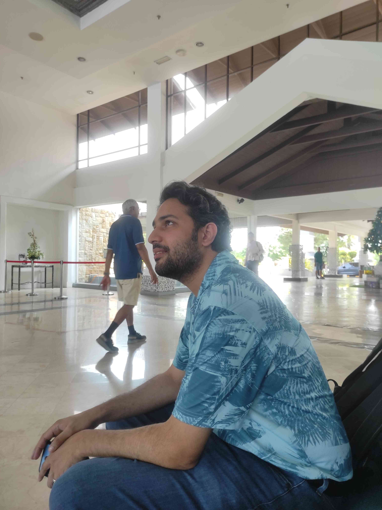
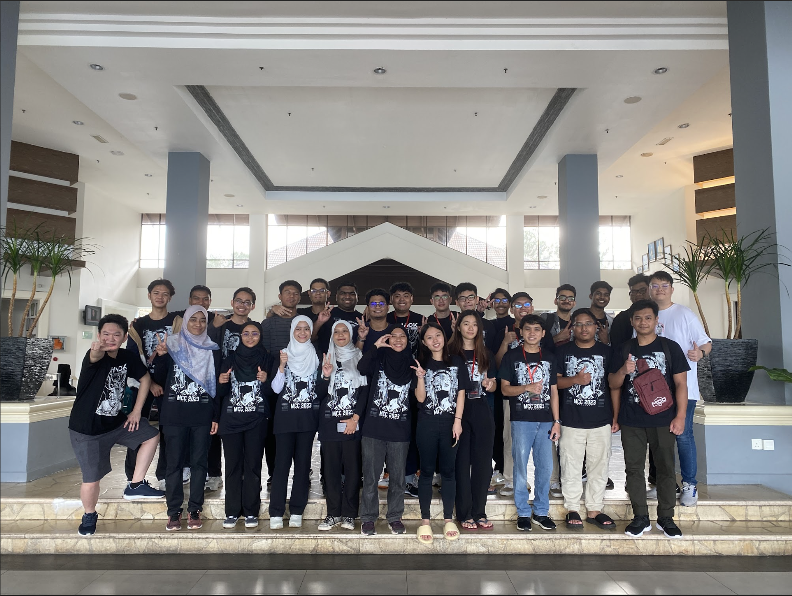

# Introduction


Malaysia Cybersecurity Camp (MCC) is an initiative that focuses on developing a better cybersecurity community for the next generation. It involves networking with top local cybersecurity experts, facilitating student exchanges to build lasting friendships, and enjoying educational experiences in nature. The camp aims to identify talented individuals, increase their knowledge through expert guidance, close the talent gap between students and professionals, bring students to par with global peers, and produce graduates ready for the workforce with minimal training. It is organised by [NanoSec](https://www.linkedin.com/company/nanosecasia/) and [RE:HACK Consultancy](https://www.linkedin.com/company/rehack-xyz/) , it's a community-driven effort by IT security professionals and students.


With that said, I had the opportunity to to participate in it! In summary, I had an incredible experience! In context, I heard of MCC back in 2022, but I had classes and exams at the time. For that reason, I unfortunately did not register for the event and I regretted it.


# Registration Process

During the registration, a TryHackMe box was given to test our respective skills. The [box](https://tryhackme.com/jr/morpheus) is available at the time of writing if you want to try it. The box consists of a red teamer route as well as a blue teamer route. As a purple teamer, I did both.

After the registration, there was an interview process. Yes, an interview, an introvert's (me btw) worst enemy. RE:HACK will shortlist a number of participants to interview them. To be fair, the whole camp was sponsored so in their point of view, they have to choose the participants wisely. Fortunately, I was shortlisted. Beforehand, [Jia Qi](https://www.linkedin.com/in/jiaqiyeo/), a friend of mine who participated in the event the previous year and also the one of the crew members of this year's event gave me some pointers on what to say during the interview.

However, things didn't go according to plan. I chose the worst day for my interview. In context, RE:HACK will organise sharing sessions sometimes for students. It is a good initiative for people who want to learn about certain topics. On the day of my interview, the speaker was [Teng](https://www.linkedin.com/in/wang-teng-zheng-1b176a1a6/), a student who specialises in Reverse Engineering. I wanted to concentrate and learn what I can from the legend, but the timing:


By the end of the session, I was tired, blur and processing what was taught during the sharing session. For that reason, I was kind of blur during the interview and I missed out on the things I was supposed to say which was briefed to me previously. Suffice to say, this was how I imagined Jia Qi's reaction was like:


Anyway, days, weeks and months passed by. Despite my poor performance during my interview my friends who were crew members as well, including Jia Qi managed to put in some good words for me and fortunately enough I managed to get into MCC2023!

# Day 1 - The Journey Begins

On the morning of December 8th, [Roheen](https://www.linkedin.com/in/roheender-sahota), [Darrshan](https://www.linkedin.com/in/darrshan-rajenderan) and I took an early road trip to Port Dickson to start our MCC journey! It was a fun 1.5 hour drive there, we played songs and vibed in the car. However, I fell asleep in the car so the only thing I remembered from the road trip was us pointing at a road sign screaming "***PORT DICKSON!!!!***".


Once we reached the resort, we put our luggages aside and talked to each other because funny enough, we were the first ones who reached the resort. We ended waiting around 15-30 minutes for the rest of the participants and crew who were coming by bus to arrive. Eventually, everybody arrived and we were led into a small room for registration. During the registration, we were given some MCC swags which included a shirt, a bag and some stickers. 


After that, we start networking with the other participants. From the mini networking session, I discovered that one of my Forensics challenges from the ASEAN Battle of Hackers CTF caused a participant to reformat their laptop. In context, it was a malware analysis challenge, and I did not warn the participants against running the malware on their host machine. During the networking session, I met my roomate as well! [Shen](https://www.linkedin.com/in/chuajianshen) is a Sunway student who managed to obtain the Offensive Security Certified Professional (OSCP) as well as the Offensive Security Wireless Professional (OSWP)! I managed to ask some questions regarding the OSCP and his advice on how he tackled the certification. He advised me that as long as I complete the labs for Active Directory, everything will go smoothly. Overall,  this networking session was more of a relaxed, casual chat as I was **FINALLY** surrounded by like-minded people!


Then, the speakers arrived, we took a sit and Mr [Ahmad Ashraff](https://www.linkedin.com/in/yappare) began introducing us to MCC, why he organised MCC and who sponsored this year’s MCC. After his speech, we had [Rizki Boisandie](https://www.linkedin.com/in/rizkiboisandie), a career advisor who gave some advice on how to get a job in cybersecurity. We even spoke to him after the session for more advice and I have to say his advice is pretty insightful! After the opening speech by Mr Ahmad Ashraff, and by the sponsors of the event, we had lunch and we were free to do whatever we wanted until the next day!


**BUT WAIT!!!** before we left for lunch, the crew gave us an assignment or rather in my case, a mission which is basically a CTF challenge for us to complete. This year's assignment is a reverse engineering challenge made by our **handsome** and **wonderful** challenge creator [Teng](https://www.linkedin.com/in/wang-teng-zheng-1b176a1a6/)! If you know any cybersecurity student or professional, you would know their persistant curiousity. Basically, we have a **TRY HARDER** mentality. So, we put our heads together and worked on the challenge… until 2–3 AM. What's funny is that they assigned us to different groups, but we didn't really discuss the challenge with our own teammates. Instead, people from different teams, myself included, came together to talk about it. I remember being in a room with five other people from different groups, discussing the reverse engineering challenge, even though none of us specialised in RE.

# Day 2 - The Forensics God


The next day, MCC 2023 officially started! I signed up for the DFIR workshop which was conducted by none other than [Fareed Fauzi](https://www.linkedin.com/in/fareedfauzi/) who I consider one of the **God of Forensics**!

>*"But Zach, from what I know, you specialise in Forensics. Why would you sign up for something you're already knowledgeable about?"*

Well, I believe if you know 80-90% of the subject, it is good to pick up another 10-20% from someone who knows more than you do. In cybersecurity, we’re always learning. Don’t forget that, even if it’s a small amount information, you’re still learning.


Of course my mascot had to make an appearance at MCC 2023! 🤣🤣 

Anyway, during the workshop, we mainly learned about Windows Forensics and the artefacts that can be found within Windows. So, what were the 10–20% of new things I learned? Well, I learned:

- When performing acquisition, using the hostname as the filename is a standard practice.
- When analysing hard disks, it's better to mount them and conduct a triage first, as this gathers and extracts most of the information from the disk before manually extracting data one by one using Autopsy.
- When analysing logs, there's no easy way to do it—you have to go through them one by one unless you use Hayabusa.
- When doing Blue Teaming, understanding Red Teaming strategies is essential, so being a Purple Teamer is the way to go. (YES, I MADE A GOOD DECISION!)


Also, I had the opportunity to coach two of my juniors, [Emmy](https://www.linkedin.com/in/toh-jia-yu-642652248/) and [Wei Ying](https://www.linkedin.com/in/teh-wei-ying-12a492261/). Throughout the session, I did my best to break down and clarify the points Fareed was discussing, making sure they could follow along and grasp the key concepts. We had some great discussions, shared insights, and even debated a few ideas, which made the learning process more engaging. Overall, it was a fun and rewarding experience, and I enjoyed guiding them while also reinforcing my own understanding.

> *Looking back, I think we spent more time chatting than listening… and I was probably too loud. Apologies, Fareed 😅😅!*


Overall, we had a great time and walked away having learned something from the session, which is exactly my motto for every CTF. Learning is supposed to be fun, and that should never be compromised. No matter how challenging a competition gets, the most important thing is to take away new knowledge and enjoy the process.

On that note, since I had previously attempted some of Fareed's challenges, I took the opportunity to ask him, as a challenge creator, how he goes about designing them. His answer was not what I expected. He said that he creates challenges as a way to learn new things himself rather than just testing others. That really resonated with me because I take the same approach when making challenges. I always try to push myself to explore new tools, techniques, or methodologies when designing a challenge, so hearing that an experienced challenge creator does the same was reassuring. It made me feel like I’m on the right track, and it reinforced my belief that CTFs are not just about solving problems but also about growing as a learner and creator.

Oh yeah, it’s worth mentioning that during the lunch break, we managed to find one of the three flags for the reverse engineering challenge, all thanks to our Prompt Engineer, [Firdaus](https://www.linkedin.com/in/firdaus-amran/)! He worked his magic with some clever prompts, and before we knew it, we had the flag. We all got excited, laughing and hyping each other up because, honestly, we didn’t expect to get it that way.

Then, after lunch, [Shenghe](https://www.linkedin.com/in/shengheong/) found another flag, and the whole room lit up. At that point, we were fully focused, bouncing ideas around and trying different approaches. With just one flag left, we were even more motivated to keep going. We were so close, and we wanted to see it through to the end. Everyone put their heads together, testing different theories and sharing their findings, hoping to uncover the last part of the flag.



Later that night, we met Max, the founder of Asia Pacific University's Forensic & Cybersecurity Research Centre Student Section. He hosted a mini workshop on lock picking, which was something completely new to me. At first, it felt tricky, but with the guidance of [Eason](https://www.linkedin.com/in/eason-tai-bb616a22a/) and Darrshan, I managed to unlock (see what I did there?) a new skill. It was surprisingly fun and definitely a cool hands-on experience!

> *So apparently, Max founded FSEC and started running weekly workshops with the ultimate goal of getting the entire FSEC squad to DEFCON one day. When I heard that, my brain short-circuited for a second. EXCUSE ME?? THAT'S INSANE. THIS MAN IS PLAYING 4D CHESS WHILE THE REST OF US ARE JUST VIBING. 🤯🤯*

After the session was over, Eason and I were on a mission to find the final flag for the reverse challenge. You might be wondering… did we get the flag? YES, WE DID!!! The moment Eason found it, he screamed right in my ear, and we both lost our minds. We hugged, jumped around, and celebrated like we had just won the lottery. Finally, all 3/3 flags secured!

Oh, and in the middle of solving the challenge, I almost single-handedly destroyed all of our computers. I thought I had discovered something groundbreaking, so in my excitement, I grabbed Eason's hand and shook it—completely unaware that he was holding a bottle of water. The bottle nearly went flying, and Eason let out a scream that sounded exactly like R2D2 getting launched into space. Absolute chaos.


After a long day, we were completely drained and starving. So what did we do? Obviously, we walked 2km to the nearest burger joint for Ostrich Burgers!!!

Me, Roheen, Darrshan, Eason, and Shenghe powered through the hunger, hyping ourselves up the whole way. We complained, we laughed, and we questioned why we were doing this to ourselves. But when we finally got our food? Best. Decision. Ever. The burgers were amazing, and we sat there stuffing our faces, talking about everything and nothing. Totally worth it.


# Day 3 - Slivering into Red Teaming


The next day’s session focused on Red Teaming, and it was exactly the kind of hands-on experience I was looking for. [Shahril](https://www.linkedin.com/in/shahrilzainolabidin/) and [Faeq](https://www.linkedin.com/in/mokhdzani-faeq-521727a1/) walked us through real-world methodologies, from reconnaissance to post-exploitation. One of the highlights was working with Sliver C2, an open-source command and control (C2) framework. We explored how attackers deploy and manage implants, gaining insight into Red Team operations while reinforcing the importance of defensive countermeasures.

Then came the boot2root challenge, where we had to exploit an RCE vulnerability in a web app. Everything was going smoothly until Roheen accidentally defaced the entire page. At first, we were confused. We refreshed the page. Still blank. Then it hit us. Roheen had somehow wiped out the web app completely. To make it even better, the defaced site proudly displayed his alias: "pwned by MaanVad3r."

We couldn’t stop laughing. One moment we were making progress, and the next, the entire challenge was gone. Roheen kept insisting he didn’t mean to do it, and honestly, we believed him, but that didn’t make it any less hilarious. Luckily, the organisers restored the challenge, and we got back on track. It was a perfect reminder that in cybersecurity, you should always expect the unexpected.

Overall, the session was both fun and insightful, especially from a Purple Teaming perspective.


> *Roheen embracing mistakes like a true legend—with Barney* 


After the session, we decided to hit the pool for some fun, and that’s when [Nal](https://www.linkedin.com/in/hassanal-harriz/) *almost* drowned. Thankfully, he survived, though I’m pretty sure we all aged a few years watching it happen. 


After a good swim and some important lessons learned, like maybe not diving into the 2.6m deep end if you are not 100% confident, we wrapped up the night with an amazing BBQ and great conversations. That was when I discovered something interesting. Nal is actually my rival. He competed in the Petronas Inter-University CTF 2023 and PWC’s Hackaday CTF 2023. Both times, my teams, DinoDefend3rs for PWC and HC4 for Petronas, managed to beat his team.  

> *Just want to say, Nal, if you are reading this, all the bombastic side-eyes were just jokes. I respect you as a CTF player and truly admire your passion for growing the cybersecurity community at your university. But a rivalry is a rivalry, so see you in the next CTF!* 😆🔥  


To end the night, Roheen, Darrshan, and I played some pool, where I *severely* injured my finger while breaking. Not only did I manage to break the billiard balls, but I also somehow managed to break my own finger.  

But hey, we won, so nothing else matters. Lmao.  

# Day 4 - The Journey Has Just Begun



Welp, here we are, the last day… Honestly, I can’t believe it’s already time to go. It’s been an amazing time with people who are now legit friends and some of the coolest folks to vibe with in the cybersecurity world. The last day was pretty chill. We packed, we ate, and slowly started realising we were about to head out.  

**BUT WAIT!!!** Before we could escape, we HAD to snap one final picture together. Because how else would we remember all the chaos, laughs, and questionable decisions we made? 😂


Honestly, to end this blog post off, I would like to thank **Mr Ahmad Ashraff**, **NanoSec**, and **RE:HACK** for offering me this opportunity to learn and grow in this community. I’ve finally found a community where I can truly vibe and learn with like-minded people. Lastly, a massive shoutout to **Jia Qi** for her continuous support and guidance before the camp. She’s an incredible friend who will always believe in you and support you until the very end.

here’s a flag for you MCC2023:

```plaintext
flag{!M_GoiNG_7o_M1Ss_MCc2023}
```