## Introduction

**Infosec in the City: SINCON** is an awesome cybersecurity conference happening in Singapore, packed with workshops, engaging talks, booths, and so much more! I seriously wouldn't have discovered it without [SherpaSec](https://www.linkedin.com/company/sherpasec)! To be completely honest, I’d noticed it popping up on LinkedIn a few times, but it wasn’t until SherpaSec introduced me to it that I really got to understand what it’s all about.

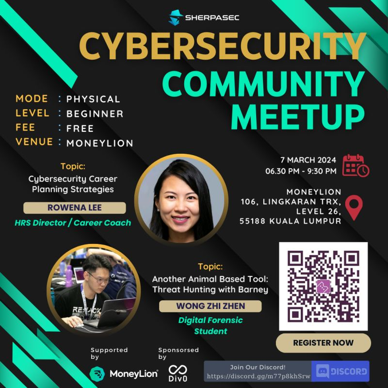

In March, I had the opportunity to present a talk about Velociraptor for SherpaSec, right alongside Rowena, who covered career planning strategies in the cybersecurity industry. At the end of Rowena’s talk, she promoted SINCON 2024, offering an **All Access Pass** to the conference for free, courtesy of her company, [HRS Talents](https://www.linkedin.com/company/hrstalents/). The catch? They’re limiting the sponsorship to just 8 participants from SherpaSec, so there’s bound to be some competition! 

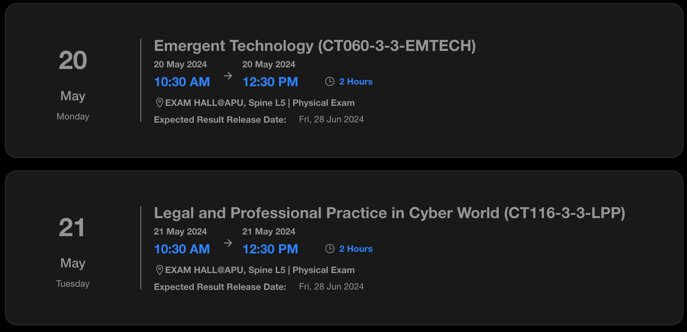

Before I reveal how I got the sponsorship (spoiler alert!), I want to highlight my recklessness in this entire process. For Black Hat Asia 2024, I applied for the sponsorship without a second thought about my assignments and final year project. Then, for SINCON 2024, I jumped at the scholarship opportunity without considering my final exams. Who could have known that SINCON 2024 would be happening during the week of my final exam?! 

Anyway, I finally got the details of my exams, and I can’t believe how close I came to a disaster. My exams were scheduled for the 20th and 21st of May, and guess what? I had to fly to Singapore on the 22nd! Long story short, I can’t help but think that some divine intervention was at play here, no matter what you believe in.

## Sponsorship Challenge

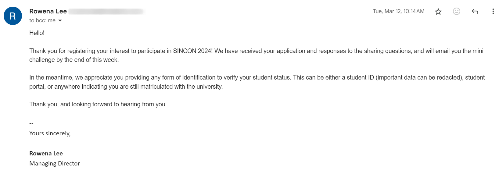

Just a few days post-SherpaSec meetup, I got the email I’d been waiting for regarding my sponsorship application! According to the message, I simply need to submit my student ID and then stay tuned for the mini CTF challenge, where I could earn that free conference pass.

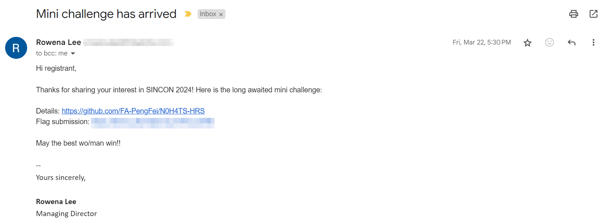

I spent another week eagerly awaiting the mini CTF challenge, and it finally came through! The challenge turned out to be an exciting Docker forensics challenge made by [Pengfei](https://www.linkedin.com/in/pengfei-yu-69783a93/).

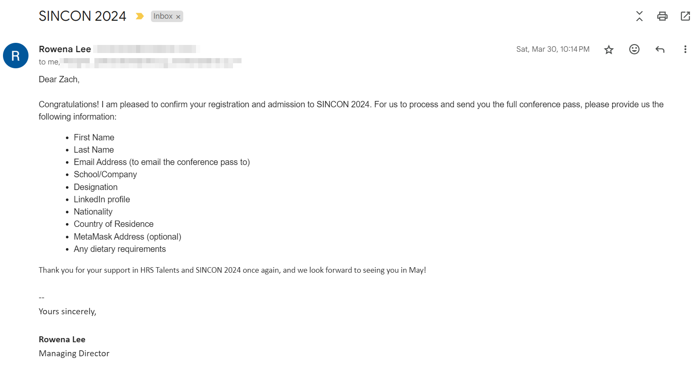

Just a few days later solving and submitting the flag for the mini CTF challenge, I got the confirmation email stating that I was sponsored for SINCON 2024! At this moment, I feel incredibly, REALLY thankful. Curious why? Just read on, and you’ll find out!

## RE:HACK, You’re Making Me Blush

For Black Hat Asia 2024, [Mr. Yapp](https://www.linkedin.com/in/yappare/) and [RE:HACK](https://www.linkedin.com/company/rehack-xyz) have sponsored my accommodation and transportation. During our exchange for the transportation fee, Mr. Yapp casually remarked (dramatic reenactment):

>**Mr. Yapp:** I assume the transportation fees will be similar for SINCON, would that be correct?
>
>**Me:** That is correct.
>
>**Mr. Yapp:** Very well, I shall provide you with double the amount for SINCON then.
>
>**Me:** AHHHHHHHHH OMG OMG!!!!

## Day 1: We Meet Again

Okay, before anyone asks, yes, there was merch and I grabbed a ton and I’ve got some fun stories to share later. And the FOOD? Seriously delicious with so much meat!

### Red Teaming is Red Teaming

If you’ve read my blog post about Black Hat Asia 2024, you probably remember I met a guy named [Sn0rkY](https://www.linkedin.com/in/joffreyczarny/)! Guess what? He was one of the instructors for the **Modern Red Teaming Workshop**!  It was awesome to see a Red Team Leader run a workshop! It was super engaging and super realistic! Now, before I get into what I learned, I have to say there were some materials to download ahead of time. Long story short, I didn’t download them. The long story? Well, just check out SINCON’s schedule on their website.

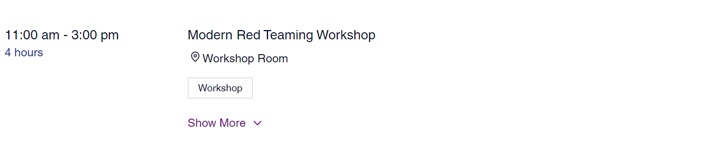

As a participant, I took a quick look at the schedule and thought, “Hey, there’s a Modern Red Teaming Workshop!” I didn't think to click on “Show More.” 

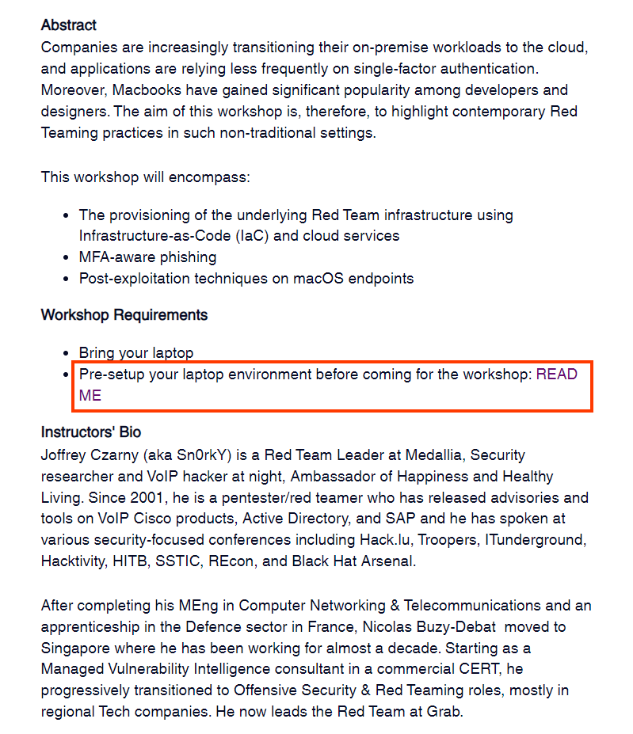

In the “Workshop Requirements” section, there was a note about preparing an environment before joining the workshop. Did I bother to read that? Nope. Is it SINCON’s fault? Not at all. I was just too excited about the conference and totally skipped that part!

Since I couldn’t join in on the hands-on work, I just sat there looking at the slides.

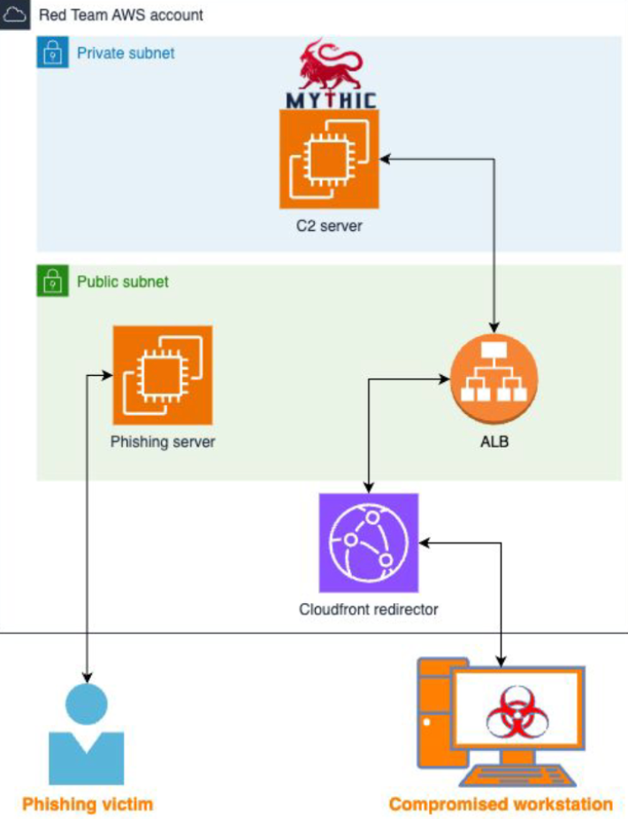

However, I wasn’t just sitting there doing nothing. I learned quite a bit from the slides and the speaker! [Mohin](https://www.linkedin.com/in/mohinparamasivam/) had mentioned that Red Teamers use redirectors to hide their actions, and it was great to see it demonstrated during the workshop! We created a phishing server that captured credentials and MFA codes. Then, we configured a Mythic C2 server connected to a load balancer that linked to a redirector. This redirector helped facilitate communication between the C2 server and a compromised macOS workstation. Plus, the entire environment can be created automatically with Terraform, making setup a breeze!

### Shiau Huei’s Sharing Session + Hardware

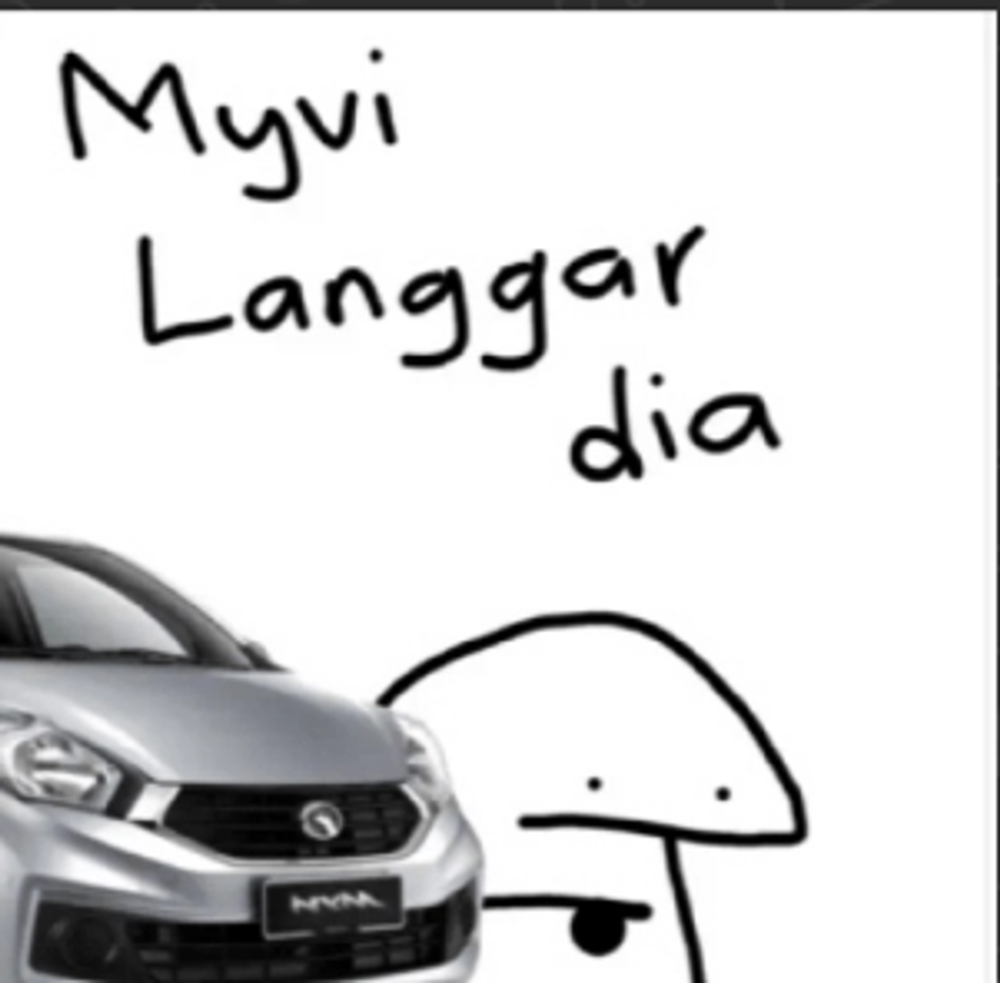

I was the only one within my friend group who applied for the SINCON sponsorship for the SherpaSec session, as my friends [Shiau Huei](https://www.linkedin.com/in/chang-shiau-huei/), [Darrshan](https://www.linkedin.com/in/darrshan-rajenderan/), and [Danisy](https://www.linkedin.com/in/danisyeisyraf/) were uncertain about attending due to exams. With SINCON approaching, the workshop topics were revealed, including one on car hacking by [Alina Tan](https://www.linkedin.com/in/alina-t-1a2631a5/) and [Camille Gay](https://www.linkedin.com/in/camille-gay-44b26530/).

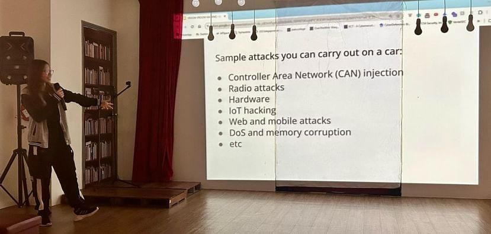

Anyone familiar with Shiau Huei knows she loves car hacking and has led several sharing sessions. She greatly admires Alina. When Shiau Huei heard that Alina would have a workshop at SINCON and that she might not be able to attend, she was a bit upset. During our final year project, mentioning “SINCON” always got her excited about Alina.

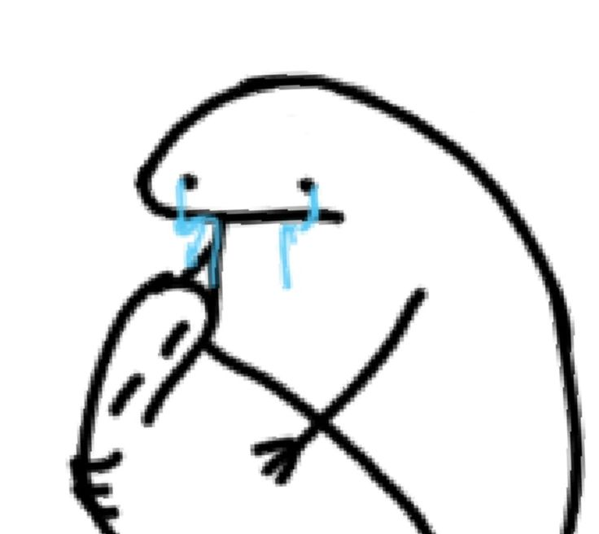

In case you were wondering, Shiau Huei made it to SINCON as a crew member.

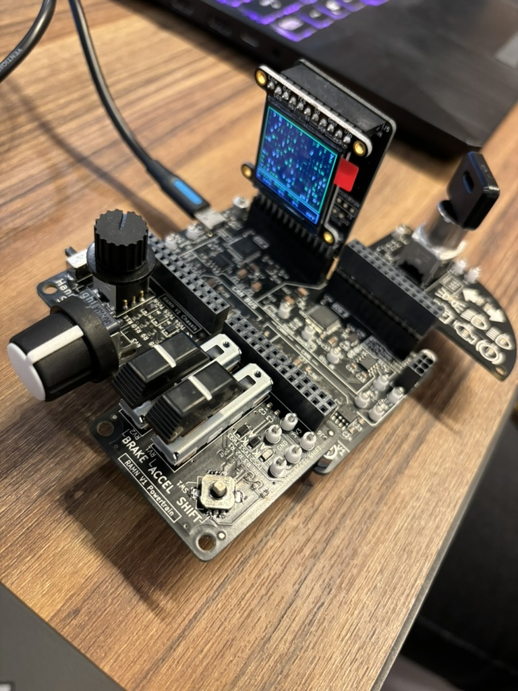

So, what did we learn? As Shiau Huei has already held multiple sessions on car hacking, this workshop took it further by giving us hardware to simulate a car! The device is about the size of my hand and includes:

- A steering wheel
- Shift gear
- Accelerator
- Brakes
- Indicators
- Ignition
- Lights

We focused on CAN buses and ECUs and learned how we can control them with `can-utils`, something Shiau Huei has introduced before but now with practical hardware!

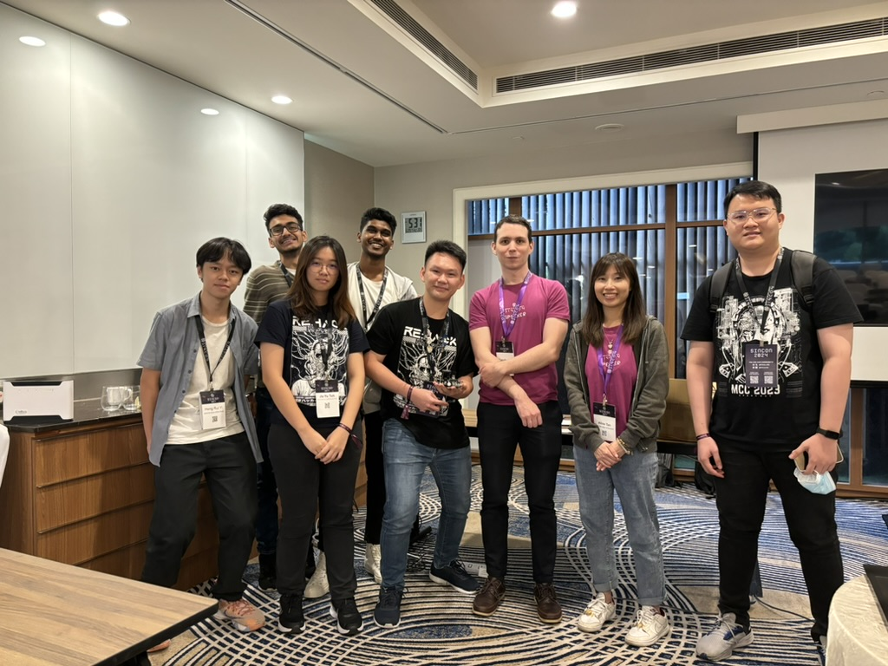

It was such a fun session, even though we were pretty tired from our trip to Singapore. At the end, we managed to take a photo with Alina and Camille! What a great memory to cherish!

From left to right:

- [Hong Rui Yi](https://www.linkedin.com/in/hong-rui-yi-7769092b9/)
- [Roheen](https://www.linkedin.com/in/roheender-sahota/)
- [Emmy](https://www.linkedin.com/in/emmy-toh-jia-yu-642652248/)
- Darrshan
- Me
- Camille
- Alina
- [Shenghe](https://www.linkedin.com/in/shengheong/)

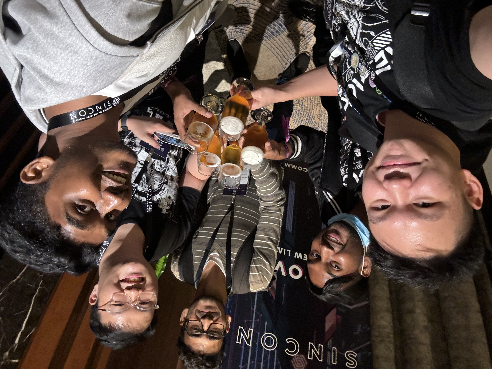

If you’ve been to a cybersecurity conference in Singapore, you know there’s always some beer involved! My friends and I enjoyed a few drinks, and I might’ve been a little too quick with mine. After five beers, nature called, and I needed to find a bathroom.

Feeling a bit unsteady this time, I decided to trust Mohin to come with me. He followed me into the restroom, and while he went into a stall, I headed for the urinal.

I finished up first (there's no way to mention that without a cheeky joke!), so I thought I’d have some fun. I held my phone over the stall and began flicking the flashlight on and off, pretending I was taking a picture of him. He had no idea!

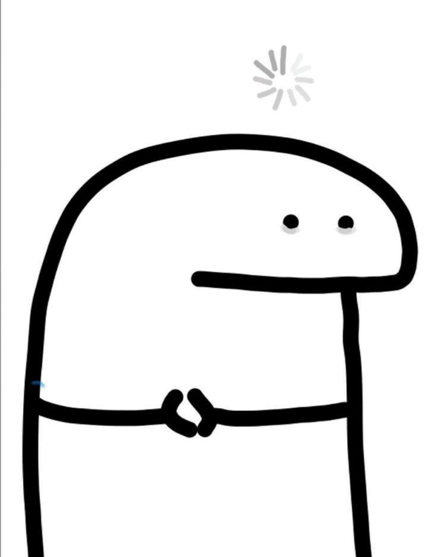

This is where the story gets a little crazy. Suddenly, a guy entered the bathroom, and we locked eyes, he stared at me, and I stared at him. My tipsy brain took a solid five seconds to piece together a response:

>**Me:** WAIT WAIT WAIT IT'S JUST A JOKE!!!
>
>**The dude:** \*ah understandable, have a nice day\*
>
>**\**Mohin comes out of the stall* \***
>
>**Mohin:** I heard that, what did you do?

## Day 2: Software Became Hardware

### The Next **Bill Morgan**
Let me tell you about Bill Morgan. He’s an Australian truck driver who defied the odds after a near-death experience by buying a scratch-off lottery ticket, winning a car worth $17,000. Intrigued by his story, a local news channel asked him to reenact the process of purchasing another ticket. To everyone’s shock, he scratched off a ticket and won a $250,000 jackpot right on camera!

So, what’s the relevance of Bill Morgan? Well, it’s because SINCON didn’t conflict with my exam dates, even though it was in the midst of my exam week. I was also fortunate to receive a sponsorship from Mr. Yapp for my trip to Singapore, along with a sponsorship for SINCON 2024 from SherpaSec. This is crucial because there are two types of sponsorship: student sponsorships and those associated with SherpaSec.

Among the swags we received was an electronic badge with CTF challenges. According to Shiau Huei, only attendees who purchased tickets were prioritised for these badges. This meant that those with student sponsorships didn’t get one. Fortunately, since I was sponsored by HRS Talents, I managed to get the badge. I’m genuinely grateful to HRS Talents and Rowena. Without their support, this wouldn’t have been possible!

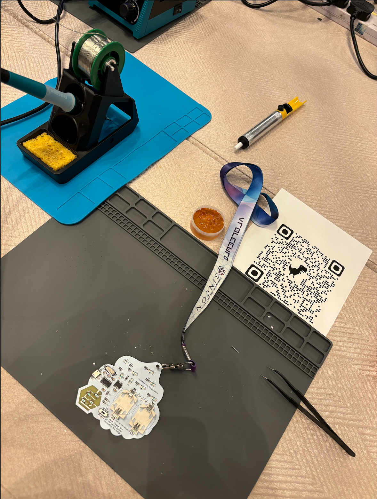

So, what was the main activity involving the electronic badge? We had to solder LEDs onto the PCB. This task proved to be quite challenging for me since I didn't have any practice with soldering back in high school. A huge thanks to Shiau Huei for guiding me through the process!

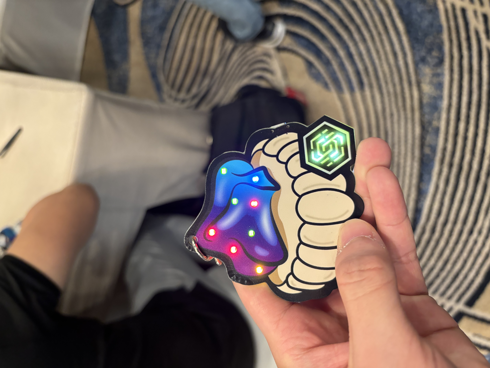

Anyways, here’s the final product! This badge is packed with 8 CTF challenges. When you complete a challenge, the LED lights up and blinks! As I'm typing this, I’ve completed 6 out of the 8 challenges.

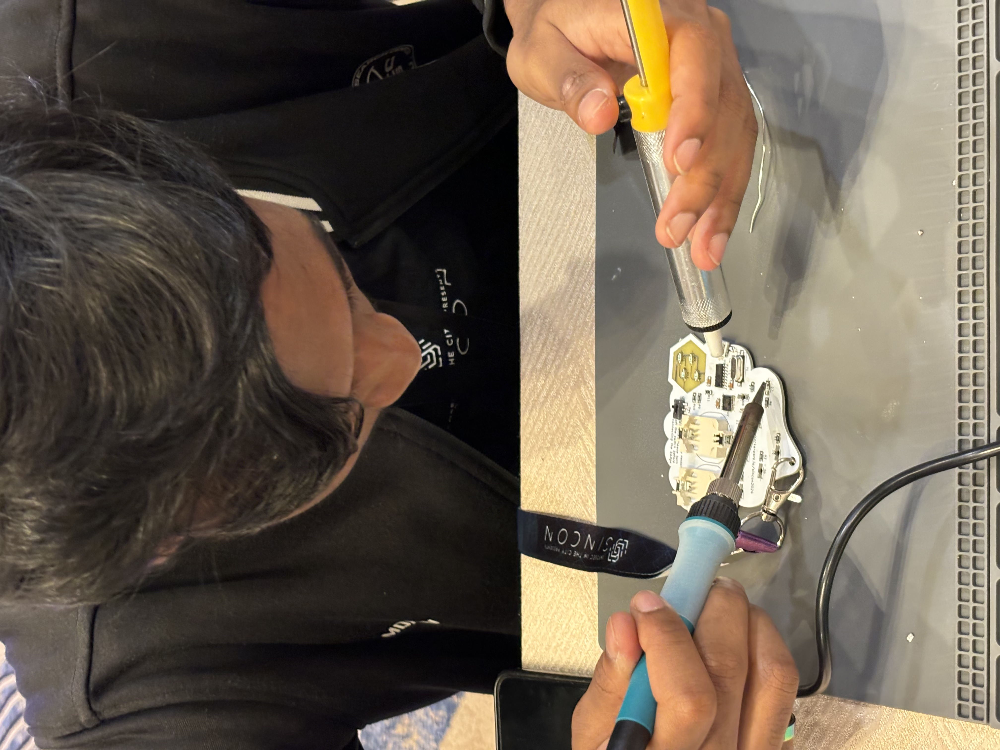

Do you remember Mohin? The guy who walked into the bathroom while I was joking around? Well, he spent nearly 3-4 hours at the soldering station trying to get his badge done. Shiau Huei and I tried to lend a hand, but I really admire his persistence. After all, he’s a professional red teamer, so he definitely has a lot of it!

I felt a bit guilty because while the rest of us were socialising and having fun, he was stuck at the soldering station alone working on his badge. But knowing him, I realised he was very patient, and in the end, he finished it. However, at the end of the conference, he wanted to give the badge away! Me being the guy who felt bad for him, tried to force him to keep the badge.

> **Mohin:** Who doesn’t have the badge? I want to give it to them.
>
> **Me:** Dude, keep it.
>
> **Me:** Everyone has the badge (which was obviously a lie).
>
> **Me:** You worked hard for it...

### VirusTotal CTF

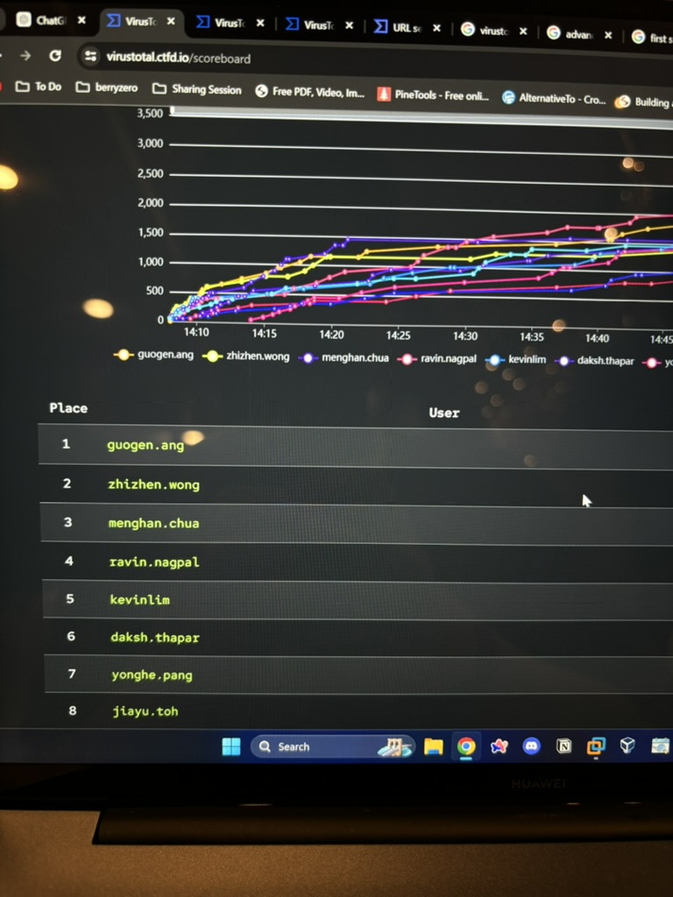

A major highlight for me on Day 2 was the VirusTotal CTF! It was a special challenge where we used VirusTotal to locate our flags and prizes were given to the top 3 winners for this CTF. It was a fun experience, especially since we got to use the enterprise version of VirusTotal! After an hour of challenges, I managed to be 2nd place on the leaderboard! **BUT WAIT!** The winners were chosen by tallying scores from both Day 1 and Day 2, so I didn’t win any prizes. 

Nonetheless, a huge shoutout to Emmy and Roheen for finishing in the top 10! Emmy came in 8th place while Roheen was in 9th. Me being a purple teamer, I would like to say that you both did an outstanding job in a blue teaming challenge even though y'all were red teamers!

### Chip Off the Old Block

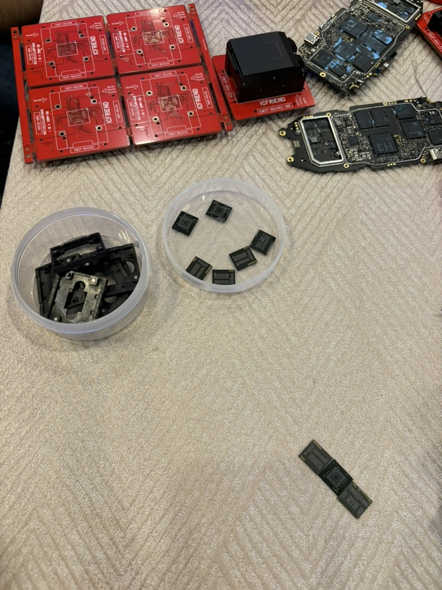

During my Mobile Forensics course, I discovered that in rare cases, forensic investigations might require extracting information directly from mobile devices by removing the flash memory and using a chip reader. In Malaysia, this approach has been utilised only twice. This is where I had the privilege of meeting the legendary [Captain Kelvin](https://www.linkedin.com/in/kelvin-captain-wong-8ab844136/)!

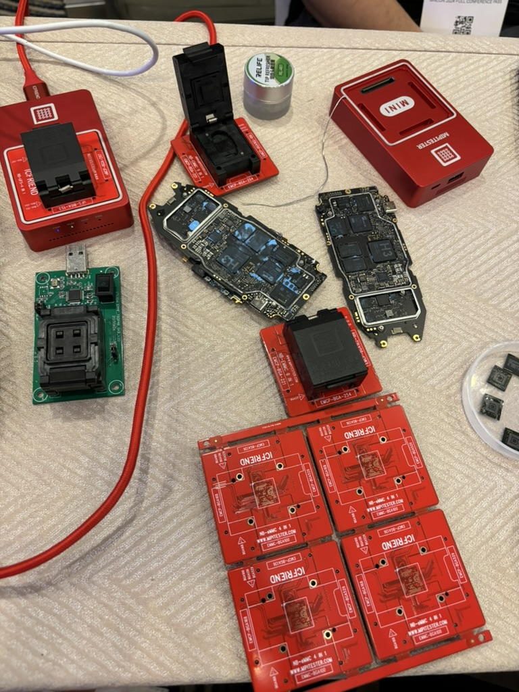

He was part of the Chip Off Village, showcasing techniques for reading data from drones and mobile phones. For those familiar with mobile forensics, you'll know that different phones use various types of flash memory, which means specialised chip readers are necessary. Remarkably, the chips presented here are utilised in 90% of mobile devices.

## Bonus Day 3: Sacrifices Had to Be Made

To give you an idea of how crazy my week was: I flew to Singapore on May 22nd for a conference that ran from the 23rd to the 24th. Then, on May 25th, I went to an event at **Universiti Malaya** called **Cyber Skills Level Up**. This event was all about helping cybersecurity students in Malaysia improve their skills. As a member of Malaysia's CTF Team, **M53**, I really wanted to support it. However, keep in mind that the event starts at 8 in the morning.

Emmy, [Wei Ying](https://www.linkedin.com/in/teh-wei-ying-12a492261/), [Shi Min](https://www.linkedin.com/in/ng-shi-min-a36688288/), and I jumped on a bus from Singapore at midnight to get back to Malaysia so that we can attend the event. We made it back around 5 AM, but it wasn’t smooth sailing. Let’s just say Emmy had her own little adventure, but I’ll let her share that.

Once we arrived, I hurried to **Universiti Malaya** via the LRT and then took a bus. During my journey, I thought I spotted Shiau Huei, a girl with glasses and a pink bag, so I got off the bus. Spoiler: it wasn’t her. I ended up walking 30-40 minutes to the **Faculty of Computer Science & Information Technology**, looking very sweaty by the time I got there.

Anyway, the session went well, and afterward, we headed to a nearby cafe for dinner. Just before we left, this funny exchange happened:

>**Kelvin:** Will rain very heavy meh?
>
>**God:** \**thunder sounds*\*

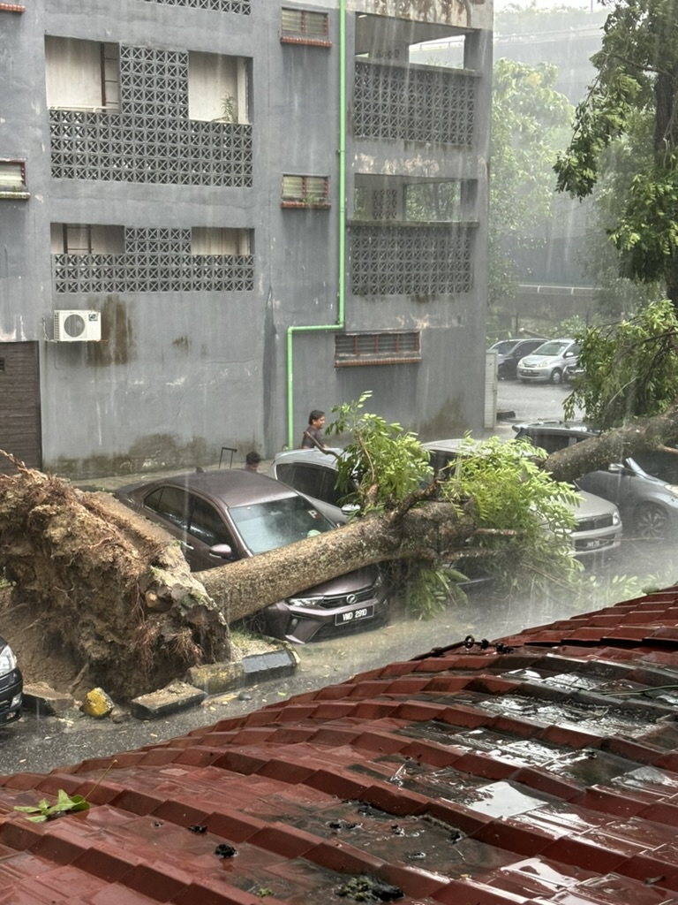

The rain was intense, causing trees to fall onto cars near the cafe. Fortunately, none of the cars from **Cyber Skills Level Up** were damaged. [KS](https://www.linkedin.com/in/loh-kae-shyan/) jokingly said:

> **KS:** Anyone has experience in Minecraft, go and chop the trees

However, the trees were blocking our cars at the university. So what ended up happening was a group of people getting their own tools to chop the trees. That, my friends, was how we finally got out!

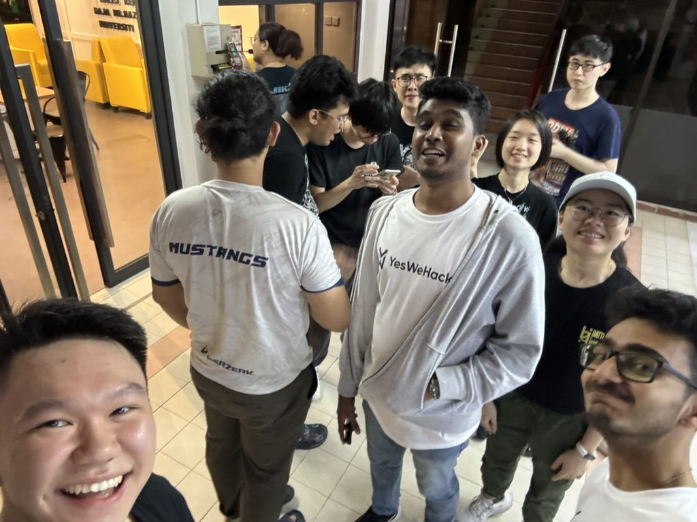

But of course, we took a photo with the person making the announcements before we left!

## Conclusion

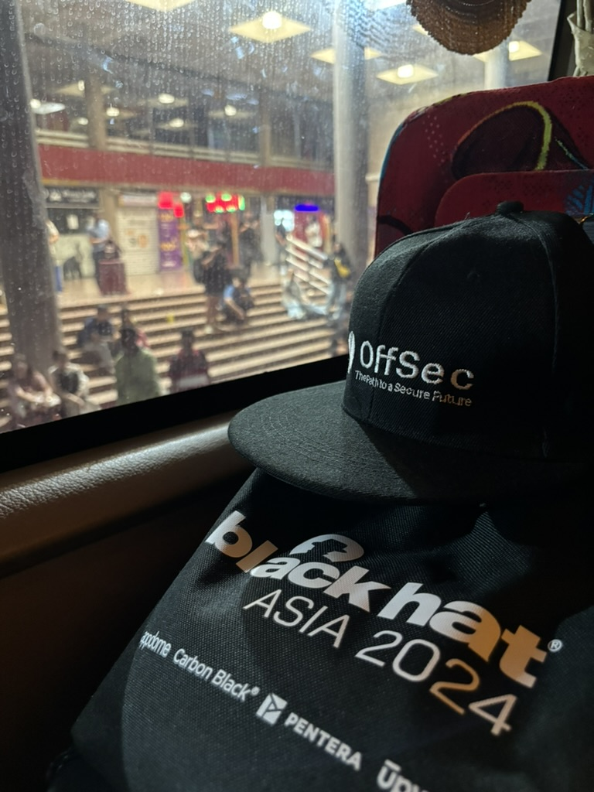

Overall, SINCON 2024 was a conference I genuinely enjoyed. I was the only attendee from my circle, but it was fantastic to see my friends and professional contacts there. A massive thank you to Mr. Yapp and RE:HACK for sponsoring my journey to these conferences! I hope your support has enabled me to give back to the cybersecurity community. Additionally, thanks to SherpaSec, HRS Talents, and Rowena for funding my SINCON ticket. I wouldn’t have been able to attend without your generosity!